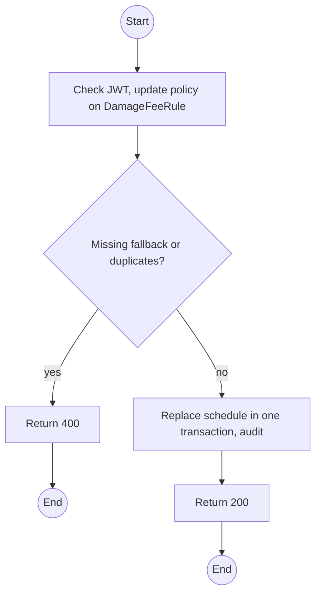
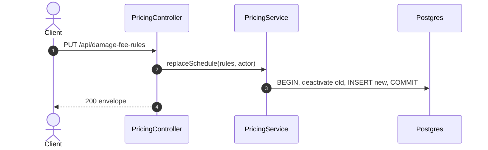

# PUT /api/damage-fee-rules: Replace the damage and loss fee schedule

> Module `billing`. Format: `02-templates/04-api-endpoint-template.md`, with Mermaid in place of PlantUML (D-017). Envelope: D-002.

[TOC]

---
## Overview

Replaces the whole schedule in one transaction. A variant-agnostic row for every condition is required, so every settlement can price every condition.

## API Specification

| API        | URL             |
| ---------- | --------------- |
| PUT | /api/damage-fee-rules |
| Permission | Admin |
| Traces | UC-25, BR-20, BR-23, D-015 |

## Request sample

```json
{
  "rules": [
    {
      "condition": "MINOR_DAMAGE",
      "hardwareVariantId": null,
      "amount": 150000
    },
    {
      "condition": "MAJOR_DAMAGE",
      "hardwareVariantId": null,
      "amount": 600000
    },
    {
      "condition": "MISSING_ACCESSORIES",
      "hardwareVariantId": null,
      "amount": 80000
    },
    {
      "condition": "LOST",
      "hardwareVariantId": null,
      "amount": 3000000
    }
  ]
}
```

| Field | Description | Data Type | Required | Examples |
| --- | --- | --- | --- | --- |
| rules | Complete schedule | object[] | yes | n/a |
| rules[].condition | MINOR_DAMAGE, MAJOR_DAMAGE, MISSING_ACCESSORIES, LOST | enum | yes | `LOST` |
| rules[].hardwareVariantId | Variant, or null for the fallback | uuid | no | `null` |
| rules[].amount | Non-negative VND | decimal | yes | `3000000` |

## Response sample

```json
{
  "result": {
    "ruleCount": 4
  },
  "isSuccess": true,
  "statusCode": 200,
  "message": "Damage fee schedule updated"
}
```

## Validation

<table>
    <th>Status code</th>
    <th>Description</th>
    <th>Examples</th>
    <tbody>
        <tr>
            <td>400</td>
            <td>A condition lacks its variant-agnostic fallback, or duplicates (<code>VALIDATION_FAILED</code>)</td>
<td>

```json
{
  "result": {
    "errorCode": "VALIDATION_FAILED"
  },
  "isSuccess": false,
  "statusCode": 400,
  "message": "A fallback rule (hardwareVariantId null) is required for LOST."
}
```
</td>
        </tr>
        <tr>
            <td>401</td>
            <td>Missing, malformed or expired access token (<code>UNAUTHENTICATED</code>)</td>
<td>

```json
{
  "result": {
    "errorCode": "UNAUTHENTICATED"
  },
  "isSuccess": false,
  "statusCode": 401,
  "message": "Authentication required."
}
```
</td>
        </tr>
        <tr>
            <td>403</td>
            <td>Authenticated, but the caller's role or policy does not allow this action (<code>FORBIDDEN</code>)</td>
<td>

```json
{
  "result": {
    "errorCode": "FORBIDDEN"
  },
  "isSuccess": false,
  "statusCode": 403,
  "message": "You do not have permission to perform this action."
}
```
</td>
        </tr>
    </tbody>
</table>

## Activity Diagram



## Sequence Diagram


