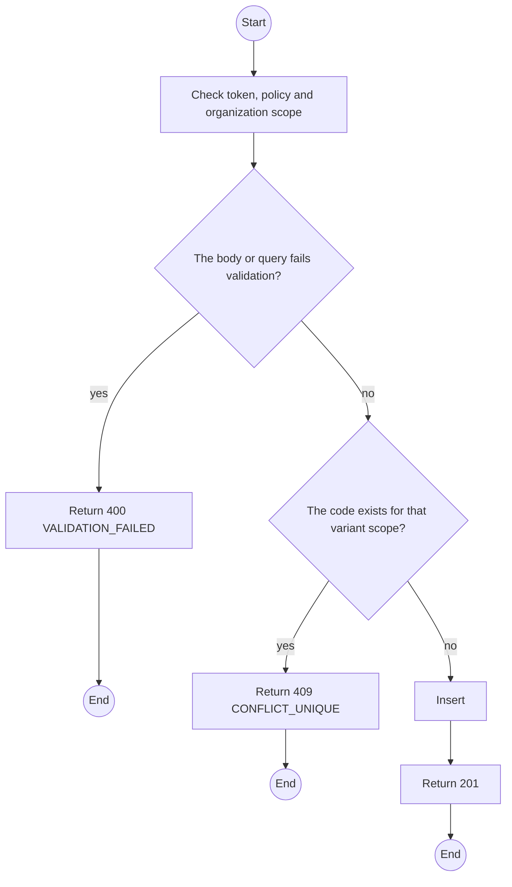
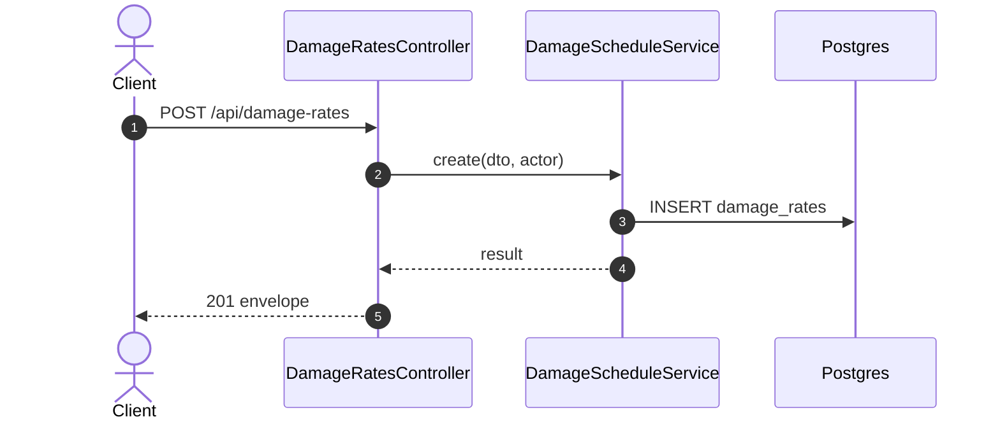

# POST /api/damage-rates: Add a damage rate

> Module `billing`. Generated from `scripts/specs/endpoints/billing.py` by `scripts/specs/build_api_design.py`; edit the catalog, not this file. Format: `02-templates/04-api-endpoint-template.md` with Mermaid (D-017). Envelope: D-002.

[TOC]

---
## Overview

Adds a damage code and amount, generic or for one variant.

## API Specification

| API | URL |
| --- | --- |
| POST | /api/damage-rates |
| Permission | TrekLink Admin |
| Traces | UC-56, FR-BILL-04 |

## Request sample

```json
{
  "code": "CASING_CRACKED",
  "label": "Casing cracked",
  "hardwareVariantId": null,
  "amountVnd": 400000
}
```

| Field | Description | Data Type | Required | Examples |
| --- | --- | --- | --- | --- |
| code | UPPER_SNAKE code | string | yes | `CASING_CRACKED` |
| label | Display label | string | yes | `Casing cracked` |
| hardwareVariantId | Null for every variant | uuid | no | `null` |
| amountVnd | Positive VND | int | yes | `400000` |

## Response sample

```json
{
  "result": {
    "id": "dr-2",
    "code": "CASING_CRACKED",
    "amountVnd": 400000,
    "isActive": true
  },
  "isSuccess": true,
  "statusCode": 201,
  "message": "Saved."
}
```

## Validation

<table>
    <th>Status code</th>
    <th>Description</th>
    <th>Examples</th>
    <tbody>
        <tr>
            <td>400</td>
            <td>The body or query fails validation (<code>VALIDATION_FAILED</code>)</td>
<td>

```json
{
  "result": {
    "errorCode": "VALIDATION_FAILED"
  },
  "isSuccess": false,
  "statusCode": 400,
  "message": "{field} is required."
}
```
</td>
        </tr>
        <tr>
            <td>401</td>
            <td>Missing, malformed or expired access token or API key (<code>UNAUTHENTICATED</code>)</td>
<td>

```json
{
  "result": {
    "errorCode": "UNAUTHENTICATED"
  },
  "isSuccess": false,
  "statusCode": 401,
  "message": "Authentication required."
}
```
</td>
        </tr>
        <tr>
            <td>403</td>
            <td>The caller's role, policy or organization does not allow this action (<code>FORBIDDEN</code>)</td>
<td>

```json
{
  "result": {
    "errorCode": "FORBIDDEN"
  },
  "isSuccess": false,
  "statusCode": 403,
  "message": "You do not have access to this."
}
```
</td>
        </tr>
        <tr>
            <td>409</td>
            <td>The code exists for that variant scope (<code>CONFLICT_UNIQUE</code>)</td>
<td>

```json
{
  "result": {
    "errorCode": "CONFLICT_UNIQUE"
  },
  "isSuccess": false,
  "statusCode": 409,
  "message": "CASING_CRACKED is already registered."
}
```
</td>
        </tr>
    </tbody>
</table>

## Activity Diagram



## Sequence Diagram


