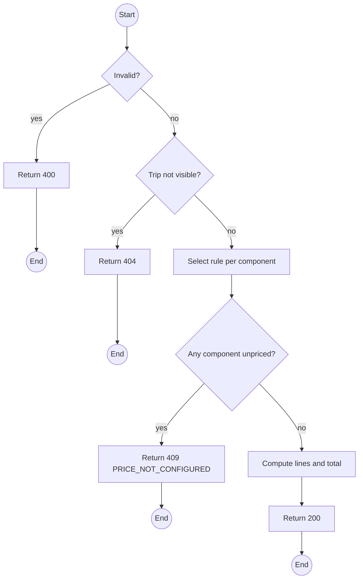
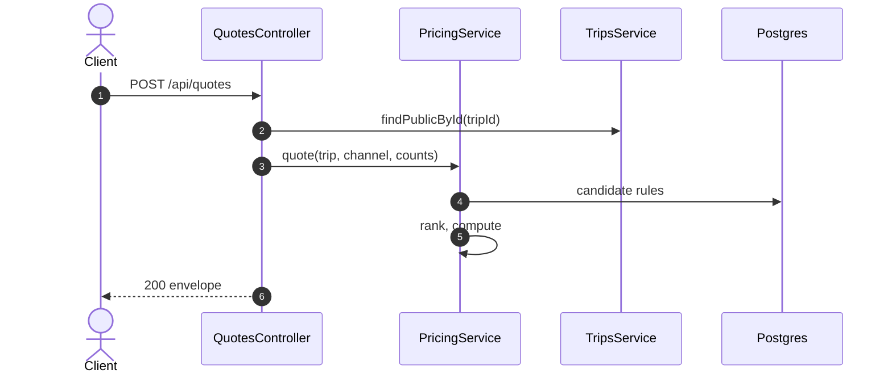

# POST /api/quotes: Quote a booking

> Module `billing`. Format: `02-templates/04-api-endpoint-template.md`, with Mermaid in place of PlantUML (D-017). Envelope: D-002.

[TOC]

---
## Overview

Itemised price for a prospective booking: trip fee per traveller, rental fee per device, refundable deposit per device, each from the most specific matching rule. Read-only; used by the package page ("from" price) and the booking wizard.

## API Specification

| API        | URL             |
| ---------- | --------------- |
| POST | /api/quotes |
| Permission | Public (for BOOKING_OPEN trips); any role |
| Traces | UC-02, FR-BILL-04 (new), REQ-EVT-01, REQ-ERR-01, Q61, Q63 |

## Request sample

```json
{
  "tripId": "a1c3...",
  "channel": "CUSTOMER",
  "travellers": 2,
  "devices": [
    {
      "hardwareVariantId": null,
      "quantity": 1
    }
  ]
}
```

| Field | Description | Data Type | Required | Examples |
| --- | --- | --- | --- | --- |
| tripId | Trip, BOOKING_OPEN for public callers | uuid | yes | `a1c3...` |
| channel | Caller's channel; public callers are CUSTOMER | enum | no | `CUSTOMER` |
| travellers | 1 or more | int | yes | `2` |
| devices | Per variant, or null variant for any accepted | object[] | yes | n/a |

## Response sample

```json
{
  "result": {
    "currency": "VND",
    "lines": [
      {
        "type": "TRIP_FEE",
        "description": "2 travellers x 1500000",
        "quantity": 2,
        "unitAmount": 1500000,
        "amount": 3000000,
        "ruleId": "pr-3..."
      },
      {
        "type": "RENTAL_FEE",
        "description": "1 device x 150000",
        "quantity": 1,
        "unitAmount": 150000,
        "amount": 150000,
        "ruleId": "pr-1..."
      },
      {
        "type": "DEPOSIT",
        "description": "Refundable deposit, 1 device",
        "quantity": 1,
        "unitAmount": 300000,
        "amount": 300000,
        "ruleId": "pr-5..."
      }
    ],
    "total": 3450000,
    "refundableDeposit": 300000
  },
  "isSuccess": true,
  "statusCode": 200,
  "message": "Quote computed"
}
```

## Validation

<table>
    <th>Status code</th>
    <th>Description</th>
    <th>Examples</th>
    <tbody>
        <tr>
            <td>400</td>
            <td>Invalid counts (<code>VALIDATION_FAILED</code>)</td>
<td>

```json
{
  "result": {
    "errorCode": "VALIDATION_FAILED"
  },
  "isSuccess": false,
  "statusCode": 400,
  "message": "travellers must be at least 1."
}
```
</td>
        </tr>
        <tr>
            <td>404</td>
            <td>Trip not visible to the caller (<code>NOT_FOUND</code>)</td>
<td>

```json
{
  "result": {
    "errorCode": "NOT_FOUND"
  },
  "isSuccess": false,
  "statusCode": 404,
  "message": "Trip not found."
}
```
</td>
        </tr>
        <tr>
            <td>409</td>
            <td>A component has no rule (<code>PRICE_NOT_CONFIGURED</code>)</td>
<td>

```json
{
  "result": {
    "errorCode": "PRICE_NOT_CONFIGURED"
  },
  "isSuccess": false,
  "statusCode": 409,
  "message": "No RENTAL_FEE rule for TN-PD-3D, treklink-v3, CUSTOMER."
}
```
</td>
        </tr>
    </tbody>
</table>

## Activity Diagram



## Sequence Diagram


