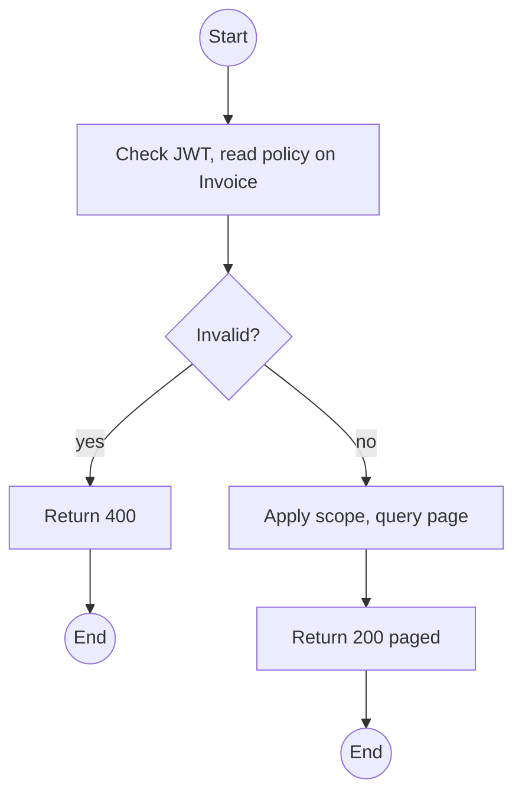
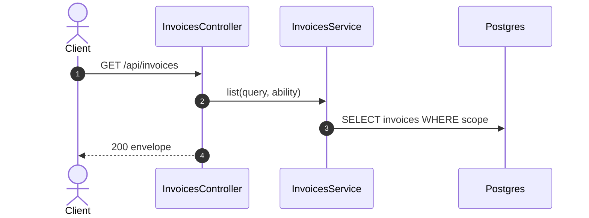

# GET /api/invoices: List invoices

> Module `billing`. Format: `02-templates/04-api-endpoint-template.md`, with Mermaid in place of PlantUML (D-017). Envelope: D-002.

[TOC]

---
## Overview

Paged invoices with balance and refund due. Customers see their own; the Operator view filters outstanding balances for follow-up (E05-4).

## API Specification

| API        | URL             |
| ---------- | --------------- |
| GET | /api/invoices |
| Permission | Operator, Admin; Customer (own) |
| Traces | US-070, UC-12 |

### Query parameters

| Field | Description | Data Type | Required | Examples |
| --- | --- | --- | --- | --- |
| status | Invoice statuses | enum[] | no | `ISSUED,PARTIALLY_PAID` |
| kind | BOOKING_ESCROW, SETTLEMENT, ADJUSTMENT | enum | no | `SETTLEMENT` |
| rentalId | Rental | uuid | no | `c9b8...` |
| bookingId | Booking | uuid | no | `7f1e...` |
| outstanding | balanceDue or refundDue above zero | bool | no | `true` |
| pageNumber | 1-based | int | no | `1` |
| pageSize | Default 20 | int | no | `20` |

## Request sample

No request body. Query string example:

```
GET /api/invoices?outstanding=true
```

## Response sample

```json
{
  "result": {
    "items": [
      {
        "id": "inv-40...",
        "number": "INV-2026-000140",
        "kind": "SETTLEMENT",
        "status": "ISSUED",
        "total": 450000,
        "balanceDue": 450000,
        "refundDue": 0,
        "issuedAt": "2026-10-12T13:00:00Z"
      }
    ],
    "pageNumber": 1,
    "pageSize": 20,
    "totalCount": 1,
    "totalPages": 1
  },
  "isSuccess": true,
  "statusCode": 200,
  "message": "Invoices retrieved"
}
```

## Validation

<table>
    <th>Status code</th>
    <th>Description</th>
    <th>Examples</th>
    <tbody>
        <tr>
            <td>400</td>
            <td>Bad filter (<code>VALIDATION_FAILED</code>)</td>
<td>

```json
{
  "result": {
    "errorCode": "VALIDATION_FAILED"
  },
  "isSuccess": false,
  "statusCode": 400,
  "message": "status must be a valid invoice status."
}
```
</td>
        </tr>
        <tr>
            <td>401</td>
            <td>Missing, malformed or expired access token (<code>UNAUTHENTICATED</code>)</td>
<td>

```json
{
  "result": {
    "errorCode": "UNAUTHENTICATED"
  },
  "isSuccess": false,
  "statusCode": 401,
  "message": "Authentication required."
}
```
</td>
        </tr>
        <tr>
            <td>403</td>
            <td>Authenticated, but the caller's role or policy does not allow this action (<code>FORBIDDEN</code>)</td>
<td>

```json
{
  "result": {
    "errorCode": "FORBIDDEN"
  },
  "isSuccess": false,
  "statusCode": 403,
  "message": "You do not have permission to perform this action."
}
```
</td>
        </tr>
    </tbody>
</table>

## Activity Diagram



## Sequence Diagram


