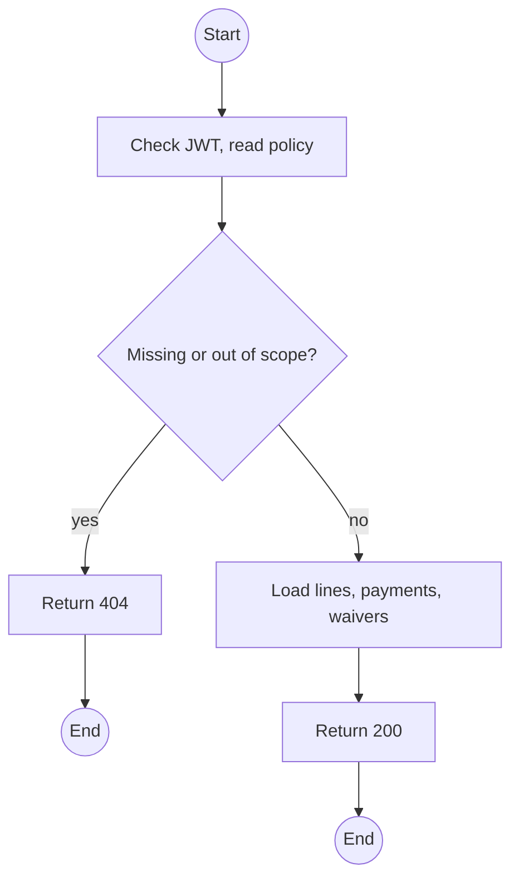
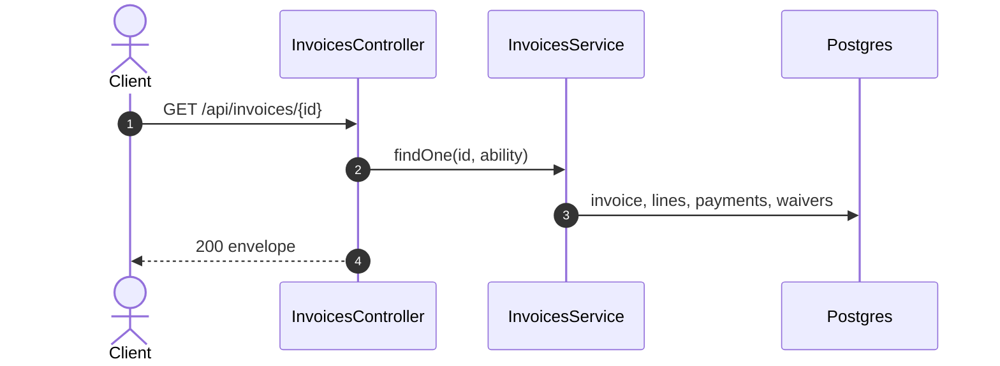

# GET /api/invoices/:id: Invoice detail

> Module `billing`. Format: `02-templates/04-api-endpoint-template.md`, with Mermaid in place of PlantUML (D-017). Envelope: D-002.

[TOC]

---
## Overview

One invoice with every line, its source, payments (including failed attempts) and waivers.

## API Specification

| API        | URL             |
| ---------- | --------------- |
| GET | /api/invoices/:id |
| Permission | Operator, Admin; Customer (own) |
| Traces | US-070, UC-12, E05-1 |

### Path parameters

| Field | Description | Data Type | Examples |
| --- | --- | --- | --- |
| id | Invoice id or number | string | `INV-2026-000140` |

## Request sample

No request body.

## Response sample

```json
{
  "result": {
    "id": "inv-40...",
    "number": "INV-2026-000140",
    "kind": "SETTLEMENT",
    "rentalId": "c9b8...",
    "billToName": "Nguyen Van A",
    "status": "ISSUED",
    "currency": "VND",
    "lines": [
      {
        "seq": 1,
        "type": "LATE_FEE",
        "description": "TL-0042 late return, 26 h after due, 2 h grace, 1 day",
        "quantity": 1,
        "unitAmount": 50000,
        "amount": 50000
      },
      {
        "seq": 2,
        "type": "DAMAGE_FEE",
        "description": "TL-0042 MAJOR_DAMAGE, treklink-v3",
        "quantity": 1,
        "unitAmount": 700000,
        "amount": 700000
      },
      {
        "seq": 3,
        "type": "DEPOSIT_APPLIED",
        "description": "Deposit held on INV-2026-000131",
        "quantity": 1,
        "unitAmount": -300000,
        "amount": -300000
      }
    ],
    "total": 450000,
    "balanceDue": 450000,
    "refundDue": 0,
    "payments": []
  },
  "isSuccess": true,
  "statusCode": 200,
  "message": "Invoice retrieved"
}
```

## Validation

<table>
    <th>Status code</th>
    <th>Description</th>
    <th>Examples</th>
    <tbody>
        <tr>
            <td>401</td>
            <td>Missing, malformed or expired access token (<code>UNAUTHENTICATED</code>)</td>
<td>

```json
{
  "result": {
    "errorCode": "UNAUTHENTICATED"
  },
  "isSuccess": false,
  "statusCode": 401,
  "message": "Authentication required."
}
```
</td>
        </tr>
        <tr>
            <td>403</td>
            <td>Authenticated, but the caller's role or policy does not allow this action (<code>FORBIDDEN</code>)</td>
<td>

```json
{
  "result": {
    "errorCode": "FORBIDDEN"
  },
  "isSuccess": false,
  "statusCode": 403,
  "message": "You do not have permission to perform this action."
}
```
</td>
        </tr>
        <tr>
            <td>404</td>
            <td>No such invoice or not the caller's (<code>NOT_FOUND</code>)</td>
<td>

```json
{
  "result": {
    "errorCode": "NOT_FOUND"
  },
  "isSuccess": false,
  "statusCode": 404,
  "message": "Invoice not found."
}
```
</td>
        </tr>
    </tbody>
</table>

## Activity Diagram



## Sequence Diagram


