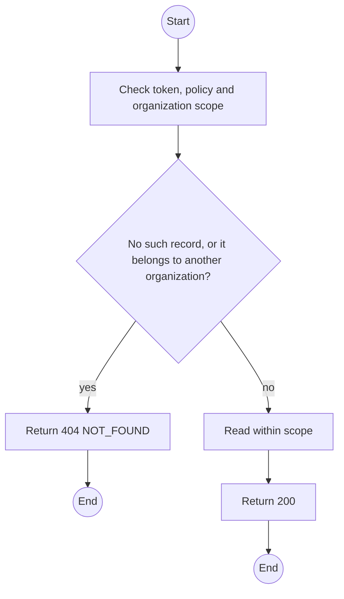
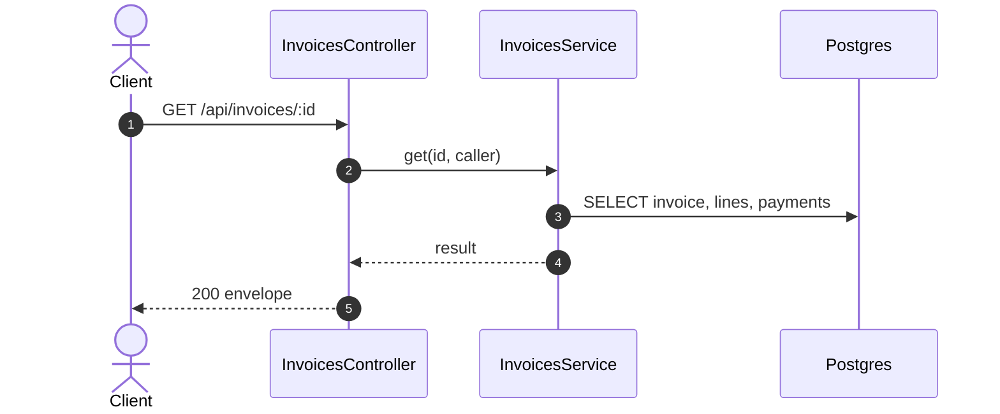

# GET /api/invoices/:id: Invoice detail

> Module `billing`. Generated from `scripts/specs/endpoints/billing.py` by `scripts/specs/build_api_design.py`; edit the catalog, not this file. Format: `02-templates/04-api-endpoint-template.md` with Mermaid (D-017). Envelope: D-002.

[TOC]

---
## Overview

Returns the immutable, itemized invoice with its dated lines and payments.

## API Specification

| API | URL |
| --- | --- |
| GET | /api/invoices/:id |
| Permission | Org Manager: own; TrekLink Staff, TrekLink Admin |
| Traces | UC-45, UC-55, FR-BILL-06 |

### Path parameters

| Field | Description | Data Type | Examples |
| --- | --- | --- | --- |
| id | Invoice id; members may use only their own | uuid | `1e2d3c4b-5a69-4788-9a0b-c1d2e3f4a5b6` |

## Request sample

No body.

## Response sample

```json
{
  "result": {
    "id": "1e2d3c4b-5a69-4788-9a0b-c1d2e3f4a5b6",
    "number": "INV-2026-000123",
    "organizationId": "5b1d2c0e-7f3a-4e21-9c8d-1a2b3c4d5e6f",
    "contract": {
      "id": "c0ffee00-1234-4abc-9def-001122334455",
      "code": "RC-2026-0042"
    },
    "kind": "TERM",
    "term": {
      "seq": 1
    },
    "status": "PARTIALLY_PAID",
    "totalVnd": 4500000,
    "paidVnd": 2250000,
    "issuedAt": "2026-10-20T03:15:00.000Z",
    "lines": [
      {
        "seq": 1,
        "type": "HOLDING_FEE",
        "description": "Term 1 holding fee, 10 x treklink-v3",
        "quantity": 10,
        "unitVnd": 225000,
        "amountVnd": 2250000,
        "dueAt": "2026-10-25T02:00:00Z",
        "paidVnd": 2250000
      },
      {
        "seq": 2,
        "type": "TERM_BALANCE",
        "description": "Term 1 balance, 10 x treklink-v3",
        "quantity": 10,
        "unitVnd": 225000,
        "amountVnd": 2250000,
        "dueAt": "2026-11-25T02:00:00Z",
        "paidVnd": 0
      }
    ],
    "payments": [
      {
        "id": "p-1",
        "reference": "TL7K2Q9M4D",
        "invoiceId": "1e2d3c4b-5a69-4788-9a0b-c1d2e3f4a5b6",
        "contractId": "c0ffee00-1234-4abc-9def-001122334455",
        "amountVnd": 2250000,
        "method": "SEPAY",
        "status": "CONFIRMED",
        "isSandbox": true,
        "expiresAt": "2026-10-20T03:45:00Z",
        "confirmedAt": "2026-10-20T03:15:00.000Z"
      }
    ]
  },
  "isSuccess": true,
  "statusCode": 200,
  "message": "OK"
}
```

## Validation

<table>
    <th>Status code</th>
    <th>Description</th>
    <th>Examples</th>
    <tbody>
        <tr>
            <td>401</td>
            <td>Missing, malformed or expired access token or API key (<code>UNAUTHENTICATED</code>)</td>
<td>

```json
{
  "result": {
    "errorCode": "UNAUTHENTICATED"
  },
  "isSuccess": false,
  "statusCode": 401,
  "message": "Authentication required."
}
```
</td>
        </tr>
        <tr>
            <td>403</td>
            <td>The caller's role, policy or organization does not allow this action (<code>FORBIDDEN</code>)</td>
<td>

```json
{
  "result": {
    "errorCode": "FORBIDDEN"
  },
  "isSuccess": false,
  "statusCode": 403,
  "message": "You do not have access to this."
}
```
</td>
        </tr>
        <tr>
            <td>404</td>
            <td>No such record, or it belongs to another organization (<code>NOT_FOUND</code>)</td>
<td>

```json
{
  "result": {
    "errorCode": "NOT_FOUND"
  },
  "isSuccess": false,
  "statusCode": 404,
  "message": "Invoice not found."
}
```
</td>
        </tr>
    </tbody>
</table>

## Activity Diagram



## Sequence Diagram


