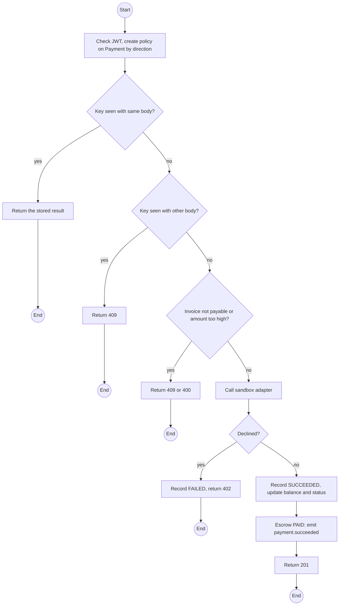
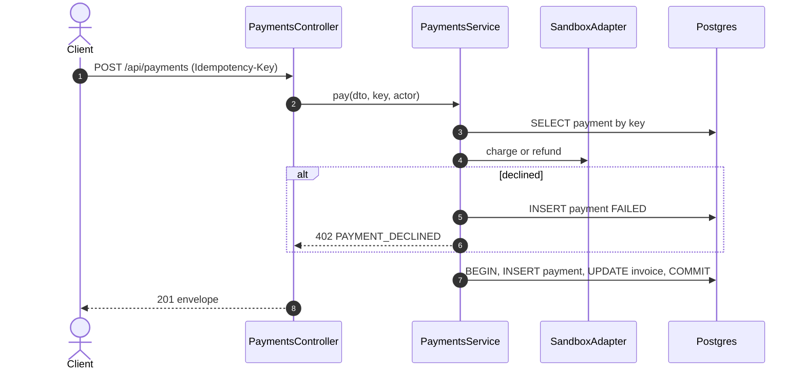

# POST /api/payments: Sandbox payment or refund

> Module `billing`. Format: `02-templates/04-api-endpoint-template.md`, with Mermaid in place of PlantUML (D-017). Envelope: D-002.

[TOC]

---
## Overview

Charges an invoice's balance or pays out its refund through the sandbox adapter. A decline records a `FAILED` payment and changes nothing else. `simulate: "DECLINE"` forces a decline for the E05-4 demonstration. Escrow invoices that become `PAID` emit `payment.succeeded`, which confirms the booking's holds.

## API Specification

| API        | URL             |
| ---------- | --------------- |
| POST | /api/payments |
| Permission | Customer (charge, own invoice); Operator (charge, refund) |
| Header | `Idempotency-Key: <uuid>` required |
| Sandbox | No real funds, no card data (charter §8) |
| Traces | UC-12, FR-BILL-05, BR-19, E05-4, US-069, REQ-UBI-04, REQ-UBI-06, REQ-EVT-09, REQ-EVT-10 |

## Request sample

```json
{
  "invoiceId": "inv-40...",
  "direction": "CHARGE",
  "amount": 450000,
  "method": "SANDBOX_CARD",
  "simulate": null
}
```

| Field | Description | Data Type | Required | Examples |
| --- | --- | --- | --- | --- |
| invoiceId | Invoice | uuid | yes | `inv-40...` |
| direction | CHARGE, or REFUND (Operator only) | enum | yes | `CHARGE` |
| amount | Up to balanceDue or refundDue | decimal | yes | `450000` |
| method | SANDBOX_CARD, SANDBOX_TRANSFER, CASH_RECORDED (Operator) | enum | yes | `SANDBOX_CARD` |
| simulate | `DECLINE` or null | string | no | `null` |

## Response sample

```json
{
  "result": {
    "paymentId": "pay-8...",
    "status": "SUCCEEDED",
    "sandbox": true,
    "providerRef": "sbx-771",
    "invoice": {
      "id": "inv-40...",
      "status": "PAID",
      "balanceDue": 0,
      "refundDue": 0
    }
  },
  "isSuccess": true,
  "statusCode": 201,
  "message": "Payment succeeded"
}
```

## Validation

<table>
    <th>Status code</th>
    <th>Description</th>
    <th>Examples</th>
    <tbody>
        <tr>
            <td>400</td>
            <td>Missing Idempotency-Key, or amount above what is due (<code>AMOUNT_EXCEEDS_DUE</code>)</td>
<td>

```json
{
  "result": {
    "errorCode": "AMOUNT_EXCEEDS_DUE"
  },
  "isSuccess": false,
  "statusCode": 400,
  "message": "Amount 500000 exceeds the balance due of 450000."
}
```
</td>
        </tr>
        <tr>
            <td>401</td>
            <td>Missing, malformed or expired access token (<code>UNAUTHENTICATED</code>)</td>
<td>

```json
{
  "result": {
    "errorCode": "UNAUTHENTICATED"
  },
  "isSuccess": false,
  "statusCode": 401,
  "message": "Authentication required."
}
```
</td>
        </tr>
        <tr>
            <td>402</td>
            <td>Sandbox declined; payment recorded FAILED, invoice unchanged (<code>PAYMENT_DECLINED</code>)</td>
<td>

```json
{
  "result": {
    "errorCode": "PAYMENT_DECLINED"
  },
  "isSuccess": false,
  "statusCode": 402,
  "message": "Payment declined: insufficient funds (sandbox). Balance due is still 450000."
}
```
</td>
        </tr>
        <tr>
            <td>403</td>
            <td>Customer attempting a REFUND or CASH_RECORDED (<code>FORBIDDEN</code>)</td>
<td>

```json
{
  "result": {
    "errorCode": "FORBIDDEN"
  },
  "isSuccess": false,
  "statusCode": 403,
  "message": "You do not have permission to perform this action."
}
```
</td>
        </tr>
        <tr>
            <td>404</td>
            <td>Invoice not found or not the Customer's (<code>NOT_FOUND</code>)</td>
<td>

```json
{
  "result": {
    "errorCode": "NOT_FOUND"
  },
  "isSuccess": false,
  "statusCode": 404,
  "message": "Invoice not found."
}
```
</td>
        </tr>
        <tr>
            <td>409</td>
            <td>Invoice void, paid or settled (<code>INVOICE_NOT_PAYABLE</code>)</td>
<td>

```json
{
  "result": {
    "errorCode": "INVOICE_NOT_PAYABLE"
  },
  "isSuccess": false,
  "statusCode": 409,
  "message": "This invoice is already paid."
}
```
</td>
        </tr>
        <tr>
            <td>409</td>
            <td>Key reused with a different body (<code>IDEMPOTENCY_KEY_REUSED</code>)</td>
<td>

```json
{
  "result": {
    "errorCode": "IDEMPOTENCY_KEY_REUSED"
  },
  "isSuccess": false,
  "statusCode": 409,
  "message": "This Idempotency-Key was used for a different request."
}
```
</td>
        </tr>
    </tbody>
</table>

## Activity Diagram



## Sequence Diagram


