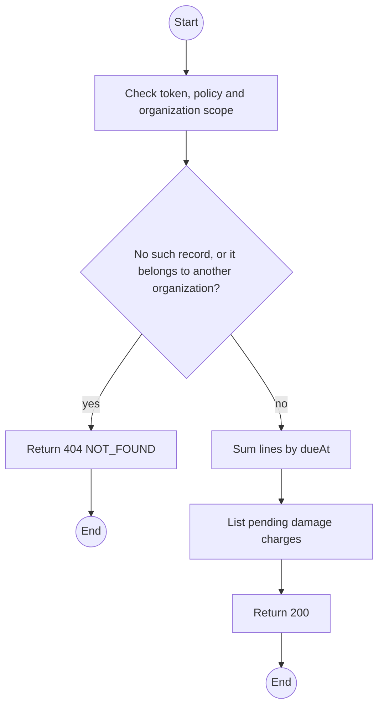
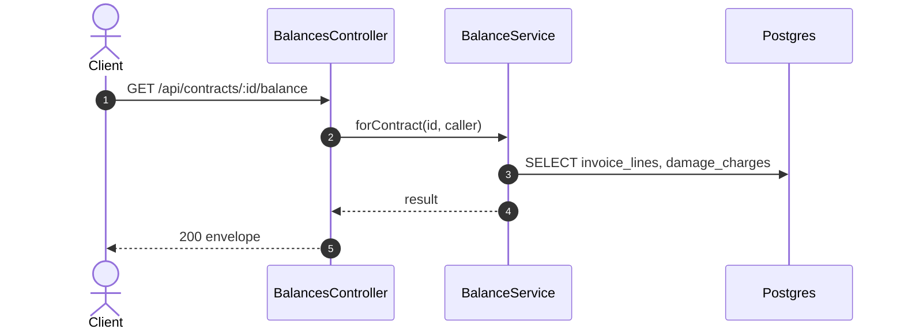

# GET /api/contracts/:id/balance: Contract balance

> Module `billing`. Generated from `scripts/specs/endpoints/billing.py` by `scripts/specs/build_api_design.py`; edit the catalog, not this file. Format: `02-templates/04-api-endpoint-template.md` with Mermaid (D-017). Envelope: D-002.

[TOC]

---
## Overview

Sums every invoice line of the contract into due now, due later and paid, and lists damage charges awaiting approval (UC-45). The closing check uses the same calculation (FR-CON-13).

## API Specification

| API | URL |
| --- | --- |
| GET | /api/contracts/:id/balance |
| Permission | Org Manager: own; TrekLink Staff, TrekLink Admin |
| Traces | UC-45, FR-BILL-06, FR-CON-13 |

### Path parameters

| Field | Description | Data Type | Examples |
| --- | --- | --- | --- |
| id | Contract id | uuid | `c0ffee00-1234-4abc-9def-001122334455` |

## Request sample

No body.

## Response sample

```json
{
  "result": {
    "contractId": "c0ffee00-1234-4abc-9def-001122334455",
    "dueNowVnd": 0,
    "dueLaterVnd": 2250000,
    "paidVnd": 2250000,
    "pendingDamageCharges": [],
    "settled": false
  },
  "isSuccess": true,
  "statusCode": 200,
  "message": "OK"
}
```

## Validation

<table>
    <th>Status code</th>
    <th>Description</th>
    <th>Examples</th>
    <tbody>
        <tr>
            <td>401</td>
            <td>Missing, malformed or expired access token or API key (<code>UNAUTHENTICATED</code>)</td>
<td>

```json
{
  "result": {
    "errorCode": "UNAUTHENTICATED"
  },
  "isSuccess": false,
  "statusCode": 401,
  "message": "Authentication required."
}
```
</td>
        </tr>
        <tr>
            <td>403</td>
            <td>The caller's role, policy or organization does not allow this action (<code>FORBIDDEN</code>)</td>
<td>

```json
{
  "result": {
    "errorCode": "FORBIDDEN"
  },
  "isSuccess": false,
  "statusCode": 403,
  "message": "You do not have access to this."
}
```
</td>
        </tr>
        <tr>
            <td>404</td>
            <td>No such record, or it belongs to another organization (<code>NOT_FOUND</code>)</td>
<td>

```json
{
  "result": {
    "errorCode": "NOT_FOUND"
  },
  "isSuccess": false,
  "statusCode": 404,
  "message": "Contract not found."
}
```
</td>
        </tr>
    </tbody>
</table>

## Activity Diagram



## Sequence Diagram


