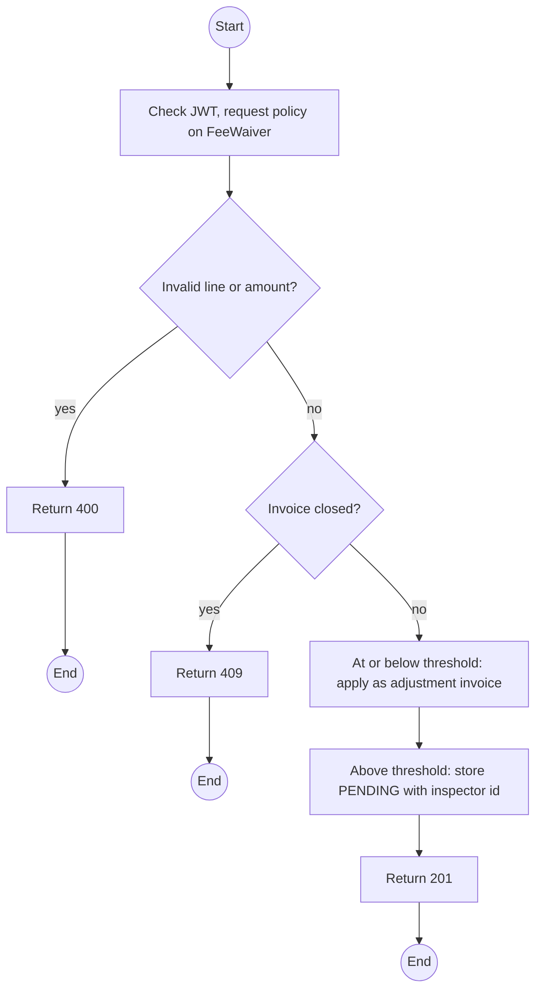
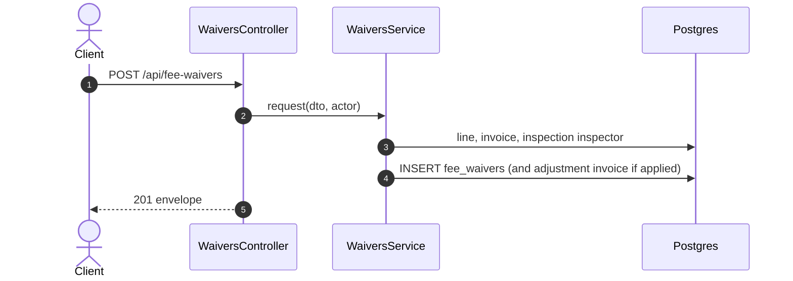

# POST /api/fee-waivers: Request a fee waiver

> Module `billing`. Format: `02-templates/04-api-endpoint-template.md`, with Mermaid in place of PlantUML (D-017). Envelope: D-002.

[TOC]

---
## Overview

Waives all or part of one fee line. At or below `billing.waiverApprovalThreshold` it applies immediately as an adjustment invoice; above it, it waits for approval by a different Operator who also did not inspect the item.

## API Specification

| API        | URL             |
| ---------- | --------------- |
| POST | /api/fee-waivers |
| Permission | Operator |
| Traces | UC-44 (new), FR-BILL-08, BR-21, E05-7, REQ-EVT-11 |

## Request sample

```json
{
  "invoiceLineId": "il-2...",
  "amount": 500000,
  "reason": "Crack traced to a manufacturing defect, not misuse"
}
```

| Field | Description | Data Type | Required | Examples |
| --- | --- | --- | --- | --- |
| invoiceLineId | A fee line: LATE_FEE, DAMAGE_FEE, LOSS_FEE, CANCELLATION_FEE | uuid | yes | `il-2...` |
| amount | Positive, at most the line amount | decimal | yes | `500000` |
| reason | Required | string | yes | `Manufacturing defect` |

## Response sample

```json
{
  "result": {
    "id": "fw-3...",
    "status": "PENDING",
    "amount": 500000,
    "threshold": 200000,
    "approvalRequired": true,
    "excludedApprovers": [
      "op-2... (requester)",
      "op-2... (inspector)"
    ]
  },
  "isSuccess": true,
  "statusCode": 201,
  "message": "Waiver requested"
}
```

## Validation

<table>
    <th>Status code</th>
    <th>Description</th>
    <th>Examples</th>
    <tbody>
        <tr>
            <td>400</td>
            <td>Line not a fee, or amount above the line (<code>WAIVER_EXCEEDS_LINE</code>)</td>
<td>

```json
{
  "result": {
    "errorCode": "WAIVER_EXCEEDS_LINE"
  },
  "isSuccess": false,
  "statusCode": 400,
  "message": "Waiver 800000 exceeds the line amount 700000."
}
```
</td>
        </tr>
        <tr>
            <td>401</td>
            <td>Missing, malformed or expired access token (<code>UNAUTHENTICATED</code>)</td>
<td>

```json
{
  "result": {
    "errorCode": "UNAUTHENTICATED"
  },
  "isSuccess": false,
  "statusCode": 401,
  "message": "Authentication required."
}
```
</td>
        </tr>
        <tr>
            <td>403</td>
            <td>Authenticated, but the caller's role or policy does not allow this action (<code>FORBIDDEN</code>)</td>
<td>

```json
{
  "result": {
    "errorCode": "FORBIDDEN"
  },
  "isSuccess": false,
  "statusCode": 403,
  "message": "You do not have permission to perform this action."
}
```
</td>
        </tr>
        <tr>
            <td>404</td>
            <td>No such line (<code>NOT_FOUND</code>)</td>
<td>

```json
{
  "result": {
    "errorCode": "NOT_FOUND"
  },
  "isSuccess": false,
  "statusCode": 404,
  "message": "Invoice line not found."
}
```
</td>
        </tr>
        <tr>
            <td>409</td>
            <td>Invoice void or settled (<code>INVOICE_NOT_PAYABLE</code>)</td>
<td>

```json
{
  "result": {
    "errorCode": "INVOICE_NOT_PAYABLE"
  },
  "isSuccess": false,
  "statusCode": 409,
  "message": "Waivers cannot be applied to a settled invoice."
}
```
</td>
        </tr>
    </tbody>
</table>

## Activity Diagram



## Sequence Diagram


