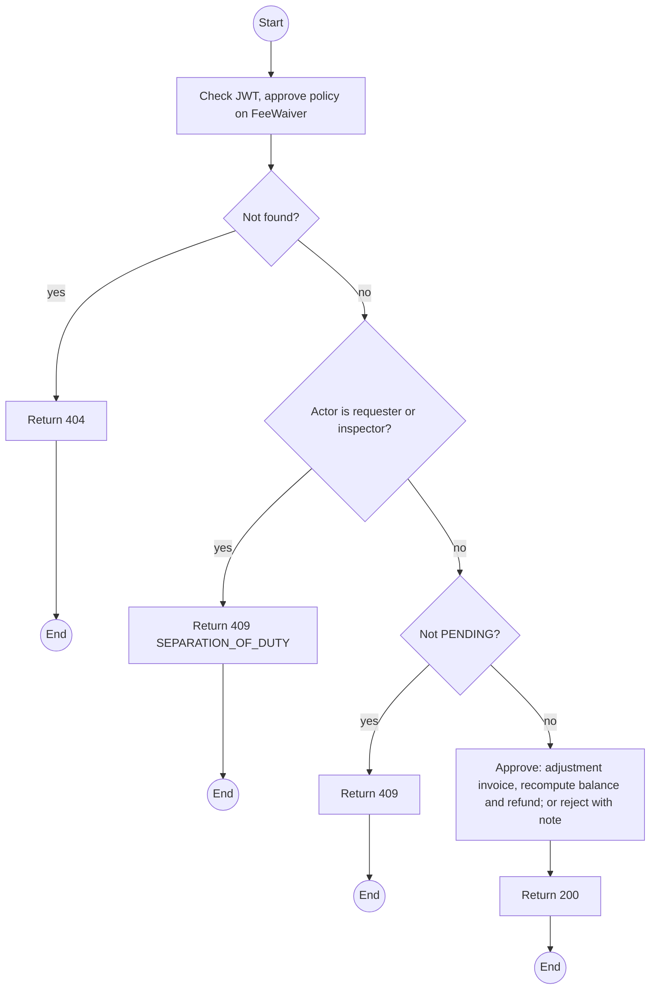
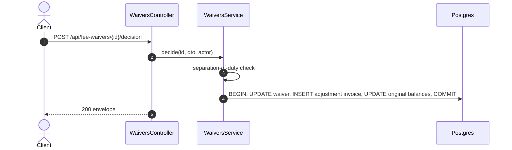

# POST /api/fee-waivers/:id/decision: Approve or reject a waiver

> Module `billing`. Format: `02-templates/04-api-endpoint-template.md`, with Mermaid in place of PlantUML (D-017). Envelope: D-002.

[TOC]

---
## Overview

Decides a pending waiver. Separation of duty: the approver must differ from the requester and from the Staff member who inspected the device. Approval issues an adjustment invoice with a negative `WAIVER` line and recomputes the balance and refund.

## API Specification

| API        | URL             |
| ---------- | --------------- |
| POST | /api/fee-waivers/:id/decision |
| Permission | Operator other than the requester and the inspector |
| Traces | FR-BILL-08, BR-21, E05-7, REQ-ERR-03 |

### Path parameters

| Field | Description | Data Type | Examples |
| --- | --- | --- | --- |
| id | Waiver id | uuid | `fw-3...` |

## Request sample

```json
{
  "decision": "APPROVE",
  "note": "Photos confirm the defect"
}
```

| Field | Description | Data Type | Required | Examples |
| --- | --- | --- | --- | --- |
| decision | APPROVE or REJECT | enum | yes | `APPROVE` |
| note | Required on REJECT | string | no | `Photos confirm` |

## Response sample

```json
{
  "result": {
    "id": "fw-3...",
    "status": "APPROVED",
    "adjustmentInvoice": {
      "id": "inv-41...",
      "number": "INV-2026-000141",
      "total": -500000
    },
    "originalInvoice": {
      "id": "inv-40...",
      "balanceDue": 0,
      "refundDue": 50000
    }
  },
  "isSuccess": true,
  "statusCode": 200,
  "message": "Waiver approved"
}
```

## Validation

<table>
    <th>Status code</th>
    <th>Description</th>
    <th>Examples</th>
    <tbody>
        <tr>
            <td>401</td>
            <td>Missing, malformed or expired access token (<code>UNAUTHENTICATED</code>)</td>
<td>

```json
{
  "result": {
    "errorCode": "UNAUTHENTICATED"
  },
  "isSuccess": false,
  "statusCode": 401,
  "message": "Authentication required."
}
```
</td>
        </tr>
        <tr>
            <td>403</td>
            <td>Authenticated, but the caller's role or policy does not allow this action (<code>FORBIDDEN</code>)</td>
<td>

```json
{
  "result": {
    "errorCode": "FORBIDDEN"
  },
  "isSuccess": false,
  "statusCode": 403,
  "message": "You do not have permission to perform this action."
}
```
</td>
        </tr>
        <tr>
            <td>404</td>
            <td>No such waiver (<code>NOT_FOUND</code>)</td>
<td>

```json
{
  "result": {
    "errorCode": "NOT_FOUND"
  },
  "isSuccess": false,
  "statusCode": 404,
  "message": "Waiver not found."
}
```
</td>
        </tr>
        <tr>
            <td>409</td>
            <td>Approver is the requester or the inspector (<code>SEPARATION_OF_DUTY</code>)</td>
<td>

```json
{
  "result": {
    "errorCode": "SEPARATION_OF_DUTY"
  },
  "isSuccess": false,
  "statusCode": 409,
  "message": "The inspector of this device cannot approve its waiver."
}
```
</td>
        </tr>
        <tr>
            <td>409</td>
            <td>Already decided (<code>INVALID_STATE_TRANSITION</code>)</td>
<td>

```json
{
  "result": {
    "errorCode": "INVALID_STATE_TRANSITION"
  },
  "isSuccess": false,
  "statusCode": 409,
  "message": "This waiver has already been decided."
}
```
</td>
        </tr>
    </tbody>
</table>

## Activity Diagram



## Sequence Diagram


