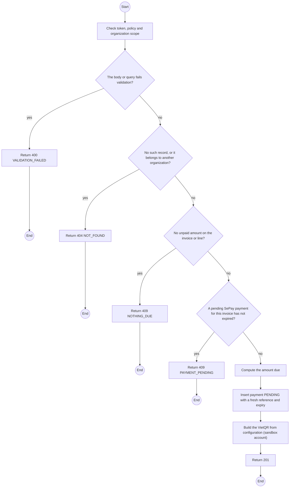
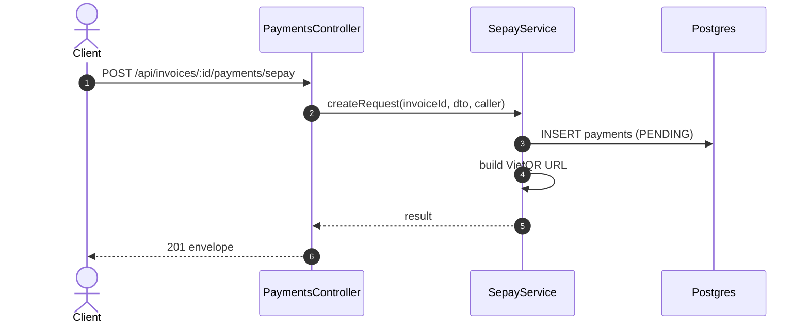

# POST /api/invoices/:id/payments/sepay: Pay online with SePay

> Module `billing`. Generated from `scripts/specs/endpoints/billing.py` by `scripts/specs/build_api_design.py`; edit the catalog, not this file. Format: `02-templates/04-api-endpoint-template.md` with Mermaid (D-017). Envelope: D-002.

[TOC]

---
## Overview

Creates a SePay payment request in the sandbox for the amount due now on the invoice (or a chosen line), with a unique reference, and returns its VietQR. The payment is recorded only when SePay's webhook confirms it (FR-BILL-07, BR-34, NFR-UI-03).

## API Specification

| API | URL |
| --- | --- |
| POST | /api/invoices/:id/payments/sepay |
| Permission | Org Manager: own |
| Traces | UC-19, FR-BILL-07, FR-BILL-09, BR-34, MSG25 |

### Path parameters

| Field | Description | Data Type | Examples |
| --- | --- | --- | --- |
| id | Invoice id; members may use only their own | uuid | `1e2d3c4b-5a69-4788-9a0b-c1d2e3f4a5b6` |

## Request sample

```json
{
  "lineSeq": 2
}
```

| Field | Description | Data Type | Required | Examples |
| --- | --- | --- | --- | --- |
| lineSeq | Pay one line; default every line due now | int | no | `1` |

## Response sample

```json
{
  "result": {
    "id": "p-1",
    "reference": "TL7K2Q9M4D",
    "invoiceId": "1e2d3c4b-5a69-4788-9a0b-c1d2e3f4a5b6",
    "contractId": "c0ffee00-1234-4abc-9def-001122334455",
    "amountVnd": 2250000,
    "method": "SEPAY",
    "status": "PENDING",
    "isSandbox": true,
    "expiresAt": "2026-10-20T03:45:00Z",
    "confirmedAt": null,
    "vietQr": {
      "imageUrl": "https://qr.sepay.vn/img?acc=...&amount=2250000&des=TL7K2Q9M4D",
      "bankAccount": "SANDBOX-0001",
      "content": "TL7K2Q9M4D"
    }
  },
  "isSuccess": true,
  "statusCode": 201,
  "message": "Scan the QR code to pay (sandbox)."
}
```

## Validation

<table>
    <th>Status code</th>
    <th>Description</th>
    <th>Examples</th>
    <tbody>
        <tr>
            <td>400</td>
            <td>The body or query fails validation (<code>VALIDATION_FAILED</code>)</td>
<td>

```json
{
  "result": {
    "errorCode": "VALIDATION_FAILED"
  },
  "isSuccess": false,
  "statusCode": 400,
  "message": "{field} is required."
}
```
</td>
        </tr>
        <tr>
            <td>401</td>
            <td>Missing, malformed or expired access token or API key (<code>UNAUTHENTICATED</code>)</td>
<td>

```json
{
  "result": {
    "errorCode": "UNAUTHENTICATED"
  },
  "isSuccess": false,
  "statusCode": 401,
  "message": "Authentication required."
}
```
</td>
        </tr>
        <tr>
            <td>403</td>
            <td>The caller's role, policy or organization does not allow this action (<code>FORBIDDEN</code>)</td>
<td>

```json
{
  "result": {
    "errorCode": "FORBIDDEN"
  },
  "isSuccess": false,
  "statusCode": 403,
  "message": "You do not have access to this."
}
```
</td>
        </tr>
        <tr>
            <td>404</td>
            <td>No such record, or it belongs to another organization (<code>NOT_FOUND</code>)</td>
<td>

```json
{
  "result": {
    "errorCode": "NOT_FOUND"
  },
  "isSuccess": false,
  "statusCode": 404,
  "message": "Invoice not found."
}
```
</td>
        </tr>
        <tr>
            <td>409</td>
            <td>No unpaid amount on the invoice or line (<code>NOTHING_DUE</code>)</td>
<td>

```json
{
  "result": {
    "errorCode": "NOTHING_DUE"
  },
  "isSuccess": false,
  "statusCode": 409,
  "message": "This invoice has nothing to pay."
}
```
</td>
        </tr>
        <tr>
            <td>409</td>
            <td>A pending SePay payment for this invoice has not expired (<code>PAYMENT_PENDING</code>)</td>
<td>

```json
{
  "result": {
    "errorCode": "PAYMENT_PENDING"
  },
  "isSuccess": false,
  "statusCode": 409,
  "message": "A payment for this invoice is already waiting. Use its QR code."
}
```
</td>
        </tr>
    </tbody>
</table>

## Activity Diagram



## Sequence Diagram


