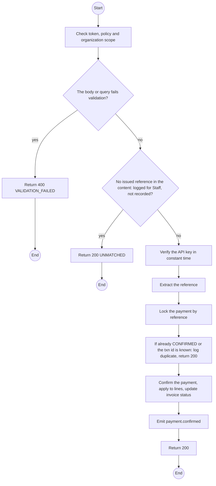
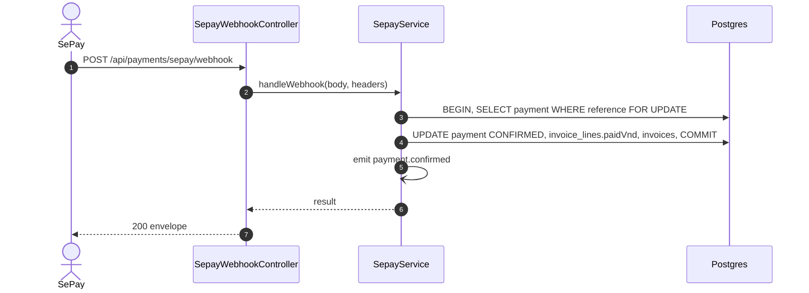

# POST /api/payments/sepay/webhook: SePay confirmation webhook

> Module `billing`. Generated from `scripts/specs/endpoints/billing.py` by `scripts/specs/build_api_design.py`; edit the catalog, not this file. Format: `02-templates/04-api-endpoint-template.md` with Mermaid (D-017). Envelope: D-002.

[TOC]

---
## Overview

Receives SePay's transaction notification. Authenticated by the `Authorization: Apikey ...` header and matched to a reference the system issued (NFR-SEC-07). A repeated transaction id or reference records nothing and logs the duplicate (FR-BILL-08, BR-31, E01-6). The amount is applied to the invoice lines oldest due first, in one transaction.

## API Specification

| API | URL |
| --- | --- |
| POST | /api/payments/sepay/webhook |
| Permission | Public (SePay API key header) |
| Traces | UC-19, FR-BILL-07, FR-BILL-08, BR-31, NFR-SEC-07, E01-6 |
| Notes | Verified against https://docs.sepay.vn/tich-hop-webhooks.html (2026-10-04): SePay sends `Authorization: Apikey <key>`, posts id, gateway, transactionDate, accountNumber, subAccount, code, content, transferType, description, transferAmount, accumulated, referenceCode; it expects HTTP 200 or 201 with the body `{"success": true}` within 30 s and otherwise retries up to 7 times over 5 hours. OPEN (D-038 pending): whether this endpoint answers the bare body, an exception to D-002, or the envelope shown here. |

## Request sample

```json
{
  "id": 92704,
  "gateway": "Sandbox",
  "transactionDate": "2026-10-20 10:20:31",
  "accountNumber": "SANDBOX-0001",
  "subAccount": null,
  "code": null,
  "content": "TL7K2Q9M4D",
  "transferType": "in",
  "description": "TL7K2Q9M4D",
  "transferAmount": 2250000,
  "accumulated": 2250000,
  "referenceCode": "FT26293...."
}
```

| Field | Description | Data Type | Required | Examples |
| --- | --- | --- | --- | --- |
| id | SePay transaction id | int | yes | `92704` |
| transferAmount | Amount received | int | yes | `2250000` |
| content | Transfer content; holds the reference | string | yes | `TL7K2Q9M4D` |
| transferType | `in` | string | yes | `in` |
| transactionDate | SePay time | string | yes | `2026-10-20 10:20:31` |

## Response sample

```json
{
  "result": {
    "success": true
  },
  "isSuccess": true,
  "statusCode": 200,
  "message": "OK"
}
```

## Validation

<table>
    <th>Status code</th>
    <th>Description</th>
    <th>Examples</th>
    <tbody>
        <tr>
            <td>400</td>
            <td>The body or query fails validation (<code>VALIDATION_FAILED</code>)</td>
<td>

```json
{
  "result": {
    "errorCode": "VALIDATION_FAILED"
  },
  "isSuccess": false,
  "statusCode": 400,
  "message": "{field} is required."
}
```
</td>
        </tr>
        <tr>
            <td>401</td>
            <td>Missing, malformed or expired access token or API key (<code>UNAUTHENTICATED</code>)</td>
<td>

```json
{
  "result": {
    "errorCode": "UNAUTHENTICATED"
  },
  "isSuccess": false,
  "statusCode": 401,
  "message": "Authentication required."
}
```
</td>
        </tr>
        <tr>
            <td>403</td>
            <td>The caller's role, policy or organization does not allow this action (<code>FORBIDDEN</code>)</td>
<td>

```json
{
  "result": {
    "errorCode": "FORBIDDEN"
  },
  "isSuccess": false,
  "statusCode": 403,
  "message": "You do not have access to this."
}
```
</td>
        </tr>
        <tr>
            <td>401</td>
            <td>Missing or wrong SePay API key (<code>WEBHOOK_UNAUTHENTICATED</code>)</td>
<td>

```json
{
  "result": {
    "errorCode": "WEBHOOK_UNAUTHENTICATED"
  },
  "isSuccess": false,
  "statusCode": 401,
  "message": "Authentication required."
}
```
</td>
        </tr>
        <tr>
            <td>200</td>
            <td>No issued reference in the content: logged for Staff, not recorded (<code>UNMATCHED</code>)</td>
<td>

```json
{
  "result": {
    "errorCode": "UNMATCHED"
  },
  "isSuccess": false,
  "statusCode": 200,
  "message": "OK"
}
```
</td>
        </tr>
    </tbody>
</table>

## Activity Diagram



## Sequence Diagram


