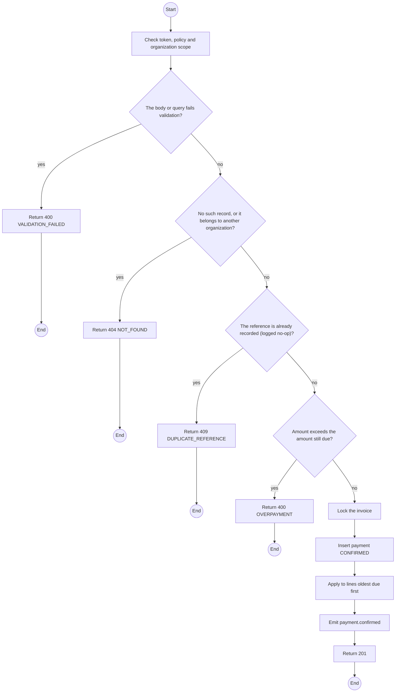
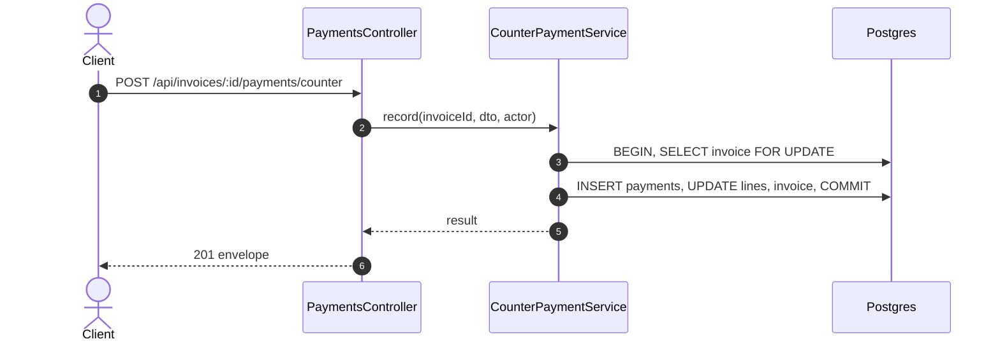

# POST /api/invoices/:id/payments/counter: Record a counter payment

> Module `billing`. Generated from `scripts/specs/endpoints/billing.py` by `scripts/specs/build_api_design.py`; edit the catalog, not this file. Format: `02-templates/04-api-endpoint-template.md` with Mermaid (D-017). Envelope: D-002.

[TOC]

---
## Overview

Records cash or bank transfer received at the counter with the receipt number as reference; a repeated receipt number records nothing (FR-BILL-08). Payments made in the sandbox stay labelled as such.

## API Specification

| API | URL |
| --- | --- |
| POST | /api/invoices/:id/payments/counter |
| Permission | TrekLink Staff, TrekLink Admin |
| Traces | UC-22, FR-BILL-08, BR-31, MSG20 |

### Path parameters

| Field | Description | Data Type | Examples |
| --- | --- | --- | --- |
| id | Invoice id; members may use only their own | uuid | `1e2d3c4b-5a69-4788-9a0b-c1d2e3f4a5b6` |

## Request sample

```json
{
  "method": "CASH",
  "amountVnd": 2250000,
  "reference": "RCPT-2026-0193"
}
```

| Field | Description | Data Type | Required | Examples |
| --- | --- | --- | --- | --- |
| method | `CASH` or `BANK_TRANSFER` | enum | yes | `CASH` |
| amountVnd | Amount received, at most the amount due | int | yes | `2250000` |
| reference | Receipt number or bank reference | string | yes | `RCPT-2026-0193` |

## Response sample

```json
{
  "result": {
    "id": "p-1",
    "reference": "RCPT-2026-0193",
    "invoiceId": "1e2d3c4b-5a69-4788-9a0b-c1d2e3f4a5b6",
    "contractId": "c0ffee00-1234-4abc-9def-001122334455",
    "amountVnd": 2250000,
    "method": "CASH",
    "status": "CONFIRMED",
    "isSandbox": false,
    "expiresAt": "2026-10-20T03:45:00Z",
    "confirmedAt": "2026-10-20T03:15:00.000Z"
  },
  "isSuccess": true,
  "statusCode": 201,
  "message": "Payment of 2,250,000 VND received."
}
```

## Validation

<table>
    <th>Status code</th>
    <th>Description</th>
    <th>Examples</th>
    <tbody>
        <tr>
            <td>400</td>
            <td>The body or query fails validation (<code>VALIDATION_FAILED</code>)</td>
<td>

```json
{
  "result": {
    "errorCode": "VALIDATION_FAILED"
  },
  "isSuccess": false,
  "statusCode": 400,
  "message": "{field} is required."
}
```
</td>
        </tr>
        <tr>
            <td>401</td>
            <td>Missing, malformed or expired access token or API key (<code>UNAUTHENTICATED</code>)</td>
<td>

```json
{
  "result": {
    "errorCode": "UNAUTHENTICATED"
  },
  "isSuccess": false,
  "statusCode": 401,
  "message": "Authentication required."
}
```
</td>
        </tr>
        <tr>
            <td>403</td>
            <td>The caller's role, policy or organization does not allow this action (<code>FORBIDDEN</code>)</td>
<td>

```json
{
  "result": {
    "errorCode": "FORBIDDEN"
  },
  "isSuccess": false,
  "statusCode": 403,
  "message": "You do not have access to this."
}
```
</td>
        </tr>
        <tr>
            <td>404</td>
            <td>No such record, or it belongs to another organization (<code>NOT_FOUND</code>)</td>
<td>

```json
{
  "result": {
    "errorCode": "NOT_FOUND"
  },
  "isSuccess": false,
  "statusCode": 404,
  "message": "Invoice not found."
}
```
</td>
        </tr>
        <tr>
            <td>409</td>
            <td>The reference is already recorded (logged no-op) (<code>DUPLICATE_REFERENCE</code>)</td>
<td>

```json
{
  "result": {
    "errorCode": "DUPLICATE_REFERENCE"
  },
  "isSuccess": false,
  "statusCode": 409,
  "message": "RCPT-2026-0193 is already registered."
}
```
</td>
        </tr>
        <tr>
            <td>400</td>
            <td>Amount exceeds the amount still due (<code>OVERPAYMENT</code>)</td>
<td>

```json
{
  "result": {
    "errorCode": "OVERPAYMENT"
  },
  "isSuccess": false,
  "statusCode": 400,
  "message": "amountVnd must be between 1 and 2250000."
}
```
</td>
        </tr>
    </tbody>
</table>

## Activity Diagram



## Sequence Diagram


