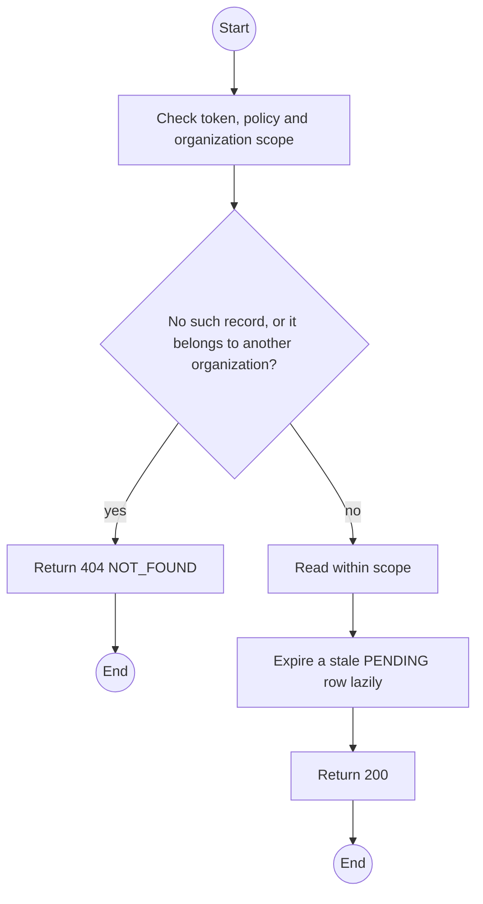
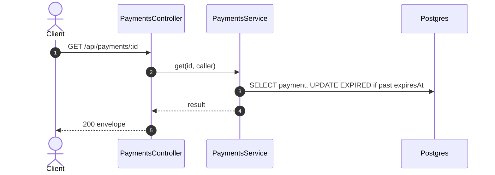

# GET /api/payments/:id: Payment status

> Module `billing`. Generated from `scripts/specs/endpoints/billing.py` by `scripts/specs/build_api_design.py`; edit the catalog, not this file. Format: `02-templates/04-api-endpoint-template.md` with Mermaid (D-017). Envelope: D-002.

[TOC]

---
## Overview

Returns one payment; the payment page polls it while the QR is shown. A `PENDING` payment past its expiry is reported `EXPIRED` and the amount stays due (FR-BILL-09).

## API Specification

| API | URL |
| --- | --- |
| GET | /api/payments/:id |
| Permission | Org Manager: own; TrekLink Staff, TrekLink Admin |
| Traces | UC-19, FR-BILL-09, E05-4 |

### Path parameters

| Field | Description | Data Type | Examples |
| --- | --- | --- | --- |
| id | Payment id | uuid | `p-1` |

## Request sample

No body.

## Response sample

```json
{
  "result": {
    "id": "p-1",
    "reference": "TL7K2Q9M4D",
    "invoiceId": "1e2d3c4b-5a69-4788-9a0b-c1d2e3f4a5b6",
    "contractId": "c0ffee00-1234-4abc-9def-001122334455",
    "amountVnd": 2250000,
    "method": "SEPAY",
    "status": "CONFIRMED",
    "isSandbox": true,
    "expiresAt": "2026-10-20T03:45:00Z",
    "confirmedAt": "2026-10-20T03:15:00.000Z"
  },
  "isSuccess": true,
  "statusCode": 200,
  "message": "OK"
}
```

## Validation

<table>
    <th>Status code</th>
    <th>Description</th>
    <th>Examples</th>
    <tbody>
        <tr>
            <td>401</td>
            <td>Missing, malformed or expired access token or API key (<code>UNAUTHENTICATED</code>)</td>
<td>

```json
{
  "result": {
    "errorCode": "UNAUTHENTICATED"
  },
  "isSuccess": false,
  "statusCode": 401,
  "message": "Authentication required."
}
```
</td>
        </tr>
        <tr>
            <td>403</td>
            <td>The caller's role, policy or organization does not allow this action (<code>FORBIDDEN</code>)</td>
<td>

```json
{
  "result": {
    "errorCode": "FORBIDDEN"
  },
  "isSuccess": false,
  "statusCode": 403,
  "message": "You do not have access to this."
}
```
</td>
        </tr>
        <tr>
            <td>404</td>
            <td>No such record, or it belongs to another organization (<code>NOT_FOUND</code>)</td>
<td>

```json
{
  "result": {
    "errorCode": "NOT_FOUND"
  },
  "isSuccess": false,
  "statusCode": 404,
  "message": "Payment not found."
}
```
</td>
        </tr>
    </tbody>
</table>

## Activity Diagram



## Sequence Diagram


