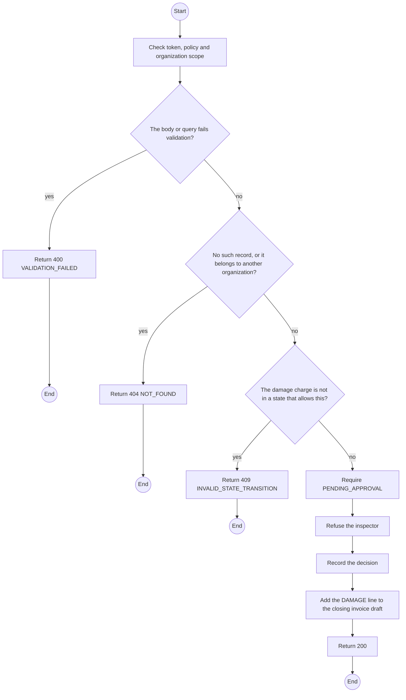
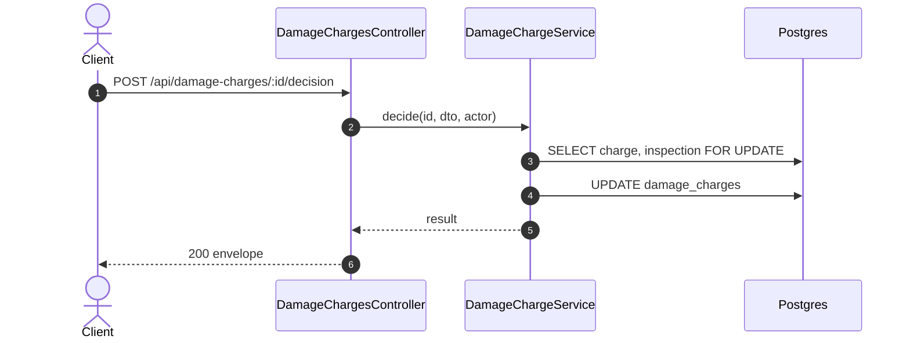

# POST /api/damage-charges/:id/decision: Decide a damage charge

> Module `billing`. Generated from `scripts/specs/endpoints/billing.py` by `scripts/specs/build_api_design.py`; edit the catalog, not this file. Format: `02-templates/04-api-endpoint-template.md` with Mermaid (D-017). Envelope: D-002.

[TOC]

---
## Overview

Approves, reduces or waives a charge above `billing.damageApprovalThresholdVnd`. The approver must not be the inspector (BR-24, E05-6, MSG30). The decided amount becomes a DAMAGE line on the closing invoice.

## API Specification

| API | URL |
| --- | --- |
| POST | /api/damage-charges/:id/decision |
| Permission | TrekLink Admin, never the inspector |
| Traces | UC-48, FR-BILL-04, BR-24, E05-6, MSG30 |

### Path parameters

| Field | Description | Data Type | Examples |
| --- | --- | --- | --- |
| id | Damage charge id | uuid | `dc-1` |

## Request sample

```json
{
  "decision": "REDUCED",
  "finalVnd": 400000,
  "note": "Casing crack predates the rental (intake photo)."
}
```

| Field | Description | Data Type | Required | Examples |
| --- | --- | --- | --- | --- |
| decision | `APPROVED`, `REDUCED` or `WAIVED` | enum | yes | `REDUCED` |
| finalVnd | Required for REDUCED, below the amount | int | cond. | `400000` |
| note | Reason | string | yes | `Pre-existing scratch on intake photo` |

## Response sample

```json
{
  "result": {
    "id": "dc-1",
    "status": "REDUCED",
    "amountVnd": 700000,
    "finalVnd": 400000,
    "decidedAt": "2026-10-20T03:15:00.000Z"
  },
  "isSuccess": true,
  "statusCode": 200,
  "message": "Decision recorded"
}
```

## Validation

<table>
    <th>Status code</th>
    <th>Description</th>
    <th>Examples</th>
    <tbody>
        <tr>
            <td>400</td>
            <td>The body or query fails validation (<code>VALIDATION_FAILED</code>)</td>
<td>

```json
{
  "result": {
    "errorCode": "VALIDATION_FAILED"
  },
  "isSuccess": false,
  "statusCode": 400,
  "message": "{field} is required."
}
```
</td>
        </tr>
        <tr>
            <td>401</td>
            <td>Missing, malformed or expired access token or API key (<code>UNAUTHENTICATED</code>)</td>
<td>

```json
{
  "result": {
    "errorCode": "UNAUTHENTICATED"
  },
  "isSuccess": false,
  "statusCode": 401,
  "message": "Authentication required."
}
```
</td>
        </tr>
        <tr>
            <td>403</td>
            <td>The caller's role, policy or organization does not allow this action (<code>FORBIDDEN</code>)</td>
<td>

```json
{
  "result": {
    "errorCode": "FORBIDDEN"
  },
  "isSuccess": false,
  "statusCode": 403,
  "message": "You do not have access to this."
}
```
</td>
        </tr>
        <tr>
            <td>404</td>
            <td>No such record, or it belongs to another organization (<code>NOT_FOUND</code>)</td>
<td>

```json
{
  "result": {
    "errorCode": "NOT_FOUND"
  },
  "isSuccess": false,
  "statusCode": 404,
  "message": "Damage charge not found."
}
```
</td>
        </tr>
        <tr>
            <td>403</td>
            <td>The caller recorded the inspection (<code>SEPARATION_OF_DUTY</code>)</td>
<td>

```json
{
  "result": {
    "errorCode": "SEPARATION_OF_DUTY"
  },
  "isSuccess": false,
  "statusCode": 403,
  "message": "A different Admin must approve this charge."
}
```
</td>
        </tr>
        <tr>
            <td>409</td>
            <td>The damage charge is not in a state that allows this (<code>INVALID_STATE_TRANSITION</code>)</td>
<td>

```json
{
  "result": {
    "errorCode": "INVALID_STATE_TRANSITION"
  },
  "isSuccess": false,
  "statusCode": 409,
  "message": "This cannot be done while it is APPROVED."
}
```
</td>
        </tr>
    </tbody>
</table>

## Activity Diagram



## Sequence Diagram


