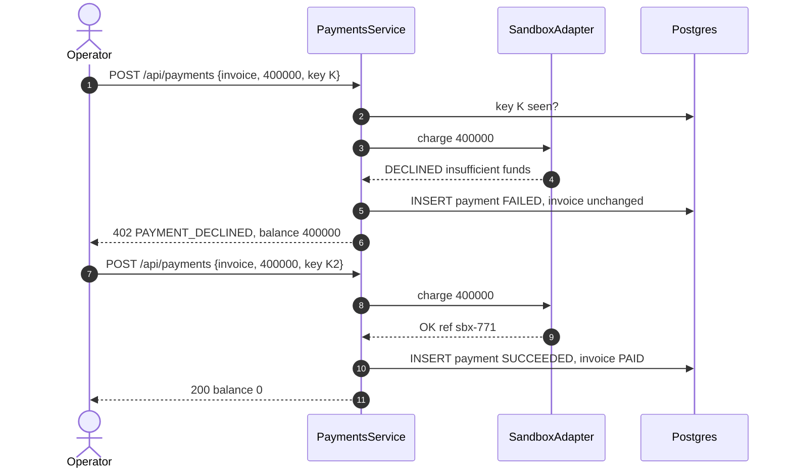

# Technical Design: billing

> Fulfills `requirements.md` in this folder. ERD slice: `specs/platform/design.md` Figure 9.

---

## 1. Domain Model & Data Schema

```prisma
enum PricingScope     { GLOBAL PACKAGE VARIANT PACKAGE_VARIANT }
enum PriceComponent   { TRIP_FEE RENTAL_FEE DEPOSIT }
enum PriceUnit        { PER_TRAVELLER PER_DEVICE_PER_TRIP PER_DEVICE_PER_DAY }
enum InvoiceKind      { BOOKING_ESCROW SETTLEMENT ADJUSTMENT }
enum InvoiceStatus    { ISSUED PARTIALLY_PAID PAID SETTLED VOID }
enum InvoiceLineType  { TRIP_FEE RENTAL_FEE DEPOSIT LATE_FEE DAMAGE_FEE LOSS_FEE DEPOSIT_APPLIED CANCELLATION_FEE WAIVER REFUND_DUE }
enum PaymentDirection { CHARGE REFUND }
enum PaymentStatus    { SUCCEEDED FAILED }
enum WaiverStatus     { APPLIED PENDING APPROVED REJECTED }
enum DamageCondition  { MINOR_DAMAGE MAJOR_DAMAGE MISSING_ACCESSORIES LOST }

model PricingRule {
  id                String         @id @default(uuid())
  name              String
  component         PriceComponent
  scope             PricingScope
  packageId         String?
  hardwareVariantId String?
  channel           String?                       // CUSTOMER, GUIDE, STAFF; null = any [Q63]
  unit              PriceUnit
  amount            Decimal        @db.Decimal(14, 2)
  minQuantity       Int            @default(1)    // quantity tiers, pack discounts [Q61, Q63]
  priority          Int            @default(0)
  validFrom         DateTime
  validTo           DateTime?
  isActive          Boolean        @default(true)
  createdAt         DateTime       @default(now())
  updatedAt         DateTime       @updatedAt
  @@index([component, isActive])
  @@map("pricing_rules")
}

model DamageFeeRule {
  id                String          @id @default(uuid())
  condition         DamageCondition
  hardwareVariantId String?                        // null = any variant
  amount            Decimal         @db.Decimal(14, 2)
  isActive          Boolean         @default(true)
  @@unique([condition, hardwareVariantId])
  @@map("damage_fee_rules")
}

model Invoice {
  id           String        @id @default(uuid())
  number       String        @unique              // INV-2026-000140, from a sequence
  kind         InvoiceKind
  bookingId    String?
  rentalId     String?
  customerId   String?
  billToName   String
  status       InvoiceStatus @default(ISSUED)
  currency     String
  total        Decimal       @db.Decimal(14, 2)   // sum of lines; may be negative before refund
  balanceDue   Decimal       @db.Decimal(14, 2)
  refundDue    Decimal       @db.Decimal(14, 2)
  dueAt        DateTime?
  adjustsInvoiceId String?                        // ADJUSTMENT invoices point at their original
  factsSnapshot Json?                              // settlement facts as received, for audit
  issuedAt     DateTime      @default(now())
  lines        InvoiceLine[]
  payments     Payment[]
  @@index([bookingId])
  @@index([rentalId])
  @@index([customerId, issuedAt])
  @@map("invoices")
}

model InvoiceLine {
  id          String          @id @default(uuid())
  invoiceId   String
  seq         Int
  type        InvoiceLineType
  description String
  quantity    Decimal         @db.Decimal(10, 2)
  unitAmount  Decimal         @db.Decimal(14, 2)
  amount      Decimal         @db.Decimal(14, 2)
  sourceType  String?                             // PRICING_RULE, DAMAGE_FEE_RULE, INSPECTION, LATENESS, PARAMETER
  sourceId    String?
  deviceId    String?
  @@unique([invoiceId, seq])
  @@map("invoice_lines")
}

model Payment {
  id             String           @id @default(uuid())
  invoiceId      String
  direction      PaymentDirection
  amount         Decimal          @db.Decimal(14, 2)
  status         PaymentStatus
  failureReason  String?
  method         String                           // SANDBOX_CARD, SANDBOX_TRANSFER, CASH_RECORDED
  sandbox        Boolean          @default(true)  // REQ-UBI-04
  idempotencyKey String           @unique
  requestHash    String                           // detects key reuse with a different body
  providerRef    String?
  actorId        String?
  createdAt      DateTime         @default(now())
  @@index([invoiceId, createdAt])
  @@map("payments")
}

model FeeWaiver {
  id             String       @id @default(uuid())
  invoiceLineId  String
  amount         Decimal      @db.Decimal(14, 2)
  reason         String
  status         WaiverStatus
  requestedById  String
  inspectorId    String?                          // copied from the inspection, for BR-21
  decidedById    String?
  decisionNote   String?
  adjustmentInvoiceId String?
  createdAt      DateTime     @default(now())
  decidedAt      DateTime?
  @@map("fee_waivers")
}
```

Invoices, lines and payments are append-only after issue (REQ-UBI-05); status and balance columns change only through the payment and waiver services, and every change is audited.

---

## 2. Service / Business Logic Design

### 2.1 Rule selection (REQ-EVT-01)

For a component, candidates are active rules valid at the trip start with `minQuantity ≤ quantity` and matching channel (or null). Rank:

1. specificity: `PACKAGE_VARIANT` > `PACKAGE` > `VARIANT` > `GLOBAL`
2. channel match exact > null
3. highest `minQuantity` (the deepest tier reached, which is how pack discounts work)
4. highest `priority`

A tie after all four is prevented at write time (`PRICING_RULE_CONFLICT`). No candidate raises `PRICE_NOT_CONFIGURED`.

### 2.2 Settlement computation (REQ-EVT-05 to REQ-EVT-08)

```
lines  = []
if !prepaid.rentalFee:  lines += RENTAL_FEE per device (rule selection)
for item in facts.items:
  if item.lost:                  lines += LOSS_FEE(rule LOST, variant)
  else:
    late = item.returnedAt - (facts.dueAt + lateGraceHours)
    if late > 0:                 lines += LATE_FEE(ceil(late / 24h) * lateFeePerDevicePerDay)
    if item.condition != GOOD:   lines += DAMAGE_FEE(rule condition, variant)
fees     = sum(lines)
deposit  = sum(DEPOSIT lines of the paid escrow invoice)   -- 0 when no escrow
lines   += DEPOSIT_APPLIED(-min(deposit, fees))
balance  = max(fees - deposit, 0)
refund   = max(deposit - fees, 0)                           -- never negative (E05-5)
```

Each line carries its source; the description states the reason in words ("Late return, 26 h after due, 2 h grace, 1 day").

### 2.3 Invoice state

| From | To | Trigger |
|---|---|---|
| ISSUED | PARTIALLY_PAID | successful charge below the balance |
| ISSUED, PARTIALLY_PAID | PAID | balance reaches zero and no refund due |
| ISSUED, PAID | SETTLED | refund due paid out, balance zero |
| ISSUED | VOID | escrow cancelled before payment, or hold expired |

`isSettled(invoiceId)` = status `PAID` or `SETTLED`, `balanceDue = 0`, `refundDue = 0`.

### 2.4 Sandbox provider

`PaymentPort` with a `SandboxPaymentAdapter`: synchronous, returns success or a decline reason, fails at `billing.sandboxFailureRate`, and honours an explicit `simulate: "DECLINE"` field so the E05-4 demo is deterministic. A real provider would be a second adapter; none is in scope (charter §8).

### 2.5 Exported surface

`quoteBooking`, `openEscrow`, `refundEscrow`, `cancellationSettlement`, `settleRental`, `isSettled`, `depositsFor`. Emits `payment.succeeded` for escrow invoices.

### 2.6 Error catalogue

| Code | HTTP | Raised when |
|---|---|---|
| `PRICE_NOT_CONFIGURED` | 409 | no rule for a component |
| `PRICING_RULE_CONFLICT` | 409 | equal-rank overlapping rule |
| `AMOUNT_EXCEEDS_DUE` | 400 | overpayment or over-refund |
| `IDEMPOTENCY_KEY_REUSED` | 409 | same key, different body |
| `PAYMENT_DECLINED` | 402 | sandbox decline; payment recorded `FAILED` |
| `INVOICE_NOT_PAYABLE` | 409 | `VOID`, `PAID` or `SETTLED` |
| `SEPARATION_OF_DUTY` | 409 | waiver approver is requester or inspector |
| `WAIVER_EXCEEDS_LINE` | 400 | waiver above the line amount |
| `INSPECTION_REQUIRED` | 409 | settlement facts incomplete |

`402 Payment Required` is used for a decline because the request was valid and the payment did not happen; the envelope still carries `isSuccess: false` and `errorCode`.

---

## 3. Sequence Flow: payment fails part-way (E05-4)

See **Figure 1**.



***Figure 1***: A failed charge writes a `FAILED` payment and nothing else; the balance stays visible and the rental stays open until a charge succeeds (E05-4, BR-19).

---

## 4. API Endpoints in this module

| # | Method | Route | Permission | Spec |
|---|---|---|---|---|
| 01 | GET | `/api/pricing-rules` | Admin, Operator | `api-design/01-get-pricing-rules-list.md` |
| 02 | POST | `/api/pricing-rules` | Admin | `api-design/02-post-pricing-rules-create.md` |
| 03 | PATCH | `/api/pricing-rules/:id` | Admin | `api-design/03-patch-pricing-rules-update.md` |
| 04 | GET | `/api/damage-fee-rules` | Admin, Operator | `api-design/04-get-damage-fee-rules.md` |
| 05 | PUT | `/api/damage-fee-rules` | Admin | `api-design/05-put-damage-fee-rules.md` |
| 06 | POST | `/api/quotes` | Public (published trips); all roles | `api-design/06-post-quotes.md` |
| 07 | GET | `/api/invoices` | Operator, Admin; Customer (own) | `api-design/07-get-invoices-list.md` |
| 08 | GET | `/api/invoices/:id` | Operator, Admin; Customer (own) | `api-design/08-get-invoices-detail.md` |
| 09 | POST | `/api/payments` | Customer (own invoice, charge); Operator (charge, refund) | `api-design/09-post-payments.md` |
| 10 | POST | `/api/fee-waivers` | Operator | `api-design/10-post-fee-waivers.md` |
| 11 | POST | `/api/fee-waivers/:id/decision` | Operator (not requester, not inspector) | `api-design/11-post-fee-waivers-decision.md` |

---

## 5. Frontend impact

- Admin: `pages/PricingPage` (rules table with scope and tier, damage schedule editor).
- Customer: quote in the booking wizard; `pages/MyInvoicesPage`; sandbox pay dialog with an explicit "Sandbox, no real money" label.
- Operator: settlement panel on the rental detail page, waiver request and approval, refund payout.
