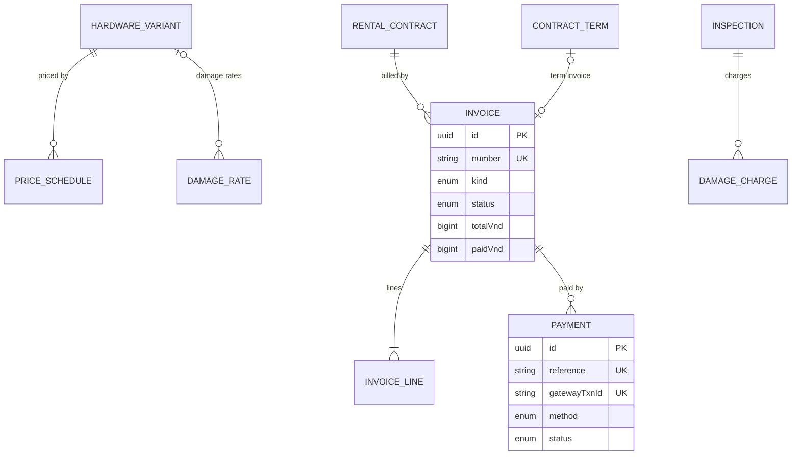
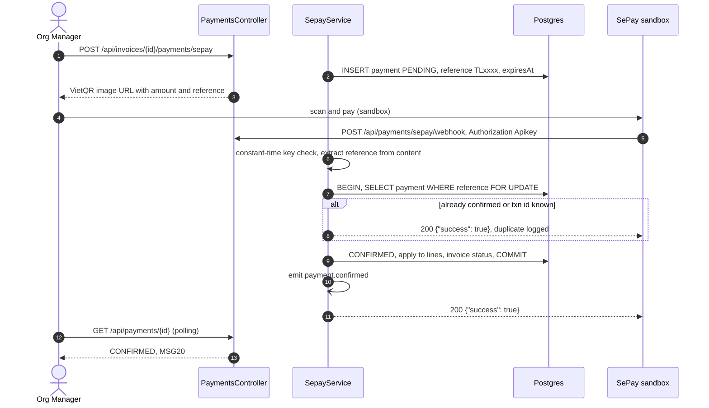

# Technical Design: billing

> Fulfills `requirements.md` in this folder. Schema: the `// @module billing` block of
> `backend/prisma/schema.prisma` is authoritative.

---

## 1. Data model

```mermaid
erDiagram
    HARDWARE_VARIANT ||--o{ PRICE_SCHEDULE : "priced by"
    HARDWARE_VARIANT |o--o{ DAMAGE_RATE : "damage rates"
    RENTAL_CONTRACT ||--o{ INVOICE : "billed by"
    CONTRACT_TERM |o--o| INVOICE : "term invoice"
    INVOICE ||--|{ INVOICE_LINE : "lines"
    INVOICE ||--o{ PAYMENT : "paid by"
    INSPECTION ||--o{ DAMAGE_CHARGE : "charges"
    INVOICE {
        uuid id PK
        string number UK
        enum kind
        enum status
        bigint totalVnd
        bigint paidVnd
    }
    PAYMENT {
        uuid id PK
        string reference UK
        string gatewayTxnId UK
        enum method
        enum status
    }
```

***Figure 1***: billing slice.

Invoice kinds: `TERM` (monthly, two dated lines), `DAY_PLAN` (one line), `CLOSING` (late, damage, loss,
adjustments; created on the first such charge of a contract and kept open for more lines until the
contract closes). A closing invoice is the one exception to "issued once": lines are appended while the
contract is not `CLOSED`, never changed (REQ-UBI-02).

---

## 2. Calculations

| Charge | Formula | Due |
|---|---|---|
| Holding fee | ⌈ratio × P × q⌉ | term start |
| Term balance | P × q − holding fee | term end |
| Day plan | ⌈P ÷ 30 × premium × days × q⌉ | start date (paid by the handover) |
| Late | `lateFeePerDevicePerDayVnd` × ⌈(checkedInAt − returnDueAt) ÷ 1 day⌉, only if past the grace | at check-in |
| Damage | Σ rate(code) for the device's variant, generic rate as fallback | when decided, or at once below the threshold |
| Loss | `devices.valueAt(device, lostAt)` | at loss |

`P` is the contract's `monthlyUnitPriceVnd` snapshot; `ratio` and `premium` are the snapshot too.

---

## 3. SePay sandbox flow

```mermaid
sequenceDiagram
    autonumber
    actor M as Org Manager
    participant API as PaymentsController
    participant S as SepayService
    participant DB as Postgres
    participant SP as SePay sandbox
    M->>API: POST /api/invoices/{id}/payments/sepay
    S->>DB: INSERT payment PENDING, reference TLxxxx, expiresAt
    API-->>M: VietQR image URL with amount and reference
    M->>SP: scan and pay (sandbox)
    SP->>API: POST /api/payments/sepay/webhook, Authorization Apikey
    S->>S: constant-time key check, extract reference from content
    S->>DB: BEGIN, SELECT payment WHERE reference FOR UPDATE
    alt already confirmed or txn id known
        S-->>SP: 200 {"success": true}, duplicate logged
    end
    S->>DB: CONFIRMED, apply to lines, invoice status, COMMIT
    S-)S: emit payment.confirmed
    S-->>SP: 200 {"success": true}
    M->>API: GET /api/payments/{id} (polling)
    API-->>M: CONFIRMED, MSG20
```

***Figure 2***: SePay flow. Facts verified on 2026-10-04 at https://docs.sepay.vn/tich-hop-webhooks.html:
the `Authorization: Apikey <key>` header, the payload fields, the required `{"success": true}` body and
the retry policy (7 retries over 5 hours). The VietQR image URL format (`qr.sepay.vn/img?acc=&bank=&amount=&des=`)
is configuration (`SEPAY_QR_BASE_URL`) and is checked against SePay's sandbox in task 3.2 (unverified).

The reference is `TL` plus 8 Crockford base32 characters, so it survives banks that strip punctuation
from transfer content. The webhook's `transferAmount` must equal the payment amount; a different amount
is recorded as a separate `CONFIRMED` payment of the received amount against the same invoice and logged
for Staff, rather than rejected, because the money has moved.

---

## 4. Services and ports

| Export | Used by |
|---|---|
| `PricingService.snapshot(variantId)` | rentals |
| `InvoicesService.issueTermInvoice(contract, term, tx)`, `issueDayPlanInvoice(contract, tx)` | rentals |
| `ChargesService.chargeLate(contract, device, checkedInAt, tx)`, `chargeDamage(contract, inspection, tx)`, `chargeLoss(contract, device, lostAt, tx)` | rentals |
| `ChargesService.settleCancellation(contract, tx)` | rentals |
| `BalanceService.firstPaymentConfirmed(contractId)`, `outstanding(contractId)`, `balanceSummary(contractId)` | rentals |
| `BalanceService.revenue(range)` | monitoring |
| provider of `ORGANIZATION_EXIT_CHECKS.canReactivate` | organizations |

Events emitted: `payment.confirmed`, `audit.record`.

---

## 5. Scheduler jobs

| Job | Rule |
|---|---|
| `billing.expirePayments` | `PENDING` past `expiresAt` to `EXPIRED` |

---

## 6. Error catalogue

| Code | HTTP |
|---|---|
| `BELOW_MOQ` | 400 (quote) |
| `EFFECTIVE_IN_PAST` | 400 |
| `NOTHING_DUE` | 409 |
| `PAYMENT_PENDING` | 409 |
| `WEBHOOK_UNAUTHENTICATED` | 401 |
| `DUPLICATE_REFERENCE` | 409 |
| `OVERPAYMENT` | 400 |
| `SEPARATION_OF_DUTY` | 403 |

---

## 7. Testing strategy

Formula tests from the acceptance criteria; rounding at boundaries; webhook replay ×10; amount mismatch;
expiry; separation of duty; adjustment lines never mutating issued lines; concurrent counter payments on
one invoice.
