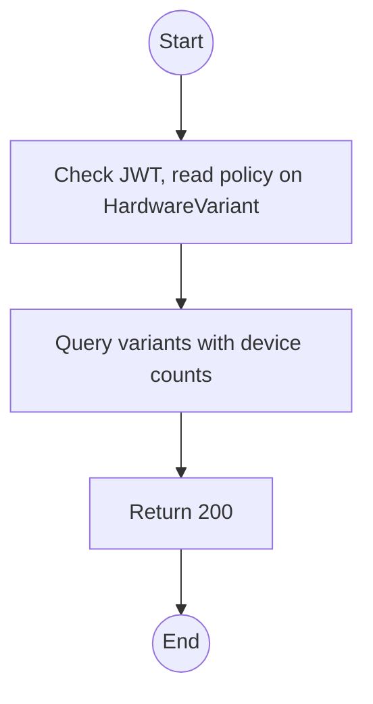
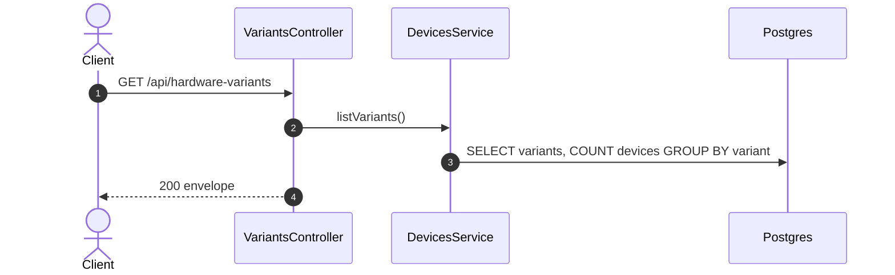

# GET /api/hardware-variants: List hardware variants

> Module `devices`. Format: `02-templates/04-api-endpoint-template.md`, with Mermaid in place of PlantUML (D-017). Envelope: D-002.

[TOC]

---
## Overview

Lists the hardware-variant catalogue with capability flags and device counts. Used by device registration, trip variant restrictions (Q50) and the fleet filters.

## API Specification

| API        | URL             |
| ---------- | --------------- |
| GET | /api/hardware-variants |
| Permission | Admin, Operator, Guide |
| Traces | US-011, UC-29 (new), FR-DEV-02 (new) |

### Query parameters

| Field | Description | Data Type | Required | Examples |
| --- | --- | --- | --- | --- |
| includeInactive | Include deactivated variants | bool | no | `false` |

## Request sample

No request body. Query string example:

```
GET /api/hardware-variants
```

## Response sample

```json
{
  "result": [
    {
      "id": "hv-03...",
      "code": "treklink-v3",
      "name": "TrekLink v3 T-Beam",
      "mqttCapable": true,
      "hasPsram": false,
      "isActive": true,
      "deviceCount": 14
    },
    {
      "id": "hv-01...",
      "code": "treklink-v1",
      "name": "TrekLink v1",
      "mqttCapable": false,
      "hasPsram": false,
      "isActive": true,
      "deviceCount": 3
    }
  ],
  "isSuccess": true,
  "statusCode": 200,
  "message": "Hardware variants retrieved"
}
```

## Validation

<table>
    <th>Status code</th>
    <th>Description</th>
    <th>Examples</th>
    <tbody>
        <tr>
            <td>401</td>
            <td>Missing, malformed or expired access token (<code>UNAUTHENTICATED</code>)</td>
<td>

```json
{
  "result": {
    "errorCode": "UNAUTHENTICATED"
  },
  "isSuccess": false,
  "statusCode": 401,
  "message": "Authentication required."
}
```
</td>
        </tr>
        <tr>
            <td>403</td>
            <td>Authenticated, but the caller's role or policy does not allow this action (<code>FORBIDDEN</code>)</td>
<td>

```json
{
  "result": {
    "errorCode": "FORBIDDEN"
  },
  "isSuccess": false,
  "statusCode": 403,
  "message": "You do not have permission to perform this action."
}
```
</td>
        </tr>
    </tbody>
</table>

## Activity Diagram



## Sequence Diagram


