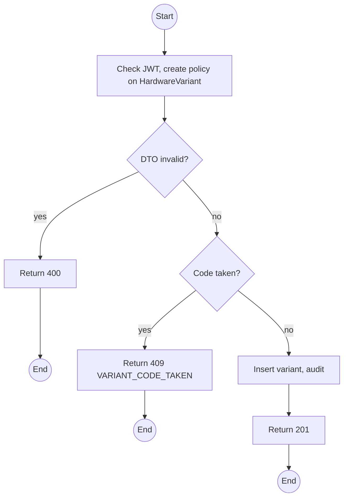
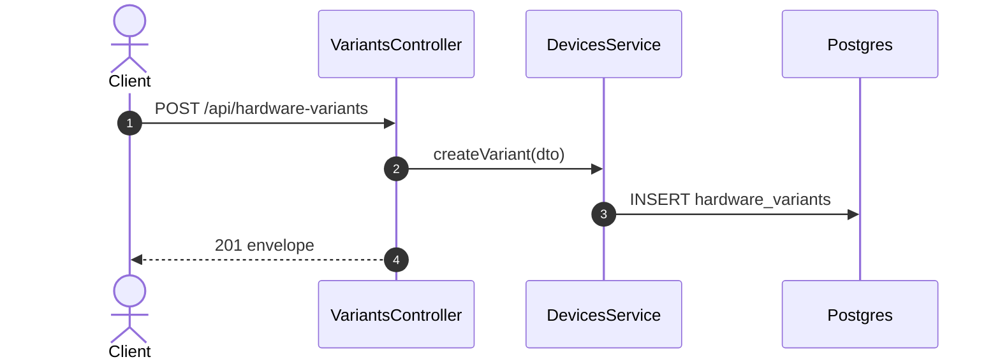

# POST /api/hardware-variants: Add a hardware variant

> Module `devices`. Format: `02-templates/04-api-endpoint-template.md`, with Mermaid in place of PlantUML (D-017). Envelope: D-002.

[TOC]

---
## Overview

Adds a variant to the catalogue. The four known variants are seeded; this exists for a future board revision.

## API Specification

| API        | URL             |
| ---------- | --------------- |
| POST | /api/hardware-variants |
| Permission | Admin |
| Traces | US-011, UC-29 (new), FR-DEV-02 |

## Request sample

```json
{
  "code": "treklink-v5",
  "name": "TrekLink v5 prototype",
  "mqttCapable": true,
  "hasPsram": true,
  "notes": "ESP32-S3, 16 MB flash"
}
```

| Field | Description | Data Type | Required | Examples |
| --- | --- | --- | --- | --- |
| code | Lower-case, unique, `treklink-` prefix | string | yes | `treklink-v5` |
| name | Display name | string | yes | `TrekLink v5 prototype` |
| mqttCapable | Whether the firmware image compiles MQTT in | bool | yes | `true` |
| hasPsram | Board carries PSRAM | bool | yes | `true` |
| notes | Free text | string | no | `ESP32-S3` |

## Response sample

```json
{
  "result": {
    "id": "hv-05...",
    "code": "treklink-v5",
    "name": "TrekLink v5 prototype",
    "mqttCapable": true,
    "hasPsram": true,
    "isActive": true,
    "deviceCount": 0
  },
  "isSuccess": true,
  "statusCode": 201,
  "message": "Hardware variant created"
}
```

## Validation

<table>
    <th>Status code</th>
    <th>Description</th>
    <th>Examples</th>
    <tbody>
        <tr>
            <td>400</td>
            <td>Field validation failed (<code>VALIDATION_FAILED</code>)</td>
<td>

```json
{
  "result": {
    "errorCode": "VALIDATION_FAILED"
  },
  "isSuccess": false,
  "statusCode": 400,
  "message": "code must match ^treklink-[a-z0-9-]+$."
}
```
</td>
        </tr>
        <tr>
            <td>401</td>
            <td>Missing, malformed or expired access token (<code>UNAUTHENTICATED</code>)</td>
<td>

```json
{
  "result": {
    "errorCode": "UNAUTHENTICATED"
  },
  "isSuccess": false,
  "statusCode": 401,
  "message": "Authentication required."
}
```
</td>
        </tr>
        <tr>
            <td>403</td>
            <td>Authenticated, but the caller's role or policy does not allow this action (<code>FORBIDDEN</code>)</td>
<td>

```json
{
  "result": {
    "errorCode": "FORBIDDEN"
  },
  "isSuccess": false,
  "statusCode": 403,
  "message": "You do not have permission to perform this action."
}
```
</td>
        </tr>
        <tr>
            <td>409</td>
            <td>Code already used (<code>VARIANT_CODE_TAKEN</code>)</td>
<td>

```json
{
  "result": {
    "errorCode": "VARIANT_CODE_TAKEN"
  },
  "isSuccess": false,
  "statusCode": 409,
  "message": "A variant with this code already exists."
}
```
</td>
        </tr>
    </tbody>
</table>

## Activity Diagram



## Sequence Diagram


