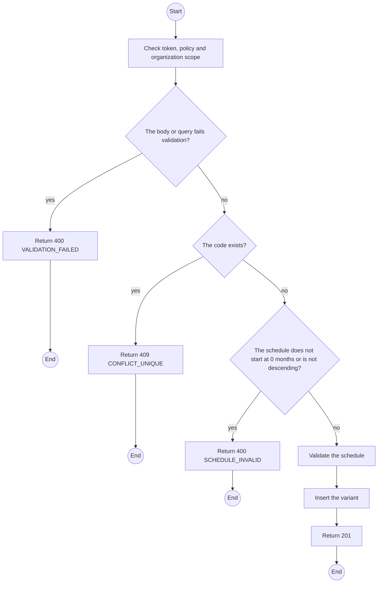
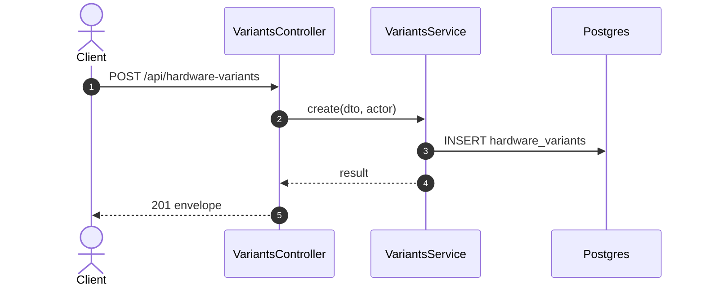

# POST /api/hardware-variants: Create a hardware variant

> Module `devices`. Generated from `scripts/specs/endpoints/devices.py` by `scripts/specs/build_api_design.py`; edit the catalog, not this file. Format: `02-templates/04-api-endpoint-template.md` with Mermaid (D-017). Envelope: D-002.

[TOC]

---
## Overview

Adds a device model with its sensors, firmware baseline and remaining-value schedule (FR-DEV-04).

## API Specification

| API | URL |
| --- | --- |
| POST | /api/hardware-variants |
| Permission | TrekLink Admin |
| Traces | UC-13, FR-DEV-04, FR-BILL-05 |

## Request sample

```json
{
  "hasGps": true,
  "hasMotionSensor": false,
  "mqttCapable": true,
  "remainingValueSchedule": [
    {
      "fromMonths": 0,
      "valueVnd": 2500000
    },
    {
      "fromMonths": 12,
      "valueVnd": 1800000
    },
    {
      "fromMonths": 24,
      "valueVnd": 1200000
    }
  ],
  "code": "treklink-v4",
  "name": "TrekLink v4 (GPS, SOS, fall detection)",
  "firmwareBaseline": "2.7.19-treklink.4"
}
```

| Field | Description | Data Type | Required | Examples |
| --- | --- | --- | --- | --- |
| code | Stable code | string | yes | `treklink-v4` |
| name | Display name | string | yes | `TrekLink v4` |
| hasGps | Has a GPS receiver | bool | yes | `true` |
| hasMotionSensor | Has an IMU; adds the motion row to the intake check | bool | yes | `true` |
| mqttCapable | False for builds with MQTT compiled out (v1) | bool | yes | `true` |
| firmwareBaseline | Firmware the variant ships with | string | yes | `2.7.19-treklink.4` |
| remainingValueSchedule | Descending value by age in months; first row fromMonths 0 | json | yes | see sample |

## Response sample

```json
{
  "result": {
    "id": "a1b2c3d4-e5f6-4a7b-8c9d-0e1f2a3b4c5d",
    "code": "treklink-v4",
    "name": "TrekLink v3 (GPS, SOS button)",
    "hasGps": true,
    "hasMotionSensor": false,
    "mqttCapable": true,
    "firmwareBaseline": "2.7.19-treklink.3",
    "remainingValueSchedule": [
      {
        "fromMonths": 0,
        "valueVnd": 2500000
      },
      {
        "fromMonths": 12,
        "valueVnd": 1800000
      },
      {
        "fromMonths": 24,
        "valueVnd": 1200000
      }
    ],
    "isActive": true,
    "deviceCount": 0
  },
  "isSuccess": true,
  "statusCode": 201,
  "message": "Saved."
}
```

## Validation

<table>
    <th>Status code</th>
    <th>Description</th>
    <th>Examples</th>
    <tbody>
        <tr>
            <td>400</td>
            <td>The body or query fails validation (<code>VALIDATION_FAILED</code>)</td>
<td>

```json
{
  "result": {
    "errorCode": "VALIDATION_FAILED"
  },
  "isSuccess": false,
  "statusCode": 400,
  "message": "{field} is required."
}
```
</td>
        </tr>
        <tr>
            <td>401</td>
            <td>Missing, malformed or expired access token or API key (<code>UNAUTHENTICATED</code>)</td>
<td>

```json
{
  "result": {
    "errorCode": "UNAUTHENTICATED"
  },
  "isSuccess": false,
  "statusCode": 401,
  "message": "Authentication required."
}
```
</td>
        </tr>
        <tr>
            <td>403</td>
            <td>The caller's role, policy or organization does not allow this action (<code>FORBIDDEN</code>)</td>
<td>

```json
{
  "result": {
    "errorCode": "FORBIDDEN"
  },
  "isSuccess": false,
  "statusCode": 403,
  "message": "You do not have access to this."
}
```
</td>
        </tr>
        <tr>
            <td>409</td>
            <td>The code exists (<code>CONFLICT_UNIQUE</code>)</td>
<td>

```json
{
  "result": {
    "errorCode": "CONFLICT_UNIQUE"
  },
  "isSuccess": false,
  "statusCode": 409,
  "message": "treklink-v4 is already registered."
}
```
</td>
        </tr>
        <tr>
            <td>400</td>
            <td>The schedule does not start at 0 months or is not descending (<code>SCHEDULE_INVALID</code>)</td>
<td>

```json
{
  "result": {
    "errorCode": "SCHEDULE_INVALID"
  },
  "isSuccess": false,
  "statusCode": 400,
  "message": "remainingValueSchedule must start at 0 months and never increase."
}
```
</td>
        </tr>
    </tbody>
</table>

## Activity Diagram



## Sequence Diagram


