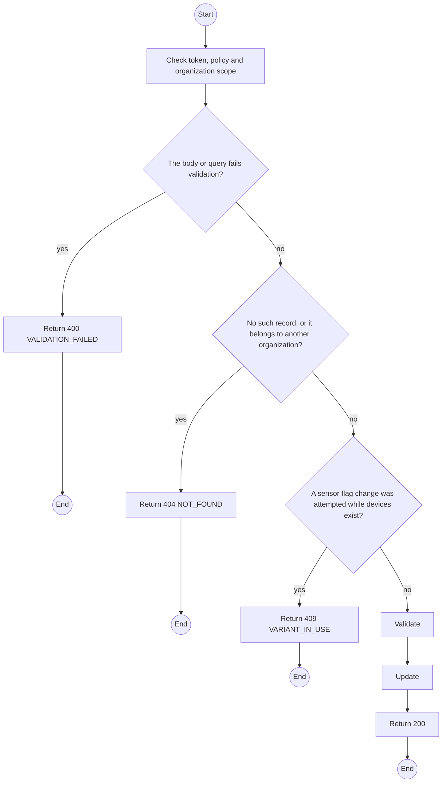
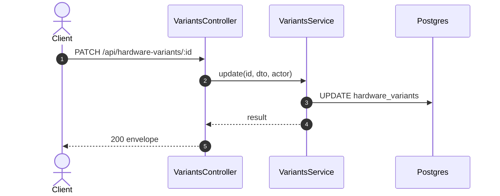

# PATCH /api/hardware-variants/:id: Edit a hardware variant

> Module `devices`. Generated from `scripts/specs/endpoints/devices.py` by `scripts/specs/build_api_design.py`; edit the catalog, not this file. Format: `02-templates/04-api-endpoint-template.md` with Mermaid (D-017). Envelope: D-002.

[TOC]

---
## Overview

Edits a variant's name, baseline, schedule or active flag. Sensor flags are fixed once devices exist, because past intake checks depend on them.

## API Specification

| API | URL |
| --- | --- |
| PATCH | /api/hardware-variants/:id |
| Permission | TrekLink Admin |
| Traces | UC-13, FR-DEV-04 |

### Path parameters

| Field | Description | Data Type | Examples |
| --- | --- | --- | --- |
| id | Variant id | uuid | `a1b2c3d4-e5f6-4a7b-8c9d-0e1f2a3b4c5d` |

## Request sample

```json
{
  "isActive": false
}
```

| Field | Description | Data Type | Required | Examples |
| --- | --- | --- | --- | --- |
| name | Name | string | no | `...` |
| firmwareBaseline | Baseline | string | no | `...` |
| remainingValueSchedule | Schedule | json | no | `[...]` |
| isActive | Offer in new requests | bool | no | `false` |

## Response sample

```json
{
  "result": {
    "id": "a1b2c3d4-e5f6-4a7b-8c9d-0e1f2a3b4c5d",
    "code": "treklink-v3",
    "name": "TrekLink v3 (GPS, SOS button)",
    "hasGps": true,
    "hasMotionSensor": false,
    "mqttCapable": true,
    "firmwareBaseline": "2.7.19-treklink.3",
    "remainingValueSchedule": [
      {
        "fromMonths": 0,
        "valueVnd": 2500000
      },
      {
        "fromMonths": 12,
        "valueVnd": 1800000
      },
      {
        "fromMonths": 24,
        "valueVnd": 1200000
      }
    ],
    "isActive": false,
    "deviceCount": 18
  },
  "isSuccess": true,
  "statusCode": 200,
  "message": "Saved."
}
```

## Validation

<table>
    <th>Status code</th>
    <th>Description</th>
    <th>Examples</th>
    <tbody>
        <tr>
            <td>400</td>
            <td>The body or query fails validation (<code>VALIDATION_FAILED</code>)</td>
<td>

```json
{
  "result": {
    "errorCode": "VALIDATION_FAILED"
  },
  "isSuccess": false,
  "statusCode": 400,
  "message": "{field} is required."
}
```
</td>
        </tr>
        <tr>
            <td>401</td>
            <td>Missing, malformed or expired access token or API key (<code>UNAUTHENTICATED</code>)</td>
<td>

```json
{
  "result": {
    "errorCode": "UNAUTHENTICATED"
  },
  "isSuccess": false,
  "statusCode": 401,
  "message": "Authentication required."
}
```
</td>
        </tr>
        <tr>
            <td>403</td>
            <td>The caller's role, policy or organization does not allow this action (<code>FORBIDDEN</code>)</td>
<td>

```json
{
  "result": {
    "errorCode": "FORBIDDEN"
  },
  "isSuccess": false,
  "statusCode": 403,
  "message": "You do not have access to this."
}
```
</td>
        </tr>
        <tr>
            <td>404</td>
            <td>No such record, or it belongs to another organization (<code>NOT_FOUND</code>)</td>
<td>

```json
{
  "result": {
    "errorCode": "NOT_FOUND"
  },
  "isSuccess": false,
  "statusCode": 404,
  "message": "Hardware variant not found."
}
```
</td>
        </tr>
        <tr>
            <td>409</td>
            <td>A sensor flag change was attempted while devices exist (<code>VARIANT_IN_USE</code>)</td>
<td>

```json
{
  "result": {
    "errorCode": "VARIANT_IN_USE"
  },
  "isSuccess": false,
  "statusCode": 409,
  "message": "Sensor flags cannot change once devices are registered."
}
```
</td>
        </tr>
    </tbody>
</table>

## Activity Diagram



## Sequence Diagram


