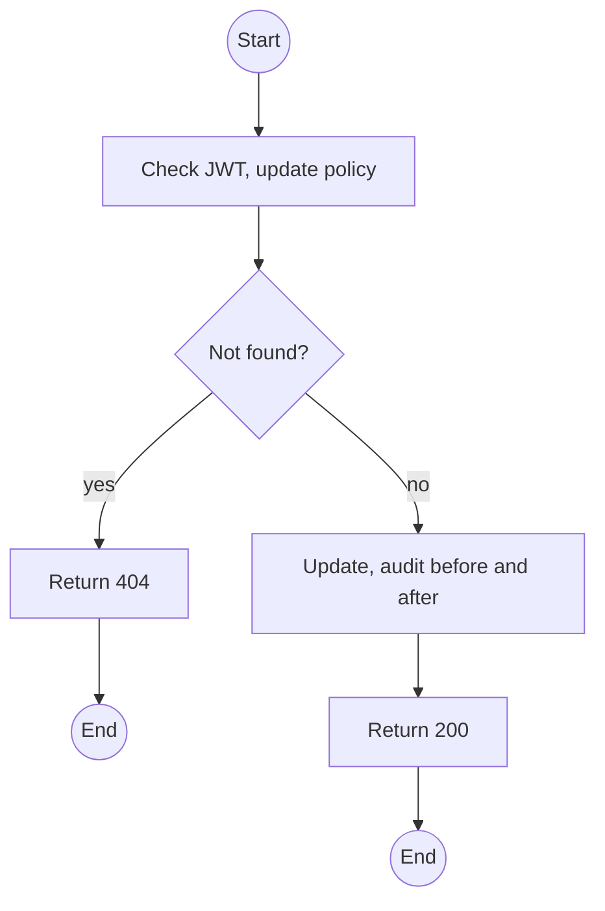
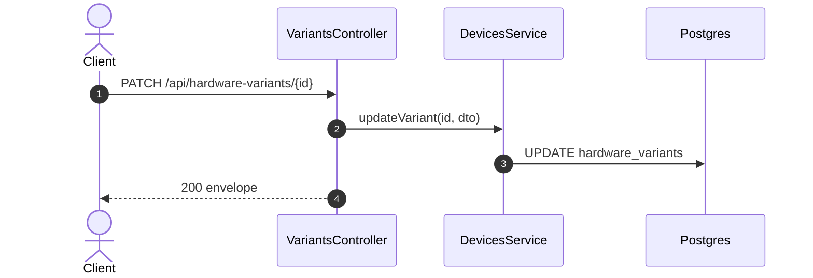

# PATCH /api/hardware-variants/:id: Update or deactivate a variant

> Module `devices`. Format: `02-templates/04-api-endpoint-template.md`, with Mermaid in place of PlantUML (D-017). Envelope: D-002.

[TOC]

---
## Overview

Edits name, flags or notes, or deactivates a variant. Deactivation blocks new registrations of that variant; existing devices keep working.

## API Specification

| API        | URL             |
| ---------- | --------------- |
| PATCH | /api/hardware-variants/:id |
| Permission | Admin |
| Traces | US-011, REQ-ERR-05 |

### Path parameters

| Field | Description | Data Type | Examples |
| --- | --- | --- | --- |
| id | Variant id | uuid | `hv-01...` |

## Request sample

```json
{
  "isActive": false,
  "notes": "No longer stocked"
}
```

| Field | Description | Data Type | Required | Examples |
| --- | --- | --- | --- | --- |
| name | Display name | string | no | `TrekLink v1` |
| mqttCapable | Capability flag | bool | no | `false` |
| hasPsram | Capability flag | bool | no | `false` |
| isActive | Deactivate or reactivate | bool | no | `false` |
| notes | Free text | string | no | `No longer stocked` |

## Response sample

```json
{
  "result": {
    "id": "hv-01...",
    "code": "treklink-v1",
    "name": "TrekLink v3 T-Beam",
    "mqttCapable": true,
    "hasPsram": false,
    "isActive": false,
    "deviceCount": 14
  },
  "isSuccess": true,
  "statusCode": 200,
  "message": "Hardware variant updated"
}
```

## Validation

<table>
    <th>Status code</th>
    <th>Description</th>
    <th>Examples</th>
    <tbody>
        <tr>
            <td>401</td>
            <td>Missing, malformed or expired access token (<code>UNAUTHENTICATED</code>)</td>
<td>

```json
{
  "result": {
    "errorCode": "UNAUTHENTICATED"
  },
  "isSuccess": false,
  "statusCode": 401,
  "message": "Authentication required."
}
```
</td>
        </tr>
        <tr>
            <td>403</td>
            <td>Authenticated, but the caller's role or policy does not allow this action (<code>FORBIDDEN</code>)</td>
<td>

```json
{
  "result": {
    "errorCode": "FORBIDDEN"
  },
  "isSuccess": false,
  "statusCode": 403,
  "message": "You do not have permission to perform this action."
}
```
</td>
        </tr>
        <tr>
            <td>404</td>
            <td>No such variant (<code>NOT_FOUND</code>)</td>
<td>

```json
{
  "result": {
    "errorCode": "NOT_FOUND"
  },
  "isSuccess": false,
  "statusCode": 404,
  "message": "Hardware variant not found."
}
```
</td>
        </tr>
    </tbody>
</table>

## Activity Diagram



## Sequence Diagram


