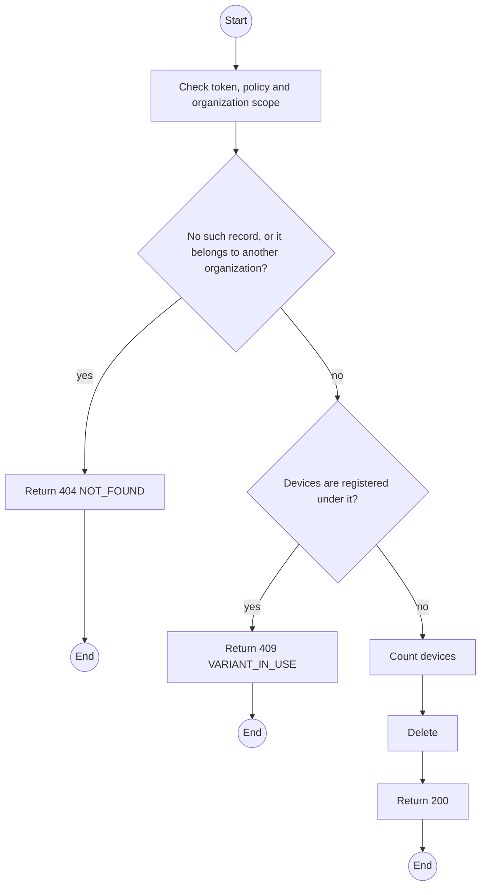
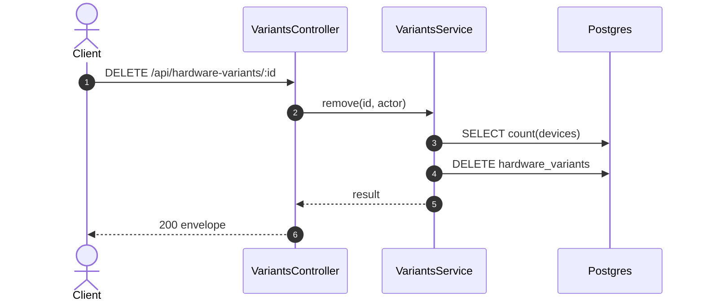

# DELETE /api/hardware-variants/:id: Delete a hardware variant

> Module `devices`. Generated from `scripts/specs/endpoints/devices.py` by `scripts/specs/build_api_design.py`; edit the catalog, not this file. Format: `02-templates/04-api-endpoint-template.md` with Mermaid (D-017). Envelope: D-002.

[TOC]

---
## Overview

Deletes a variant that has no registered device; otherwise refused (FR-DEV-04). Deactivate it instead.

## API Specification

| API | URL |
| --- | --- |
| DELETE | /api/hardware-variants/:id |
| Permission | TrekLink Admin |
| Traces | UC-13, FR-DEV-04, MSG29 |

### Path parameters

| Field | Description | Data Type | Examples |
| --- | --- | --- | --- |
| id | Variant id | uuid | `a1b2c3d4-e5f6-4a7b-8c9d-0e1f2a3b4c5d` |

## Request sample

No body.

## Response sample

```json
{
  "result": null,
  "isSuccess": true,
  "statusCode": 200,
  "message": "Deleted"
}
```

## Validation

<table>
    <th>Status code</th>
    <th>Description</th>
    <th>Examples</th>
    <tbody>
        <tr>
            <td>401</td>
            <td>Missing, malformed or expired access token or API key (<code>UNAUTHENTICATED</code>)</td>
<td>

```json
{
  "result": {
    "errorCode": "UNAUTHENTICATED"
  },
  "isSuccess": false,
  "statusCode": 401,
  "message": "Authentication required."
}
```
</td>
        </tr>
        <tr>
            <td>403</td>
            <td>The caller's role, policy or organization does not allow this action (<code>FORBIDDEN</code>)</td>
<td>

```json
{
  "result": {
    "errorCode": "FORBIDDEN"
  },
  "isSuccess": false,
  "statusCode": 403,
  "message": "You do not have access to this."
}
```
</td>
        </tr>
        <tr>
            <td>404</td>
            <td>No such record, or it belongs to another organization (<code>NOT_FOUND</code>)</td>
<td>

```json
{
  "result": {
    "errorCode": "NOT_FOUND"
  },
  "isSuccess": false,
  "statusCode": 404,
  "message": "Hardware variant not found."
}
```
</td>
        </tr>
        <tr>
            <td>409</td>
            <td>Devices are registered under it (<code>VARIANT_IN_USE</code>)</td>
<td>

```json
{
  "result": {
    "errorCode": "VARIANT_IN_USE"
  },
  "isSuccess": false,
  "statusCode": 409,
  "message": "This cannot be done while it has open devices."
}
```
</td>
        </tr>
    </tbody>
</table>

## Activity Diagram



## Sequence Diagram


