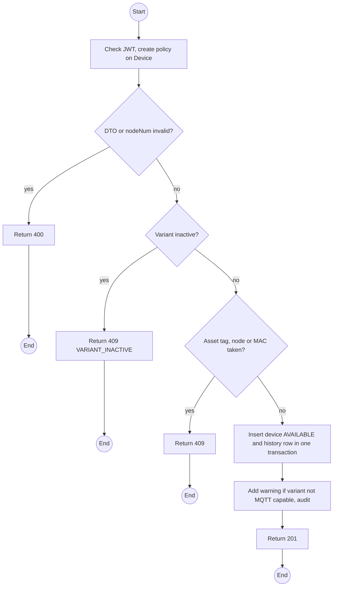
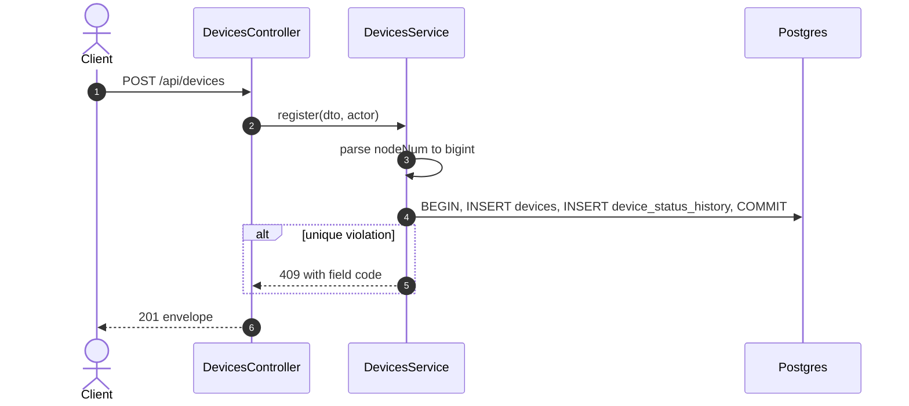

# POST /api/devices: Register a device

> Module `devices`. Format: `02-templates/04-api-endpoint-template.md`, with Mermaid in place of PlantUML (D-017). Envelope: D-002.

[TOC]

---
## Overview

Registers a physical unit. It starts in `AVAILABLE` with a first history row. `nodeNum` links field events to the device and is accepted as decimal or as the `!xxxxxxxx` id the Meshtastic app shows. Registering a variant that cannot uplink directly succeeds with a warning.

## API Specification

| API        | URL             |
| ---------- | --------------- |
| POST | /api/devices |
| Permission | Operator, Admin |
| Traces | US-012, UC-38 (new), FR-DEV-03 (new), REQ-EVT-01, REQ-EVT-02, REQ-UBI-04, Q49, Q50 |

## Request sample

```json
{
  "assetTag": "TL-0042",
  "hardwareVariantId": "hv-03...",
  "nodeNum": "!a4b1c2d3",
  "macAddress": "A4:CF:12:A4:B1:C2",
  "firmwareVersion": "2.7.19-treklink.3",
  "notes": "Bought 2026-09"
}
```

| Field | Description | Data Type | Required | Examples |
| --- | --- | --- | --- | --- |
| assetTag | Printed label, `TL-` plus 4 digits | string | yes | `TL-0042` |
| hardwareVariantId | Active variant | uuid | yes | `hv-03...` |
| nodeNum | Decimal uint32 or `!` plus 8 hex digits | string | no | `!a4b1c2d3` |
| macAddress | Colon-separated | string | no | `A4:CF:12:A4:B1:C2` |
| firmwareVersion | As shown by the device | string | no | `2.7.19-treklink.3` |
| notes | Free text | string | no | `Bought 2026-09` |

## Response sample

```json
{
  "result": {
    "id": "0d3f6a2b-7e11-4c55-8f0a-2b1c9e7d4a10",
    "assetTag": "TL-0042",
    "hardwareVariant": {
      "id": "hv-03...",
      "code": "treklink-v3"
    },
    "nodeNum": 2763113171,
    "nodeId": "!a4b1c2d3",
    "macAddress": "A4:CF:12:A4:B1:C2",
    "firmwareVersion": "2.7.19-treklink.3",
    "status": "AVAILABLE",
    "statusChangedAt": "2026-10-02T02:00:00Z",
    "pskVersion": null,
    "batteryPct": null,
    "batteryAdvisory": "UNKNOWN",
    "lastSeenAt": null,
    "connectivity": "NEVER_SEEN",
    "lastPosition": null,
    "buffering": false,
    "warnings": []
  },
  "isSuccess": true,
  "statusCode": 201,
  "message": "Device registered"
}
```

| Field | Description | Data Type | Examples |
| --- | --- | --- | --- |
| warnings | For example `VARIANT_NOT_MQTT_CAPABLE` for treklink-v1 | string[] | `VARIANT_NOT_MQTT_CAPABLE` |

## Validation

<table>
    <th>Status code</th>
    <th>Description</th>
    <th>Examples</th>
    <tbody>
        <tr>
            <td>400</td>
            <td>Node number not a uint32 in either form (<code>NODE_NUM_INVALID</code>)</td>
<td>

```json
{
  "result": {
    "errorCode": "NODE_NUM_INVALID"
  },
  "isSuccess": false,
  "statusCode": 400,
  "message": "nodeNum must be a decimal from 0 to 4294967295 or ! followed by 8 hex digits."
}
```
</td>
        </tr>
        <tr>
            <td>401</td>
            <td>Missing, malformed or expired access token (<code>UNAUTHENTICATED</code>)</td>
<td>

```json
{
  "result": {
    "errorCode": "UNAUTHENTICATED"
  },
  "isSuccess": false,
  "statusCode": 401,
  "message": "Authentication required."
}
```
</td>
        </tr>
        <tr>
            <td>403</td>
            <td>Authenticated, but the caller's role or policy does not allow this action (<code>FORBIDDEN</code>)</td>
<td>

```json
{
  "result": {
    "errorCode": "FORBIDDEN"
  },
  "isSuccess": false,
  "statusCode": 403,
  "message": "You do not have permission to perform this action."
}
```
</td>
        </tr>
        <tr>
            <td>409</td>
            <td>Asset tag used (<code>ASSET_TAG_TAKEN</code>)</td>
<td>

```json
{
  "result": {
    "errorCode": "ASSET_TAG_TAKEN"
  },
  "isSuccess": false,
  "statusCode": 409,
  "message": "Asset tag TL-0042 is already registered."
}
```
</td>
        </tr>
        <tr>
            <td>409</td>
            <td>Node number used (<code>NODE_NUM_TAKEN</code>)</td>
<td>

```json
{
  "result": {
    "errorCode": "NODE_NUM_TAKEN"
  },
  "isSuccess": false,
  "statusCode": 409,
  "message": "Node !a4b1c2d3 is already registered to TL-0017."
}
```
</td>
        </tr>
        <tr>
            <td>409</td>
            <td>MAC used (<code>MAC_TAKEN</code>)</td>
<td>

```json
{
  "result": {
    "errorCode": "MAC_TAKEN"
  },
  "isSuccess": false,
  "statusCode": 409,
  "message": "MAC address is already registered."
}
```
</td>
        </tr>
        <tr>
            <td>409</td>
            <td>Variant inactive (<code>VARIANT_INACTIVE</code>)</td>
<td>

```json
{
  "result": {
    "errorCode": "VARIANT_INACTIVE"
  },
  "isSuccess": false,
  "statusCode": 409,
  "message": "Hardware variant is inactive."
}
```
</td>
        </tr>
    </tbody>
</table>

## Activity Diagram



## Sequence Diagram


