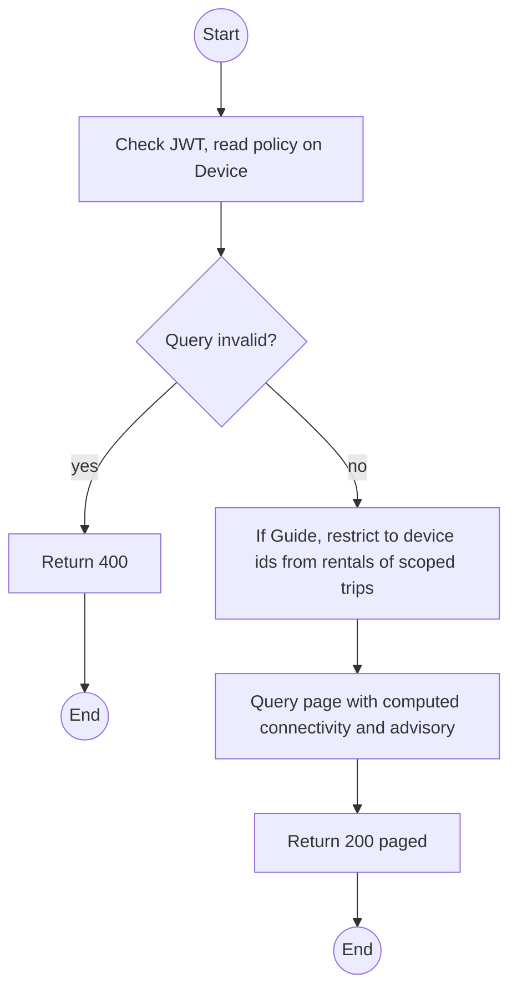
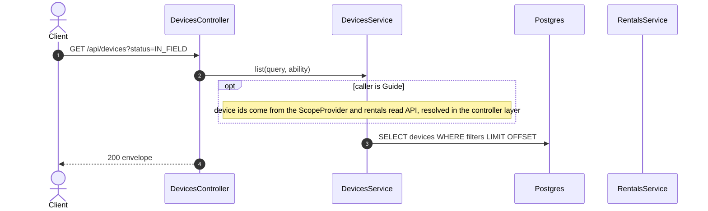

# GET /api/devices: Fleet list with filters

> Module `devices`. Format: `02-templates/04-api-endpoint-template.md`, with Mermaid in place of PlantUML (D-017). Envelope: D-002.

[TOC]

---
## Overview

Paged fleet list for the Pattern A screen in `06-frontend-conventions.md` §4. Guides see only devices on rentals of their assigned trips; the scope is applied server-side.

## API Specification

| API        | URL             |
| ---------- | --------------- |
| GET | /api/devices |
| Permission | Operator, Admin; Guide (devices on own trips) |
| Traces | US-015, US-021, FR-DEV-08 (new), UC-14 |

### Query parameters

| Field | Description | Data Type | Required | Examples |
| --- | --- | --- | --- | --- |
| search | Asset tag, node id or MAC | string | no | `TL-00` |
| status | One or more statuses, comma-separated | enum[] | no | `AVAILABLE,RESERVED` |
| hardwareVariantId | Variant filter | uuid | no | `hv-03...` |
| connectivity | LIVE, STALE, BUFFERING, NEVER_SEEN | enum | no | `STALE` |
| batteryAdvisory | OK, CHARGE_ADVISED, UNKNOWN | enum | no | `CHARGE_ADVISED` |
| tripId | Devices on this trip | uuid | no | `a1c3...` |
| pageNumber | 1-based | int | no | `1` |
| pageSize | Default 20, max 100 | int | no | `20` |
| sort | `assetTag`, `status`, `lastSeenAt`, `batteryPct`, prefix `-` for desc | string | no | `-lastSeenAt` |

## Request sample

No request body. Query string example:

```
GET /api/devices?status=IN_FIELD&connectivity=STALE&sort=-lastSeenAt
```

## Response sample

```json
{
  "result": {
    "items": [
      {
        "id": "0d3f6a2b-7e11-4c55-8f0a-2b1c9e7d4a10",
        "assetTag": "TL-0042",
        "hardwareVariant": {
          "id": "hv-03...",
          "code": "treklink-v3"
        },
        "nodeNum": 2763113171,
        "nodeId": "!a4b1c2d3",
        "macAddress": "A4:CF:12:A4:B1:C2",
        "firmwareVersion": "2.7.19-treklink.3",
        "status": "AVAILABLE",
        "statusChangedAt": "2026-10-02T02:00:00Z",
        "pskVersion": 1,
        "batteryPct": 68,
        "batteryAdvisory": "CHARGE_ADVISED",
        "lastSeenAt": "2026-10-02T03:58:10Z",
        "connectivity": "LIVE",
        "lastPosition": {
          "lat": 11.5544,
          "lon": 108.5381
        },
        "buffering": false
      }
    ],
    "pageNumber": 1,
    "pageSize": 20,
    "totalCount": 57,
    "totalPages": 3
  },
  "isSuccess": true,
  "statusCode": 200,
  "message": "Devices retrieved"
}
```

### Rules

`connectivity` filtering uses `lastSeenAt` against `monitoring.deviceStaleSeconds`; it is a computed filter, so it is applied in SQL as a time comparison, not in memory.

## Validation

<table>
    <th>Status code</th>
    <th>Description</th>
    <th>Examples</th>
    <tbody>
        <tr>
            <td>400</td>
            <td>Unknown filter value or sort field (<code>VALIDATION_FAILED</code>)</td>
<td>

```json
{
  "result": {
    "errorCode": "VALIDATION_FAILED"
  },
  "isSuccess": false,
  "statusCode": 400,
  "message": "status must be one of AVAILABLE, RESERVED, RENTED, IN_FIELD, RETURNED, MAINTENANCE, RETIRED."
}
```
</td>
        </tr>
        <tr>
            <td>401</td>
            <td>Missing, malformed or expired access token (<code>UNAUTHENTICATED</code>)</td>
<td>

```json
{
  "result": {
    "errorCode": "UNAUTHENTICATED"
  },
  "isSuccess": false,
  "statusCode": 401,
  "message": "Authentication required."
}
```
</td>
        </tr>
        <tr>
            <td>403</td>
            <td>Authenticated, but the caller's role or policy does not allow this action (<code>FORBIDDEN</code>)</td>
<td>

```json
{
  "result": {
    "errorCode": "FORBIDDEN"
  },
  "isSuccess": false,
  "statusCode": 403,
  "message": "You do not have permission to perform this action."
}
```
</td>
        </tr>
    </tbody>
</table>

## Activity Diagram



## Sequence Diagram


