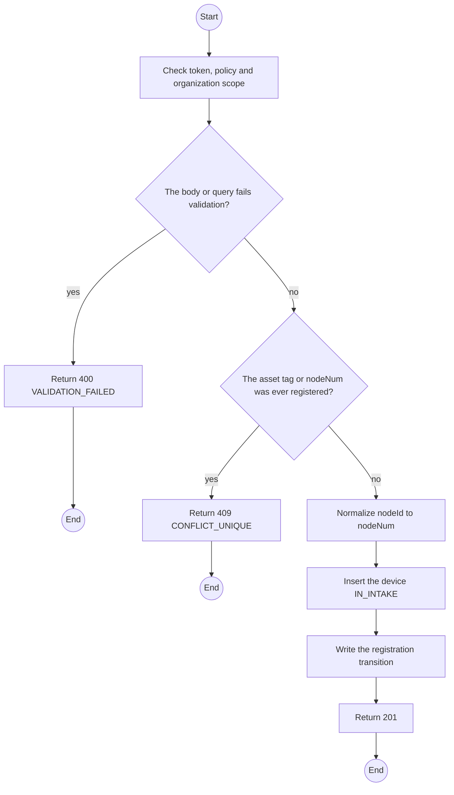
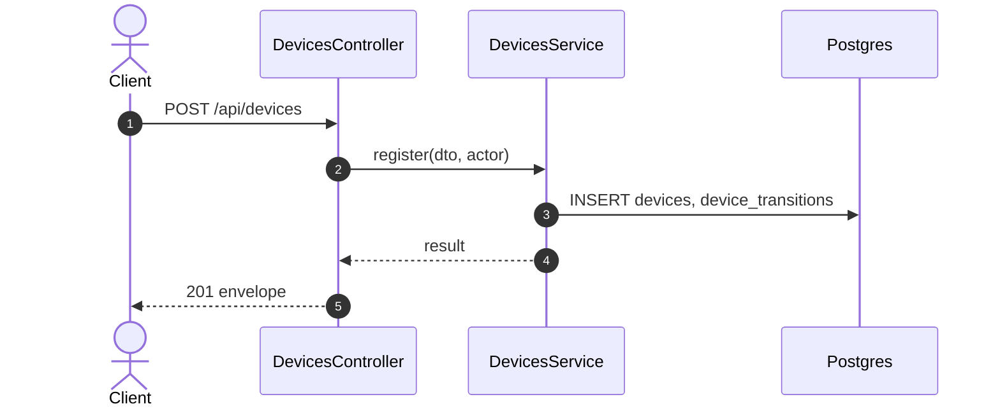

# POST /api/devices: Register a device

> Module `devices`. Generated from `scripts/specs/endpoints/devices.py` by `scripts/specs/build_api_design.py`; edit the catalog, not this file. Format: `02-templates/04-api-endpoint-template.md` with Mermaid (D-017). Envelope: D-002.

[TOC]

---
## Overview

Registers a physical unit with its printed asset tag and its radio `nodeNum`, both unique across every device ever registered, and creates it `IN_INTAKE` (FR-DEV-02, BR-10).

## API Specification

| API | URL |
| --- | --- |
| POST | /api/devices |
| Permission | TrekLink Staff |
| Traces | UC-11, FR-DEV-01, FR-DEV-02, MSG10 |

## Request sample

```json
{
  "assetTag": "TL-0042",
  "nodeNum": 2763113171,
  "hardwareVariantId": "a1b2c3d4-e5f6-4a7b-8c9d-0e1f2a3b4c5d",
  "firmwareVersion": "2.7.19-treklink.3",
  "acquiredAt": "2026-06-15"
}
```

| Field | Description | Data Type | Required | Examples |
| --- | --- | --- | --- | --- |
| assetTag | Printed label | string | yes | `TL-0042` |
| nodeNum | Unsigned 32-bit radio id; or nodeId `!a4b1c2d3` | int | yes | `2763113171` |
| hardwareVariantId | Variant | uuid | yes | `a1b2c3d4-e5f6-4a7b-8c9d-0e1f2a3b4c5d` |
| firmwareVersion | Firmware on the unit | string | yes | `2.7.19-treklink.3` |
| acquiredAt | Purchase or build date, the age basis for remaining value | date | yes | `2026-06-15` |

## Response sample

```json
{
  "result": {
    "id": "0d3f6a2b-7e11-4c55-8f0a-2b1c9e7d4a10",
    "assetTag": "TL-0042",
    "nodeNum": 2763113171,
    "nodeId": "!a4b1c2d3",
    "hardwareVariant": {
      "id": "a1b2c3d4-e5f6-4a7b-8c9d-0e1f2a3b4c5d",
      "code": "treklink-v3"
    },
    "firmwareVersion": "2.7.19-treklink.3",
    "acquiredAt": "2026-06-15T00:00:00Z",
    "status": "IN_INTAKE",
    "statusChangedAt": "2026-10-20T03:15:00.000Z",
    "keyVersion": null,
    "keyOrganizationId": null,
    "batteryPct": null,
    "lastSeenAt": null,
    "lastPosition": null,
    "version": 0
  },
  "isSuccess": true,
  "statusCode": 201,
  "message": "Device registered"
}
```

## Validation

<table>
    <th>Status code</th>
    <th>Description</th>
    <th>Examples</th>
    <tbody>
        <tr>
            <td>400</td>
            <td>The body or query fails validation (<code>VALIDATION_FAILED</code>)</td>
<td>

```json
{
  "result": {
    "errorCode": "VALIDATION_FAILED"
  },
  "isSuccess": false,
  "statusCode": 400,
  "message": "{field} is required."
}
```
</td>
        </tr>
        <tr>
            <td>401</td>
            <td>Missing, malformed or expired access token or API key (<code>UNAUTHENTICATED</code>)</td>
<td>

```json
{
  "result": {
    "errorCode": "UNAUTHENTICATED"
  },
  "isSuccess": false,
  "statusCode": 401,
  "message": "Authentication required."
}
```
</td>
        </tr>
        <tr>
            <td>403</td>
            <td>The caller's role, policy or organization does not allow this action (<code>FORBIDDEN</code>)</td>
<td>

```json
{
  "result": {
    "errorCode": "FORBIDDEN"
  },
  "isSuccess": false,
  "statusCode": 403,
  "message": "You do not have access to this."
}
```
</td>
        </tr>
        <tr>
            <td>409</td>
            <td>The asset tag or nodeNum was ever registered (<code>CONFLICT_UNIQUE</code>)</td>
<td>

```json
{
  "result": {
    "errorCode": "CONFLICT_UNIQUE"
  },
  "isSuccess": false,
  "statusCode": 409,
  "message": "TL-0042 is already registered."
}
```
</td>
        </tr>
    </tbody>
</table>

## Activity Diagram



## Sequence Diagram


