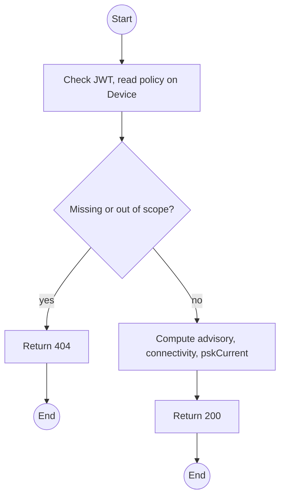
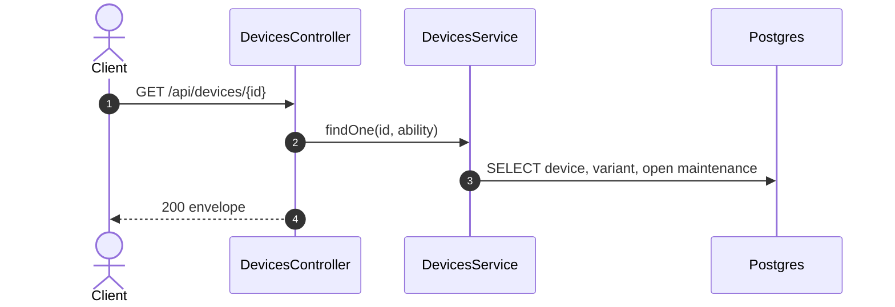

# GET /api/devices/:id: Device detail

> Module `devices`. Format: `02-templates/04-api-endpoint-template.md`, with Mermaid in place of PlantUML (D-017). Envelope: D-002.

[TOC]

---
## Overview

Returns one device with its live projection, battery advisory, connectivity, current PSK version against the fleet version, and the open maintenance record if any.

## API Specification

| API        | URL             |
| ---------- | --------------- |
| GET | /api/devices/:id |
| Permission | Operator, Admin; Guide (own trips) |
| Traces | US-016, FR-DEV-08, UC-14 |

### Path parameters

| Field | Description | Data Type | Examples |
| --- | --- | --- | --- |
| id | Device id | uuid | `0d3f6a2b-7e11-4c55-8f0a-2b1c9e7d4a10` |

## Request sample

No request body.

## Response sample

```json
{
  "result": {
    "id": "0d3f6a2b-7e11-4c55-8f0a-2b1c9e7d4a10",
    "assetTag": "TL-0042",
    "hardwareVariant": {
      "id": "hv-03...",
      "code": "treklink-v3"
    },
    "nodeNum": 2763113171,
    "nodeId": "!a4b1c2d3",
    "macAddress": "A4:CF:12:A4:B1:C2",
    "firmwareVersion": "2.7.19-treklink.3",
    "status": "AVAILABLE",
    "statusChangedAt": "2026-10-02T02:00:00Z",
    "pskVersion": 1,
    "batteryPct": 68,
    "batteryAdvisory": "CHARGE_ADVISED",
    "lastSeenAt": "2026-10-02T03:58:10Z",
    "connectivity": "LIVE",
    "lastPosition": {
      "lat": 11.5544,
      "lon": 108.5381
    },
    "buffering": false,
    "pskCurrent": true,
    "openMaintenance": null,
    "variantWarnings": []
  },
  "isSuccess": true,
  "statusCode": 200,
  "message": "Device retrieved"
}
```

## Validation

<table>
    <th>Status code</th>
    <th>Description</th>
    <th>Examples</th>
    <tbody>
        <tr>
            <td>401</td>
            <td>Missing, malformed or expired access token (<code>UNAUTHENTICATED</code>)</td>
<td>

```json
{
  "result": {
    "errorCode": "UNAUTHENTICATED"
  },
  "isSuccess": false,
  "statusCode": 401,
  "message": "Authentication required."
}
```
</td>
        </tr>
        <tr>
            <td>403</td>
            <td>Authenticated, but the caller's role or policy does not allow this action (<code>FORBIDDEN</code>)</td>
<td>

```json
{
  "result": {
    "errorCode": "FORBIDDEN"
  },
  "isSuccess": false,
  "statusCode": 403,
  "message": "You do not have permission to perform this action."
}
```
</td>
        </tr>
        <tr>
            <td>404</td>
            <td>No such device or outside the Guide's scope (<code>NOT_FOUND</code>)</td>
<td>

```json
{
  "result": {
    "errorCode": "NOT_FOUND"
  },
  "isSuccess": false,
  "statusCode": 404,
  "message": "Device not found."
}
```
</td>
        </tr>
    </tbody>
</table>

## Activity Diagram



## Sequence Diagram


