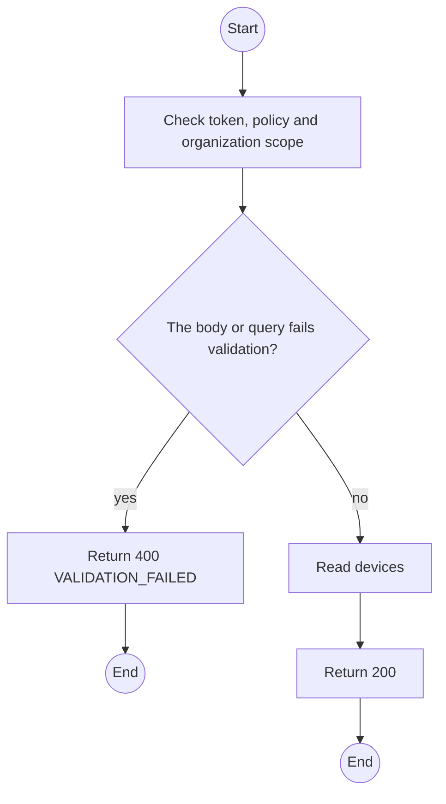
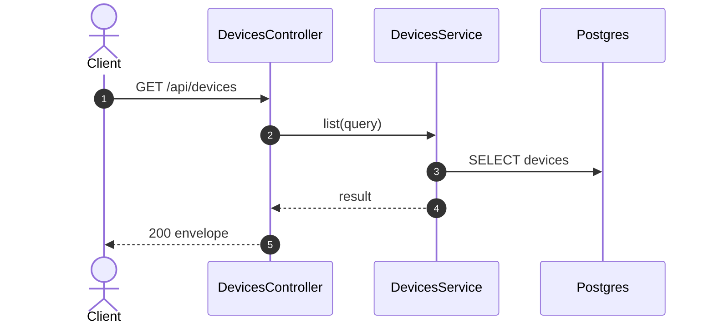

# GET /api/devices: List devices

> Module `devices`. Generated from `scripts/specs/endpoints/devices.py` by `scripts/specs/build_api_design.py`; edit the catalog, not this file. Format: `02-templates/04-api-endpoint-template.md` with Mermaid (D-017). Envelope: D-002.

[TOC]

---
## Overview

Lists the fleet. Organization members see their rented devices through the live map snapshot and the contract detail, never through this fleet view (FR-AUTH-11).

## API Specification

| API | URL |
| --- | --- |
| GET | /api/devices |
| Permission | TrekLink Staff, TrekLink Admin |
| Traces | UC-38, UC-54, FR-AUTH-11 |

### Query parameters

| Field | Description | Data Type | Required | Examples |
| --- | --- | --- | --- | --- |
| status | DeviceStatus, repeatable | enum | no | `AVAILABLE` |
| hardwareVariantId | Variant | uuid | no | `a1b2c3d4-e5f6-4a7b-8c9d-0e1f2a3b4c5d` |
| q | Asset tag or nodeId contains | string | no | `TL-00` |
| pageNumber | 1-based page | int | no | `1` |
| pageSize | Items per page, at most MAX_PAGE_SIZE | int | no | `20` |

## Request sample

No body.

## Response sample

```json
{
  "result": {
    "items": [
      {
        "id": "0d3f6a2b-7e11-4c55-8f0a-2b1c9e7d4a10",
        "assetTag": "TL-0042",
        "nodeNum": 2763113171,
        "nodeId": "!a4b1c2d3",
        "hardwareVariant": {
          "id": "a1b2c3d4-e5f6-4a7b-8c9d-0e1f2a3b4c5d",
          "code": "treklink-v3"
        },
        "firmwareVersion": "2.7.19-treklink.3",
        "acquiredAt": "2026-06-15T00:00:00Z",
        "status": "AVAILABLE",
        "statusChangedAt": "2026-10-20T03:15:00.000Z",
        "keyVersion": null,
        "keyOrganizationId": null,
        "batteryPct": 96,
        "lastSeenAt": "2026-10-20T03:15:00.000Z",
        "lastPosition": {
          "lat": 11.5544,
          "lon": 108.5381
        },
        "version": 5
      }
    ],
    "pageNumber": 1,
    "pageSize": 20,
    "totalCount": 40,
    "totalPages": 1
  },
  "isSuccess": true,
  "statusCode": 200,
  "message": "OK"
}
```

## Validation

<table>
    <th>Status code</th>
    <th>Description</th>
    <th>Examples</th>
    <tbody>
        <tr>
            <td>400</td>
            <td>The body or query fails validation (<code>VALIDATION_FAILED</code>)</td>
<td>

```json
{
  "result": {
    "errorCode": "VALIDATION_FAILED"
  },
  "isSuccess": false,
  "statusCode": 400,
  "message": "{field} is required."
}
```
</td>
        </tr>
        <tr>
            <td>401</td>
            <td>Missing, malformed or expired access token or API key (<code>UNAUTHENTICATED</code>)</td>
<td>

```json
{
  "result": {
    "errorCode": "UNAUTHENTICATED"
  },
  "isSuccess": false,
  "statusCode": 401,
  "message": "Authentication required."
}
```
</td>
        </tr>
        <tr>
            <td>403</td>
            <td>The caller's role, policy or organization does not allow this action (<code>FORBIDDEN</code>)</td>
<td>

```json
{
  "result": {
    "errorCode": "FORBIDDEN"
  },
  "isSuccess": false,
  "statusCode": 403,
  "message": "You do not have access to this."
}
```
</td>
        </tr>
    </tbody>
</table>

## Activity Diagram



## Sequence Diagram


