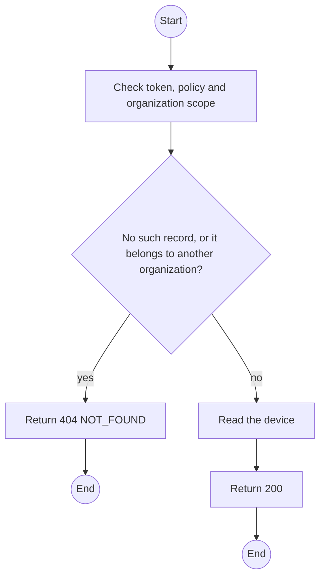
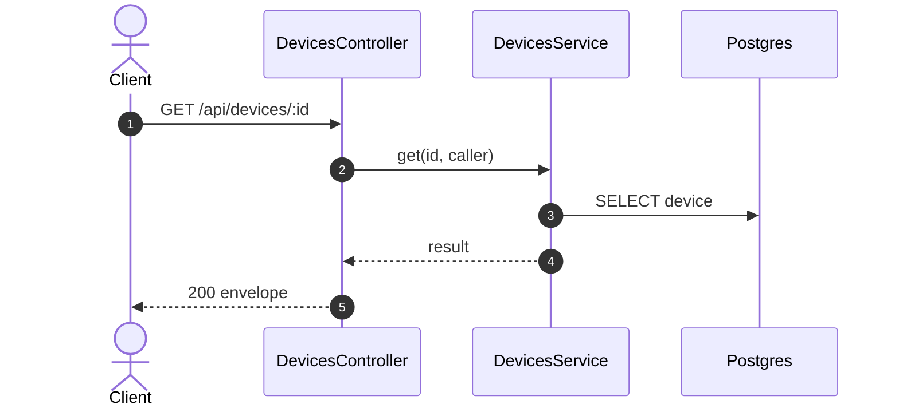

# GET /api/devices/:id: Device detail

> Module `devices`. Generated from `scripts/specs/endpoints/devices.py` by `scripts/specs/build_api_design.py`; edit the catalog, not this file. Format: `02-templates/04-api-endpoint-template.md` with Mermaid (D-017). Envelope: D-002.

[TOC]

---
## Overview

Returns one device with its open maintenance, last intake check and last reset.

## API Specification

| API | URL |
| --- | --- |
| GET | /api/devices/:id |
| Permission | TrekLink Staff, TrekLink Admin |
| Traces | UC-11, UC-53, FR-AUTH-11 |

### Path parameters

| Field | Description | Data Type | Examples |
| --- | --- | --- | --- |
| id | Device id | uuid | `0d3f6a2b-7e11-4c55-8f0a-2b1c9e7d4a10` |

## Request sample

No body.

## Response sample

```json
{
  "result": {
    "id": "0d3f6a2b-7e11-4c55-8f0a-2b1c9e7d4a10",
    "assetTag": "TL-0042",
    "nodeNum": 2763113171,
    "nodeId": "!a4b1c2d3",
    "hardwareVariant": {
      "id": "a1b2c3d4-e5f6-4a7b-8c9d-0e1f2a3b4c5d",
      "code": "treklink-v3"
    },
    "firmwareVersion": "2.7.19-treklink.3",
    "acquiredAt": "2026-06-15T00:00:00Z",
    "status": "AVAILABLE",
    "statusChangedAt": "2026-10-20T03:15:00.000Z",
    "keyVersion": null,
    "keyOrganizationId": null,
    "batteryPct": 96,
    "lastSeenAt": "2026-10-20T03:15:00.000Z",
    "lastPosition": {
      "lat": 11.5544,
      "lon": 108.5381
    },
    "version": 5,
    "openMaintenance": null,
    "lastIntakeCheck": {
      "passed": true,
      "createdAt": "2026-10-20T03:15:00.000Z"
    },
    "lastReset": null
  },
  "isSuccess": true,
  "statusCode": 200,
  "message": "OK"
}
```

## Validation

<table>
    <th>Status code</th>
    <th>Description</th>
    <th>Examples</th>
    <tbody>
        <tr>
            <td>401</td>
            <td>Missing, malformed or expired access token or API key (<code>UNAUTHENTICATED</code>)</td>
<td>

```json
{
  "result": {
    "errorCode": "UNAUTHENTICATED"
  },
  "isSuccess": false,
  "statusCode": 401,
  "message": "Authentication required."
}
```
</td>
        </tr>
        <tr>
            <td>403</td>
            <td>The caller's role, policy or organization does not allow this action (<code>FORBIDDEN</code>)</td>
<td>

```json
{
  "result": {
    "errorCode": "FORBIDDEN"
  },
  "isSuccess": false,
  "statusCode": 403,
  "message": "You do not have access to this."
}
```
</td>
        </tr>
        <tr>
            <td>404</td>
            <td>No such record, or it belongs to another organization (<code>NOT_FOUND</code>)</td>
<td>

```json
{
  "result": {
    "errorCode": "NOT_FOUND"
  },
  "isSuccess": false,
  "statusCode": 404,
  "message": "Device not found."
}
```
</td>
        </tr>
    </tbody>
</table>

## Activity Diagram



## Sequence Diagram


