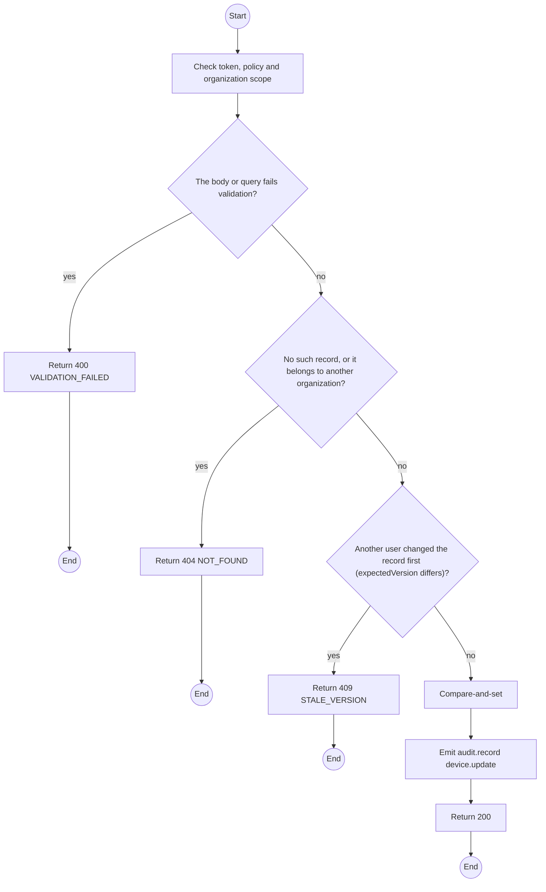
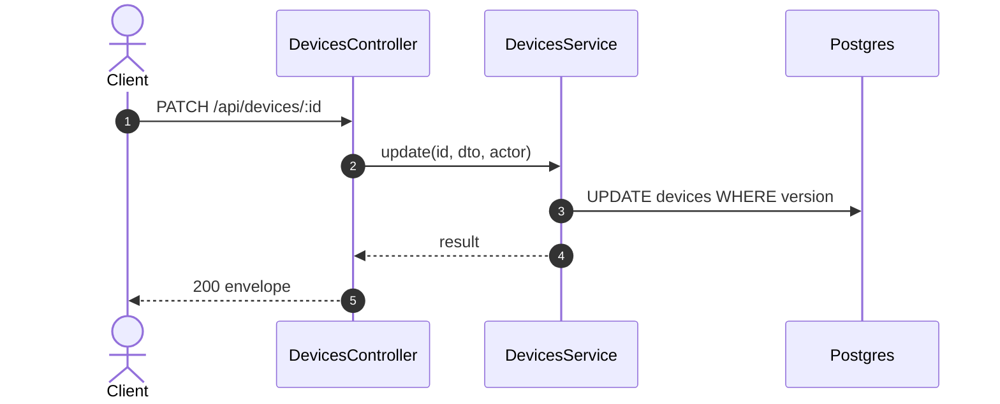

# PATCH /api/devices/:id: Edit device data

> Module `devices`. Generated from `scripts/specs/endpoints/devices.py` by `scripts/specs/build_api_design.py`; edit the catalog, not this file. Format: `02-templates/04-api-endpoint-template.md` with Mermaid (D-017). Envelope: D-002.

[TOC]

---
## Overview

Corrects the firmware version after a reflash. Identity fields never change; state changes go through their own endpoints (FR-DEV-01).

## API Specification

| API | URL |
| --- | --- |
| PATCH | /api/devices/:id |
| Permission | TrekLink Staff |
| Traces | UC-11, FR-DEV-01 |

### Path parameters

| Field | Description | Data Type | Examples |
| --- | --- | --- | --- |
| id | Device id | uuid | `0d3f6a2b-7e11-4c55-8f0a-2b1c9e7d4a10` |

## Request sample

```json
{
  "firmwareVersion": "2.7.19-treklink.4",
  "expectedVersion": 5
}
```

| Field | Description | Data Type | Required | Examples |
| --- | --- | --- | --- | --- |
| firmwareVersion | Firmware on the unit | string | yes | `2.7.19-treklink.4` |
| expectedVersion | Device version the caller saw | int | yes | `5` |

## Response sample

```json
{
  "result": {
    "id": "0d3f6a2b-7e11-4c55-8f0a-2b1c9e7d4a10",
    "assetTag": "TL-0042",
    "nodeNum": 2763113171,
    "nodeId": "!a4b1c2d3",
    "hardwareVariant": {
      "id": "a1b2c3d4-e5f6-4a7b-8c9d-0e1f2a3b4c5d",
      "code": "treklink-v3"
    },
    "firmwareVersion": "2.7.19-treklink.4",
    "acquiredAt": "2026-06-15T00:00:00Z",
    "status": "AVAILABLE",
    "statusChangedAt": "2026-10-20T03:15:00.000Z",
    "keyVersion": null,
    "keyOrganizationId": null,
    "batteryPct": 96,
    "lastSeenAt": "2026-10-20T03:15:00.000Z",
    "lastPosition": {
      "lat": 11.5544,
      "lon": 108.5381
    },
    "version": 6
  },
  "isSuccess": true,
  "statusCode": 200,
  "message": "Saved."
}
```

## Validation

<table>
    <th>Status code</th>
    <th>Description</th>
    <th>Examples</th>
    <tbody>
        <tr>
            <td>400</td>
            <td>The body or query fails validation (<code>VALIDATION_FAILED</code>)</td>
<td>

```json
{
  "result": {
    "errorCode": "VALIDATION_FAILED"
  },
  "isSuccess": false,
  "statusCode": 400,
  "message": "{field} is required."
}
```
</td>
        </tr>
        <tr>
            <td>401</td>
            <td>Missing, malformed or expired access token or API key (<code>UNAUTHENTICATED</code>)</td>
<td>

```json
{
  "result": {
    "errorCode": "UNAUTHENTICATED"
  },
  "isSuccess": false,
  "statusCode": 401,
  "message": "Authentication required."
}
```
</td>
        </tr>
        <tr>
            <td>403</td>
            <td>The caller's role, policy or organization does not allow this action (<code>FORBIDDEN</code>)</td>
<td>

```json
{
  "result": {
    "errorCode": "FORBIDDEN"
  },
  "isSuccess": false,
  "statusCode": 403,
  "message": "You do not have access to this."
}
```
</td>
        </tr>
        <tr>
            <td>404</td>
            <td>No such record, or it belongs to another organization (<code>NOT_FOUND</code>)</td>
<td>

```json
{
  "result": {
    "errorCode": "NOT_FOUND"
  },
  "isSuccess": false,
  "statusCode": 404,
  "message": "Device not found."
}
```
</td>
        </tr>
        <tr>
            <td>409</td>
            <td>Another user changed the record first (expectedVersion differs) (<code>STALE_VERSION</code>)</td>
<td>

```json
{
  "result": {
    "errorCode": "STALE_VERSION"
  },
  "isSuccess": false,
  "statusCode": 409,
  "message": "This was changed by someone else. Reload and try again."
}
```
</td>
        </tr>
    </tbody>
</table>

## Activity Diagram



## Sequence Diagram


