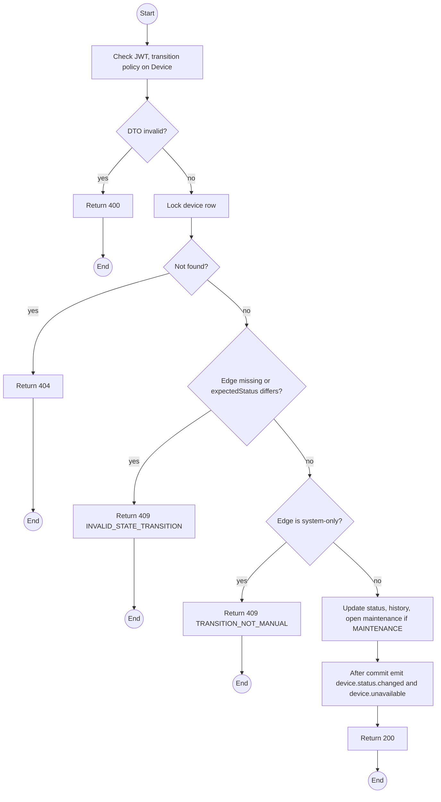
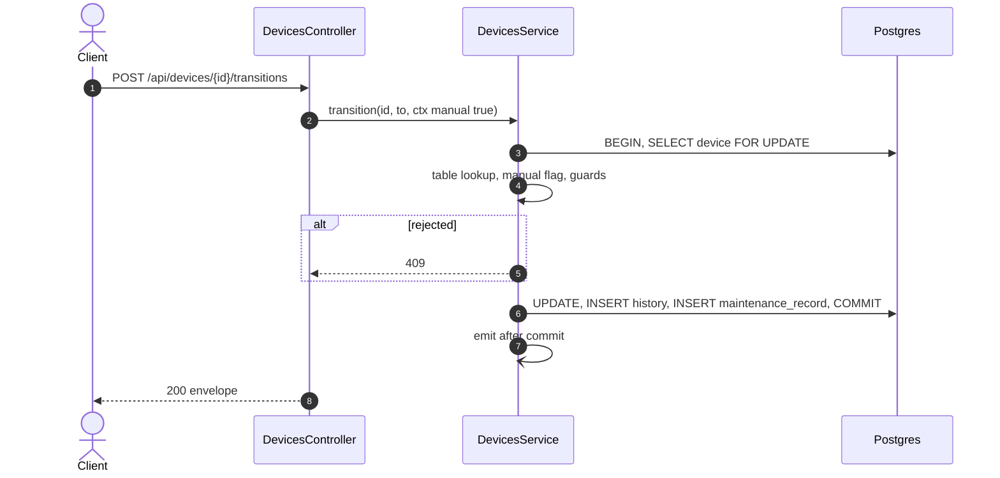

# POST /api/devices/:id/transitions: Manual lifecycle transition

> Module `devices`. Format: `02-templates/04-api-endpoint-template.md`, with Mermaid in place of PlantUML (D-017). Envelope: D-002.

[TOC]

---
## Overview

Performs one of the **manual** edges of the transition table (`design.md` §2.1): report a fault (`AVAILABLE` or `RESERVED` to `MAINTENANCE`) or decommission (`AVAILABLE` to `RETIRED`). System-only edges such as check-out are rejected here with `TRANSITION_NOT_MANUAL`; completing maintenance goes through the maintenance-record endpoint.

## API Specification

| API        | URL             |
| ---------- | --------------- |
| POST | /api/devices/:id/transitions |
| Permission | Operator; Admin for RETIRED from AVAILABLE |
| Traces | US-013, US-018, US-020, FR-DEV-01, BR-05, REQ-UBI-02, REQ-ERR-02, REQ-ERR-03, Q47, Q48 |

### Path parameters

| Field | Description | Data Type | Examples |
| --- | --- | --- | --- |
| id | Device id | uuid | `0d3f6a2b-7e11-4c55-8f0a-2b1c9e7d4a10` |

## Request sample

```json
{
  "toStatus": "MAINTENANCE",
  "reason": "STAFF_REPORTED",
  "note": "Screen cracked, noticed during stock check",
  "expectedStatus": "AVAILABLE"
}
```

| Field | Description | Data Type | Required | Examples |
| --- | --- | --- | --- | --- |
| toStatus | Target state | enum | yes | `MAINTENANCE` |
| reason | For MAINTENANCE a MaintenanceReason; for RETIRED a RetireReason | enum | yes | `STAFF_REPORTED` |
| note | Required for RETIRED | string | no | `Screen cracked` |
| expectedStatus | State the caller saw; mismatch returns 409 | enum | no | `AVAILABLE` |

## Response sample

```json
{
  "result": {
    "id": "0d3f6a2b-7e11-4c55-8f0a-2b1c9e7d4a10",
    "assetTag": "TL-0042",
    "hardwareVariant": {
      "id": "hv-03...",
      "code": "treklink-v3"
    },
    "nodeNum": 2763113171,
    "nodeId": "!a4b1c2d3",
    "macAddress": "A4:CF:12:A4:B1:C2",
    "firmwareVersion": "2.7.19-treklink.3",
    "status": "MAINTENANCE",
    "statusChangedAt": "2026-10-02T02:00:00Z",
    "pskVersion": 1,
    "batteryPct": 68,
    "batteryAdvisory": "CHARGE_ADVISED",
    "lastSeenAt": "2026-10-02T03:58:10Z",
    "connectivity": "LIVE",
    "lastPosition": {
      "lat": 11.5544,
      "lon": 108.5381
    },
    "buffering": false,
    "openMaintenance": {
      "id": "mr-19...",
      "reason": "STAFF_REPORTED",
      "status": "OPEN"
    },
    "affectedAllocationIds": []
  },
  "isSuccess": true,
  "statusCode": 200,
  "message": "Device status changed"
}
```

| Field | Description | Data Type | Examples |
| --- | --- | --- | --- |
| affectedAllocationIds | Future allocations flagged for re-allocation (REQ-EVT-09) | uuid[] | n/a |

## Validation

<table>
    <th>Status code</th>
    <th>Description</th>
    <th>Examples</th>
    <tbody>
        <tr>
            <td>400</td>
            <td>Reason or note missing (<code>VALIDATION_FAILED</code>)</td>
<td>

```json
{
  "result": {
    "errorCode": "VALIDATION_FAILED"
  },
  "isSuccess": false,
  "statusCode": 400,
  "message": "note is required when retiring a device."
}
```
</td>
        </tr>
        <tr>
            <td>401</td>
            <td>Missing, malformed or expired access token (<code>UNAUTHENTICATED</code>)</td>
<td>

```json
{
  "result": {
    "errorCode": "UNAUTHENTICATED"
  },
  "isSuccess": false,
  "statusCode": 401,
  "message": "Authentication required."
}
```
</td>
        </tr>
        <tr>
            <td>403</td>
            <td>Authenticated, but the caller's role or policy does not allow this action (<code>FORBIDDEN</code>)</td>
<td>

```json
{
  "result": {
    "errorCode": "FORBIDDEN"
  },
  "isSuccess": false,
  "statusCode": 403,
  "message": "You do not have permission to perform this action."
}
```
</td>
        </tr>
        <tr>
            <td>404</td>
            <td>No such device (<code>NOT_FOUND</code>)</td>
<td>

```json
{
  "result": {
    "errorCode": "NOT_FOUND"
  },
  "isSuccess": false,
  "statusCode": 404,
  "message": "Device not found."
}
```
</td>
        </tr>
        <tr>
            <td>409</td>
            <td>Pair not in the table, or state changed (<code>INVALID_STATE_TRANSITION</code>)</td>
<td>

```json
{
  "result": {
    "errorCode": "INVALID_STATE_TRANSITION"
  },
  "isSuccess": false,
  "statusCode": 409,
  "message": "Cannot move a device from RENTED to RETIRED this way."
}
```
</td>
        </tr>
        <tr>
            <td>409</td>
            <td>Edge exists but only the system may take it (<code>TRANSITION_NOT_MANUAL</code>)</td>
<td>

```json
{
  "result": {
    "errorCode": "TRANSITION_NOT_MANUAL"
  },
  "isSuccess": false,
  "statusCode": 409,
  "message": "RESERVED to RENTED happens only at check-out."
}
```
</td>
        </tr>
    </tbody>
</table>

## Activity Diagram



## Sequence Diagram


