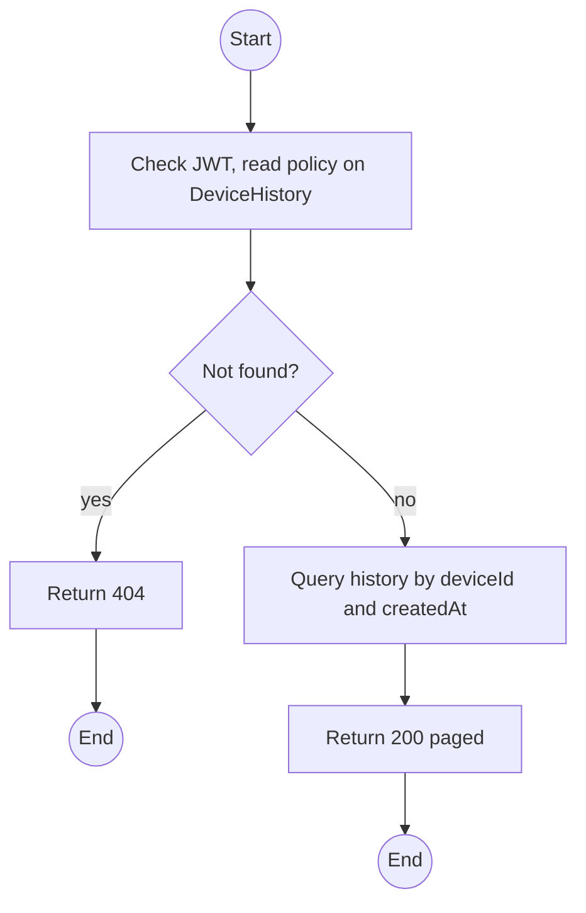
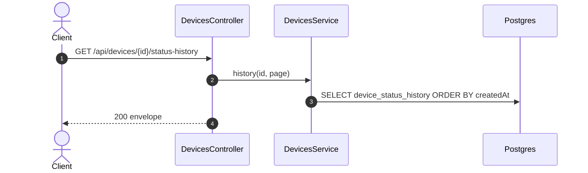

# GET /api/devices/:id/status-history: Device status history

> Module `devices`. Format: `02-templates/04-api-endpoint-template.md`, with Mermaid in place of PlantUML (D-017). Envelope: D-002.

[TOC]

---
## Overview

Paged, oldest-first lifecycle history of one device: every transition with actor, reason and reference. Together with the rentals and incidents lists filtered by `deviceId` it forms the device history view.

## API Specification

| API        | URL             |
| ---------- | --------------- |
| GET | /api/devices/:id/status-history |
| Permission | Operator, Admin |
| Traces | US-022, Q54, NFR-SEC-04, AC-08 |

### Path parameters

| Field | Description | Data Type | Examples |
| --- | --- | --- | --- |
| id | Device id | uuid | `0d3f6a2b-7e11-4c55-8f0a-2b1c9e7d4a10` |

### Query parameters

| Field | Description | Data Type | Required | Examples |
| --- | --- | --- | --- | --- |
| pageNumber | 1-based | int | no | `1` |
| pageSize | Default 50, max 100 | int | no | `50` |
| order | `asc` or `desc` by time | string | no | `asc` |

## Request sample

No request body. Query string example:

```
GET /api/devices/{id}/status-history?order=asc
```

## Response sample

```json
{
  "result": {
    "items": [
      {
        "id": "h-1",
        "fromStatus": null,
        "toStatus": "AVAILABLE",
        "actor": {
          "kind": "USER",
          "id": "9a1b...",
          "username": "op.lan"
        },
        "reason": "REGISTERED",
        "refType": null,
        "refId": null,
        "createdAt": "2026-09-28T02:00:00Z"
      },
      {
        "id": "h-2",
        "fromStatus": "AVAILABLE",
        "toStatus": "RESERVED",
        "actor": {
          "kind": "SYSTEM"
        },
        "reason": "ALLOCATION_CREATED",
        "refType": "ALLOCATION",
        "refId": "al-7...",
        "createdAt": "2026-10-01T04:10:00Z"
      }
    ],
    "pageNumber": 1,
    "pageSize": 50,
    "totalCount": 2,
    "totalPages": 1
  },
  "isSuccess": true,
  "statusCode": 200,
  "message": "Device history retrieved"
}
```

## Validation

<table>
    <th>Status code</th>
    <th>Description</th>
    <th>Examples</th>
    <tbody>
        <tr>
            <td>401</td>
            <td>Missing, malformed or expired access token (<code>UNAUTHENTICATED</code>)</td>
<td>

```json
{
  "result": {
    "errorCode": "UNAUTHENTICATED"
  },
  "isSuccess": false,
  "statusCode": 401,
  "message": "Authentication required."
}
```
</td>
        </tr>
        <tr>
            <td>403</td>
            <td>Authenticated, but the caller's role or policy does not allow this action (<code>FORBIDDEN</code>)</td>
<td>

```json
{
  "result": {
    "errorCode": "FORBIDDEN"
  },
  "isSuccess": false,
  "statusCode": 403,
  "message": "You do not have permission to perform this action."
}
```
</td>
        </tr>
        <tr>
            <td>404</td>
            <td>No such device (<code>NOT_FOUND</code>)</td>
<td>

```json
{
  "result": {
    "errorCode": "NOT_FOUND"
  },
  "isSuccess": false,
  "statusCode": 404,
  "message": "Device not found."
}
```
</td>
        </tr>
    </tbody>
</table>

## Activity Diagram



## Sequence Diagram


