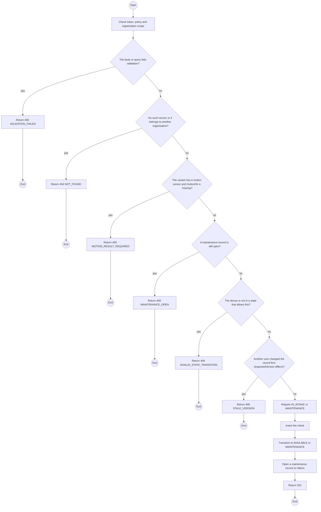
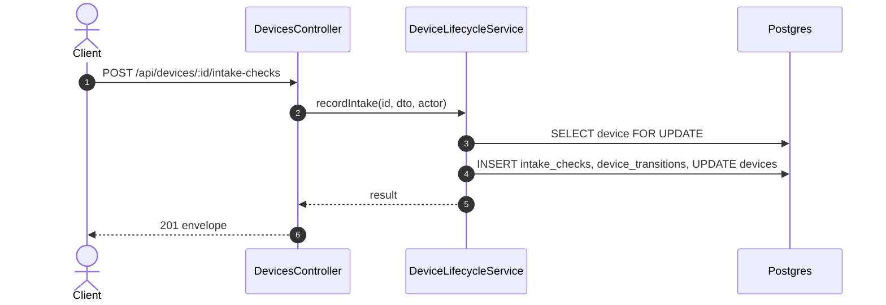

# POST /api/devices/:id/intake-checks: Record an intake check

> Module `devices`. Generated from `scripts/specs/endpoints/devices.py` by `scripts/specs/build_api_design.py`; edit the catalog, not this file. Format: `02-templates/04-api-endpoint-template.md` with Mermaid (D-017). Envelope: D-002.

[TOC]

---
## Overview

Records the GPS fix, radio, battery and, where the variant has one, motion-sensor results. A pass moves an `IN_INTAKE` or `MAINTENANCE` device (with no open maintenance record) to `AVAILABLE`; a failure moves it to `MAINTENANCE` with a record opened (FR-DEV-03, FR-DEV-08).

## API Specification

| API | URL |
| --- | --- |
| POST | /api/devices/:id/intake-checks |
| Permission | TrekLink Staff |
| Traces | UC-12, FR-DEV-01, FR-DEV-03, FR-DEV-08 |

### Path parameters

| Field | Description | Data Type | Examples |
| --- | --- | --- | --- |
| id | Device id | uuid | `0d3f6a2b-7e11-4c55-8f0a-2b1c9e7d4a10` |

## Request sample

```json
{
  "gpsFixOk": true,
  "radioOk": true,
  "batteryOk": true,
  "expectedVersion": 0
}
```

| Field | Description | Data Type | Required | Examples |
| --- | --- | --- | --- | --- |
| gpsFixOk | GPS fix obtained | bool | yes | `true` |
| radioOk | Heard on the mesh | bool | yes | `true` |
| batteryOk | Charges and holds | bool | yes | `true` |
| motionOk | Required when the variant has a motion sensor | bool | cond. | `true` |
| note | Free text | string | no | `...` |
| expectedVersion | Device version the caller saw | int | yes | `5` |

## Response sample

```json
{
  "result": {
    "check": {
      "id": "ic-1",
      "passed": true,
      "createdAt": "2026-10-20T03:15:00.000Z"
    },
    "device": {
      "id": "0d3f6a2b-7e11-4c55-8f0a-2b1c9e7d4a10",
      "assetTag": "TL-0042",
      "nodeNum": 2763113171,
      "nodeId": "!a4b1c2d3",
      "hardwareVariant": {
        "id": "a1b2c3d4-e5f6-4a7b-8c9d-0e1f2a3b4c5d",
        "code": "treklink-v3"
      },
      "firmwareVersion": "2.7.19-treklink.3",
      "acquiredAt": "2026-06-15T00:00:00Z",
      "status": "AVAILABLE",
      "statusChangedAt": "2026-10-20T03:15:00.000Z",
      "keyVersion": null,
      "keyOrganizationId": null,
      "batteryPct": 96,
      "lastSeenAt": "2026-10-20T03:15:00.000Z",
      "lastPosition": {
        "lat": 11.5544,
        "lon": 108.5381
      },
      "version": 1
    }
  },
  "isSuccess": true,
  "statusCode": 201,
  "message": "Intake check recorded"
}
```

## Validation

<table>
    <th>Status code</th>
    <th>Description</th>
    <th>Examples</th>
    <tbody>
        <tr>
            <td>400</td>
            <td>The body or query fails validation (<code>VALIDATION_FAILED</code>)</td>
<td>

```json
{
  "result": {
    "errorCode": "VALIDATION_FAILED"
  },
  "isSuccess": false,
  "statusCode": 400,
  "message": "{field} is required."
}
```
</td>
        </tr>
        <tr>
            <td>401</td>
            <td>Missing, malformed or expired access token or API key (<code>UNAUTHENTICATED</code>)</td>
<td>

```json
{
  "result": {
    "errorCode": "UNAUTHENTICATED"
  },
  "isSuccess": false,
  "statusCode": 401,
  "message": "Authentication required."
}
```
</td>
        </tr>
        <tr>
            <td>403</td>
            <td>The caller's role, policy or organization does not allow this action (<code>FORBIDDEN</code>)</td>
<td>

```json
{
  "result": {
    "errorCode": "FORBIDDEN"
  },
  "isSuccess": false,
  "statusCode": 403,
  "message": "You do not have access to this."
}
```
</td>
        </tr>
        <tr>
            <td>404</td>
            <td>No such record, or it belongs to another organization (<code>NOT_FOUND</code>)</td>
<td>

```json
{
  "result": {
    "errorCode": "NOT_FOUND"
  },
  "isSuccess": false,
  "statusCode": 404,
  "message": "Device not found."
}
```
</td>
        </tr>
        <tr>
            <td>400</td>
            <td>The variant has a motion sensor and motionOk is missing (<code>MOTION_RESULT_REQUIRED</code>)</td>
<td>

```json
{
  "result": {
    "errorCode": "MOTION_RESULT_REQUIRED"
  },
  "isSuccess": false,
  "statusCode": 400,
  "message": "motionOk is required."
}
```
</td>
        </tr>
        <tr>
            <td>409</td>
            <td>A maintenance record is still open (<code>MAINTENANCE_OPEN</code>)</td>
<td>

```json
{
  "result": {
    "errorCode": "MAINTENANCE_OPEN"
  },
  "isSuccess": false,
  "statusCode": 409,
  "message": "Close the maintenance record first."
}
```
</td>
        </tr>
        <tr>
            <td>409</td>
            <td>The device is not in a state that allows this (<code>INVALID_STATE_TRANSITION</code>)</td>
<td>

```json
{
  "result": {
    "errorCode": "INVALID_STATE_TRANSITION"
  },
  "isSuccess": false,
  "statusCode": 409,
  "message": "This cannot be done while it is RENTED."
}
```
</td>
        </tr>
        <tr>
            <td>409</td>
            <td>Another user changed the record first (expectedVersion differs) (<code>STALE_VERSION</code>)</td>
<td>

```json
{
  "result": {
    "errorCode": "STALE_VERSION"
  },
  "isSuccess": false,
  "statusCode": 409,
  "message": "This was changed by someone else. Reload and try again."
}
```
</td>
        </tr>
    </tbody>
</table>

## Activity Diagram



## Sequence Diagram


