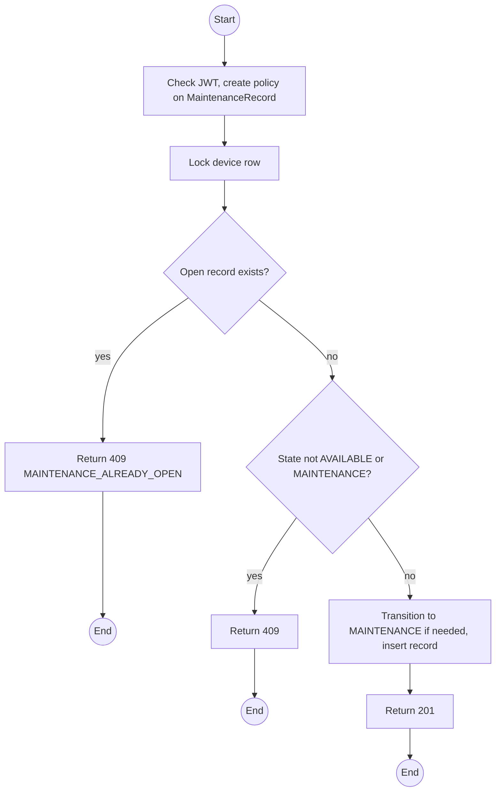
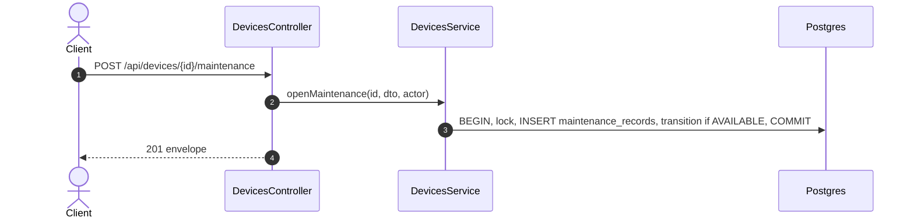

# POST /api/devices/:id/maintenance: Open a maintenance record

> Module `devices`. Format: `02-templates/04-api-endpoint-template.md`, with Mermaid in place of PlantUML (D-017). Envelope: D-002.

[TOC]

---
## Overview

Opens a maintenance record for a device already in `MAINTENANCE` without one (for example after a manual transition that the Operator wants to document further), or schedules preventive maintenance on an `AVAILABLE` device, which moves it to `MAINTENANCE` in the same transaction. Records opened automatically by inspection or handover failure do not use this endpoint.

## API Specification

| API        | URL             |
| ---------- | --------------- |
| POST | /api/devices/:id/maintenance |
| Permission | Operator |
| Traces | US-018, US-019, UC-41 (new), FR-DEV-07 (new), REQ-ERR-04 |

### Path parameters

| Field | Description | Data Type | Examples |
| --- | --- | --- | --- |
| id | Device id | uuid | `0d3f6a2b-7e11-4c55-8f0a-2b1c9e7d4a10` |

## Request sample

```json
{
  "reason": "SCHEDULED",
  "description": "Quarterly battery and antenna check"
}
```

| Field | Description | Data Type | Required | Examples |
| --- | --- | --- | --- | --- |
| reason | MaintenanceReason | enum | yes | `SCHEDULED` |
| description | What is to be done or what is wrong | string | yes | `Quarterly battery check` |

## Response sample

```json
{
  "result": {
    "id": "mr-20...",
    "deviceId": "0d3f6a2b-7e11-4c55-8f0a-2b1c9e7d4a10",
    "reason": "SCHEDULED",
    "status": "OPEN",
    "description": "Quarterly battery and antenna check",
    "openedAt": "2026-10-03T01:00:00Z",
    "deviceStatus": "MAINTENANCE"
  },
  "isSuccess": true,
  "statusCode": 201,
  "message": "Maintenance record opened"
}
```

## Validation

<table>
    <th>Status code</th>
    <th>Description</th>
    <th>Examples</th>
    <tbody>
        <tr>
            <td>401</td>
            <td>Missing, malformed or expired access token (<code>UNAUTHENTICATED</code>)</td>
<td>

```json
{
  "result": {
    "errorCode": "UNAUTHENTICATED"
  },
  "isSuccess": false,
  "statusCode": 401,
  "message": "Authentication required."
}
```
</td>
        </tr>
        <tr>
            <td>403</td>
            <td>Authenticated, but the caller's role or policy does not allow this action (<code>FORBIDDEN</code>)</td>
<td>

```json
{
  "result": {
    "errorCode": "FORBIDDEN"
  },
  "isSuccess": false,
  "statusCode": 403,
  "message": "You do not have permission to perform this action."
}
```
</td>
        </tr>
        <tr>
            <td>404</td>
            <td>No such device (<code>NOT_FOUND</code>)</td>
<td>

```json
{
  "result": {
    "errorCode": "NOT_FOUND"
  },
  "isSuccess": false,
  "statusCode": 404,
  "message": "Device not found."
}
```
</td>
        </tr>
        <tr>
            <td>409</td>
            <td>An open record exists (<code>MAINTENANCE_ALREADY_OPEN</code>)</td>
<td>

```json
{
  "result": {
    "errorCode": "MAINTENANCE_ALREADY_OPEN"
  },
  "isSuccess": false,
  "statusCode": 409,
  "message": "This device already has an open maintenance record."
}
```
</td>
        </tr>
        <tr>
            <td>409</td>
            <td>Device not in AVAILABLE or MAINTENANCE (<code>INVALID_STATE_TRANSITION</code>)</td>
<td>

```json
{
  "result": {
    "errorCode": "INVALID_STATE_TRANSITION"
  },
  "isSuccess": false,
  "statusCode": 409,
  "message": "Cannot schedule maintenance on a device that is IN_FIELD."
}
```
</td>
        </tr>
    </tbody>
</table>

## Activity Diagram



## Sequence Diagram


