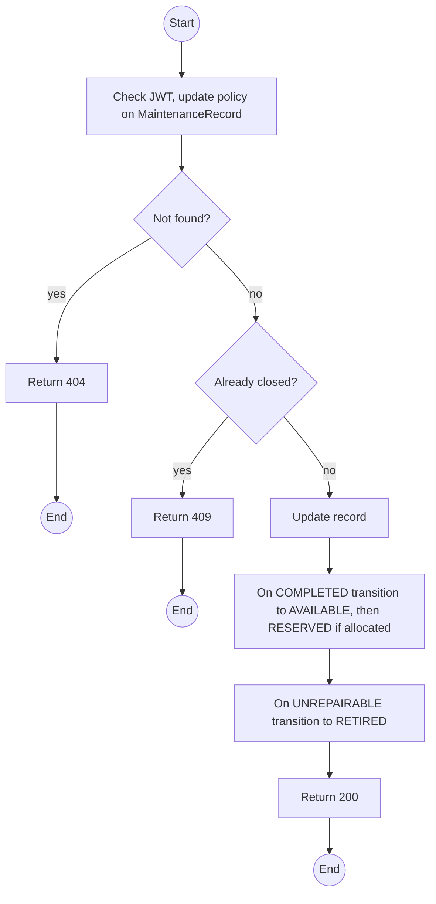
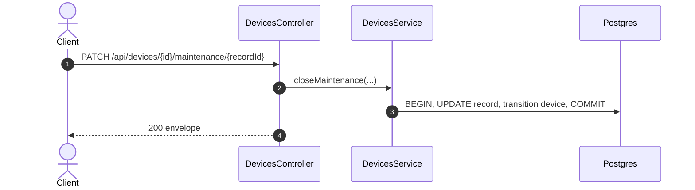

# PATCH /api/devices/:id/maintenance/:recordId: Progress or close a maintenance record

> Module `devices`. Format: `02-templates/04-api-endpoint-template.md`, with Mermaid in place of PlantUML (D-017). Envelope: D-002.

[TOC]

---
## Overview

Moves a record to `IN_REPAIR`, or closes it as `COMPLETED` (device back to `AVAILABLE`, then `RESERVED` if it has future allocations) or `UNREPAIRABLE` (device `RETIRED` with reason `UNREPAIRABLE`).

## API Specification

| API        | URL             |
| ---------- | --------------- |
| PATCH | /api/devices/:id/maintenance/:recordId |
| Permission | Operator |
| Traces | US-018, US-020, REQ-EVT-10, E05-6 |

### Path parameters

| Field | Description | Data Type | Examples |
| --- | --- | --- | --- |
| id | Device id | uuid | `0d3f6a2b-7e11-4c55-8f0a-2b1c9e7d4a10` |
| recordId | Maintenance record id | uuid | `mr-20...` |

## Request sample

```json
{
  "status": "COMPLETED",
  "resolution": "Replaced antenna, range test passed"
}
```

| Field | Description | Data Type | Required | Examples |
| --- | --- | --- | --- | --- |
| status | IN_REPAIR, COMPLETED or UNREPAIRABLE | enum | yes | `COMPLETED` |
| resolution | Required to close | string | no | `Replaced antenna` |

## Response sample

```json
{
  "result": {
    "id": "mr-20...",
    "status": "COMPLETED",
    "resolution": "Replaced antenna, range test passed",
    "closedAt": "2026-10-05T08:00:00Z",
    "deviceStatus": "AVAILABLE"
  },
  "isSuccess": true,
  "statusCode": 200,
  "message": "Maintenance record updated"
}
```

## Validation

<table>
    <th>Status code</th>
    <th>Description</th>
    <th>Examples</th>
    <tbody>
        <tr>
            <td>400</td>
            <td>Resolution missing on close (<code>VALIDATION_FAILED</code>)</td>
<td>

```json
{
  "result": {
    "errorCode": "VALIDATION_FAILED"
  },
  "isSuccess": false,
  "statusCode": 400,
  "message": "resolution is required to close a record."
}
```
</td>
        </tr>
        <tr>
            <td>401</td>
            <td>Missing, malformed or expired access token (<code>UNAUTHENTICATED</code>)</td>
<td>

```json
{
  "result": {
    "errorCode": "UNAUTHENTICATED"
  },
  "isSuccess": false,
  "statusCode": 401,
  "message": "Authentication required."
}
```
</td>
        </tr>
        <tr>
            <td>403</td>
            <td>Authenticated, but the caller's role or policy does not allow this action (<code>FORBIDDEN</code>)</td>
<td>

```json
{
  "result": {
    "errorCode": "FORBIDDEN"
  },
  "isSuccess": false,
  "statusCode": 403,
  "message": "You do not have permission to perform this action."
}
```
</td>
        </tr>
        <tr>
            <td>404</td>
            <td>No such record on this device (<code>NOT_FOUND</code>)</td>
<td>

```json
{
  "result": {
    "errorCode": "NOT_FOUND"
  },
  "isSuccess": false,
  "statusCode": 404,
  "message": "Maintenance record not found."
}
```
</td>
        </tr>
        <tr>
            <td>409</td>
            <td>Record already closed (<code>MAINTENANCE_NOT_OPEN</code>)</td>
<td>

```json
{
  "result": {
    "errorCode": "MAINTENANCE_NOT_OPEN"
  },
  "isSuccess": false,
  "statusCode": 409,
  "message": "Maintenance record is already closed."
}
```
</td>
        </tr>
    </tbody>
</table>

## Activity Diagram



## Sequence Diagram


