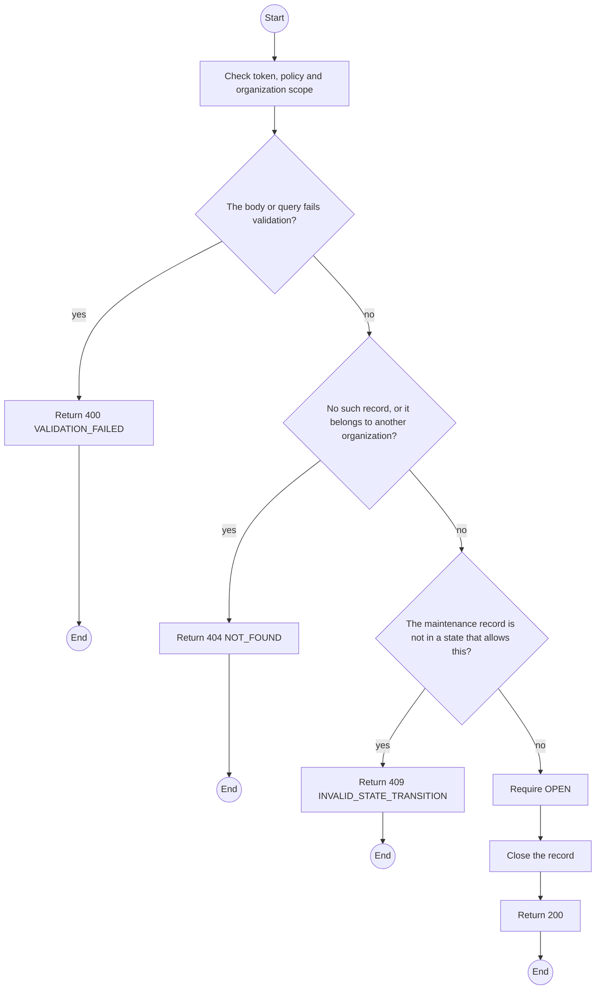
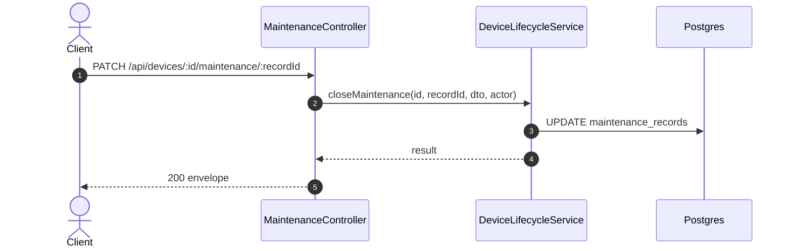

# PATCH /api/devices/:id/maintenance/:recordId: Close maintenance

> Module `devices`. Generated from `scripts/specs/endpoints/devices.py` by `scripts/specs/build_api_design.py`; edit the catalog, not this file. Format: `02-templates/04-api-endpoint-template.md` with Mermaid (D-017). Envelope: D-002.

[TOC]

---
## Overview

Closes a maintenance record as `COMPLETED` or `UNREPAIRABLE`. A completed device stays `MAINTENANCE` until it passes an intake check (FR-DEV-08); an unrepairable one waits for an Admin to retire it.

## API Specification

| API | URL |
| --- | --- |
| PATCH | /api/devices/:id/maintenance/:recordId |
| Permission | TrekLink Staff |
| Traces | UC-52, FR-DEV-08 |

### Path parameters

| Field | Description | Data Type | Examples |
| --- | --- | --- | --- |
| id | Device id | uuid | `0d3f6a2b-7e11-4c55-8f0a-2b1c9e7d4a10` |
| recordId | Maintenance record id | uuid | `mr-1` |

## Request sample

```json
{
  "status": "COMPLETED",
  "resolution": "Battery replaced"
}
```

| Field | Description | Data Type | Required | Examples |
| --- | --- | --- | --- | --- |
| status | `COMPLETED` or `UNREPAIRABLE` | enum | yes | `COMPLETED` |
| resolution | What was done | string | yes | `Battery replaced` |

## Response sample

```json
{
  "result": {
    "id": "mr-1",
    "status": "COMPLETED",
    "closedAt": "2026-10-20T03:15:00.000Z"
  },
  "isSuccess": true,
  "statusCode": 200,
  "message": "Maintenance closed"
}
```

## Validation

<table>
    <th>Status code</th>
    <th>Description</th>
    <th>Examples</th>
    <tbody>
        <tr>
            <td>400</td>
            <td>The body or query fails validation (<code>VALIDATION_FAILED</code>)</td>
<td>

```json
{
  "result": {
    "errorCode": "VALIDATION_FAILED"
  },
  "isSuccess": false,
  "statusCode": 400,
  "message": "{field} is required."
}
```
</td>
        </tr>
        <tr>
            <td>401</td>
            <td>Missing, malformed or expired access token or API key (<code>UNAUTHENTICATED</code>)</td>
<td>

```json
{
  "result": {
    "errorCode": "UNAUTHENTICATED"
  },
  "isSuccess": false,
  "statusCode": 401,
  "message": "Authentication required."
}
```
</td>
        </tr>
        <tr>
            <td>403</td>
            <td>The caller's role, policy or organization does not allow this action (<code>FORBIDDEN</code>)</td>
<td>

```json
{
  "result": {
    "errorCode": "FORBIDDEN"
  },
  "isSuccess": false,
  "statusCode": 403,
  "message": "You do not have access to this."
}
```
</td>
        </tr>
        <tr>
            <td>404</td>
            <td>No such record, or it belongs to another organization (<code>NOT_FOUND</code>)</td>
<td>

```json
{
  "result": {
    "errorCode": "NOT_FOUND"
  },
  "isSuccess": false,
  "statusCode": 404,
  "message": "Maintenance record not found."
}
```
</td>
        </tr>
        <tr>
            <td>409</td>
            <td>The maintenance record is not in a state that allows this (<code>INVALID_STATE_TRANSITION</code>)</td>
<td>

```json
{
  "result": {
    "errorCode": "INVALID_STATE_TRANSITION"
  },
  "isSuccess": false,
  "statusCode": 409,
  "message": "This cannot be done while it is COMPLETED."
}
```
</td>
        </tr>
    </tbody>
</table>

## Activity Diagram



## Sequence Diagram


