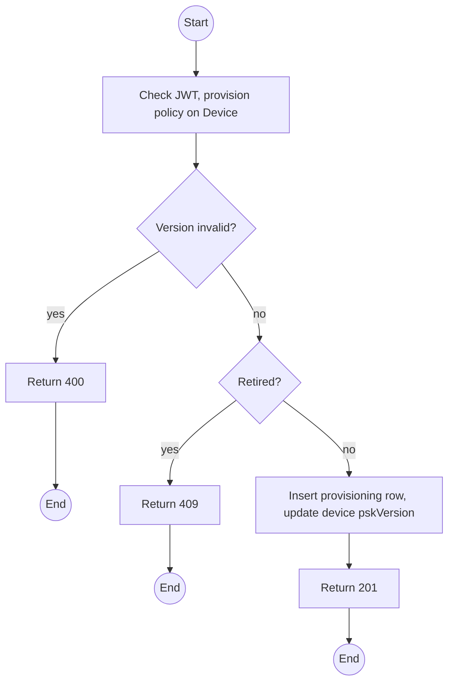
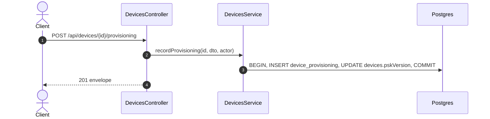

# POST /api/devices/:id/provisioning: Record channel PSK provisioning

> Module `devices`. Format: `02-templates/04-api-endpoint-template.md`, with Mermaid in place of PlantUML (D-017). Envelope: D-002.

[TOC]

---
## Overview

Records that a unit was provisioned with the fleet channel key at a given version, using the Meshtastic app (channel QR) or CLI. The key itself never passes through this API. Check-out requires the current version while `devices.requireCurrentPskForCheckout` is true.

## API Specification

| API        | URL             |
| ---------- | --------------- |
| POST | /api/devices/:id/provisioning |
| Permission | Operator |
| Traces | D-021, UC-39 (new), FR-DEV-06 (new), REQ-EVT-11, REQ-UBI-06, Q51 |

### Path parameters

| Field | Description | Data Type | Examples |
| --- | --- | --- | --- |
| id | Device id | uuid | `0d3f6a2b-7e11-4c55-8f0a-2b1c9e7d4a10` |

## Request sample

```json
{
  "pskVersion": 2,
  "channelName": "TrekLink",
  "method": "MESHTASTIC_APP_QR",
  "note": "Verified in app: channel TrekLink, key fingerprint matches"
}
```

| Field | Description | Data Type | Required | Examples |
| --- | --- | --- | --- | --- |
| pskVersion | Must equal `devices.currentPskVersion` or be lower (back-filling history) | int | yes | `2` |
| channelName | Primary channel name set on the unit | string | yes | `TrekLink` |
| method | ProvisioningMethod | enum | yes | `MESHTASTIC_APP_QR` |
| note | What was verified | string | no | `Verified in app` |

## Response sample

```json
{
  "result": {
    "deviceId": "0d3f6a2b-7e11-4c55-8f0a-2b1c9e7d4a10",
    "pskVersion": 2,
    "pskCurrent": true,
    "provisionedAt": "2026-10-03T01:30:00Z",
    "provisionedBy": {
      "id": "9a1b...",
      "username": "op.lan"
    }
  },
  "isSuccess": true,
  "statusCode": 201,
  "message": "Provisioning recorded"
}
```

## Validation

<table>
    <th>Status code</th>
    <th>Description</th>
    <th>Examples</th>
    <tbody>
        <tr>
            <td>400</td>
            <td>Version above the current fleet version (<code>VALIDATION_FAILED</code>)</td>
<td>

```json
{
  "result": {
    "errorCode": "VALIDATION_FAILED"
  },
  "isSuccess": false,
  "statusCode": 400,
  "message": "pskVersion cannot exceed the current fleet version 2."
}
```
</td>
        </tr>
        <tr>
            <td>401</td>
            <td>Missing, malformed or expired access token (<code>UNAUTHENTICATED</code>)</td>
<td>

```json
{
  "result": {
    "errorCode": "UNAUTHENTICATED"
  },
  "isSuccess": false,
  "statusCode": 401,
  "message": "Authentication required."
}
```
</td>
        </tr>
        <tr>
            <td>403</td>
            <td>Authenticated, but the caller's role or policy does not allow this action (<code>FORBIDDEN</code>)</td>
<td>

```json
{
  "result": {
    "errorCode": "FORBIDDEN"
  },
  "isSuccess": false,
  "statusCode": 403,
  "message": "You do not have permission to perform this action."
}
```
</td>
        </tr>
        <tr>
            <td>404</td>
            <td>No such device (<code>NOT_FOUND</code>)</td>
<td>

```json
{
  "result": {
    "errorCode": "NOT_FOUND"
  },
  "isSuccess": false,
  "statusCode": 404,
  "message": "Device not found."
}
```
</td>
        </tr>
        <tr>
            <td>409</td>
            <td>Device retired (<code>INVALID_STATE_TRANSITION</code>)</td>
<td>

```json
{
  "result": {
    "errorCode": "INVALID_STATE_TRANSITION"
  },
  "isSuccess": false,
  "statusCode": 409,
  "message": "Cannot provision a retired device."
}
```
</td>
        </tr>
    </tbody>
</table>

## Activity Diagram



## Sequence Diagram


