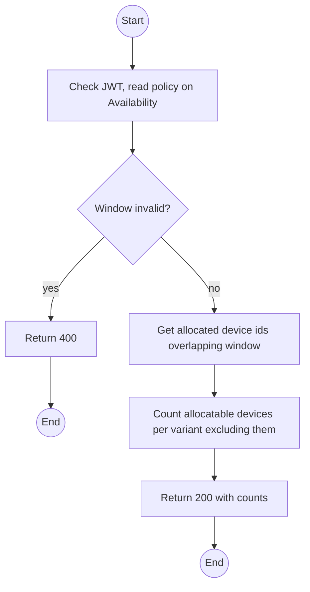
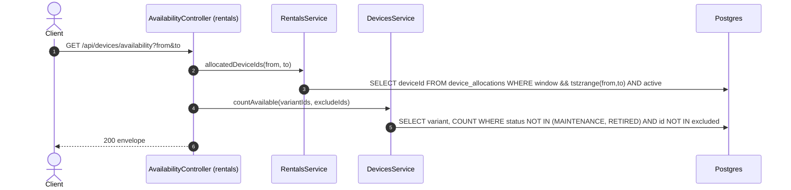

# GET /api/devices/availability: Availability count for a window

> Module `devices`. Format: `02-templates/04-api-endpoint-template.md`, with Mermaid in place of PlantUML (D-017). Envelope: D-002.

[TOC]

---
## Overview

How many devices, per variant, can still be allocated for a time window. A device counts when it is not `MAINTENANCE` or `RETIRED` and has no allocation overlapping the window. Customers see counts only, never device identities. Counts are advisory: the reservation call re-checks under lock.

## API Specification

| API        | URL             |
| ---------- | --------------- |
| GET | /api/devices/availability |
| Permission | Operator, Admin, Guide, Customer |
| Traces | UC-22 Verify Device Availability, FR-BOOK-02, BR-01, E01-5 |

### Query parameters

| Field | Description | Data Type | Required | Examples |
| --- | --- | --- | --- | --- |
| from | Window start, UTC | datetime | yes | `2026-10-10T00:00:00Z` |
| to | Window end, UTC, after from | datetime | yes | `2026-10-13T00:00:00Z` |
| hardwareVariantIds | Restrict to these variants (trip restriction) | uuid[] | no | `hv-02...,hv-03...` |

## Request sample

No request body. Query string example:

```
GET /api/devices/availability?from=2026-10-10T00:00:00Z&to=2026-10-13T00:00:00Z
```

## Response sample

```json
{
  "result": {
    "from": "2026-10-10T00:00:00Z",
    "to": "2026-10-13T00:00:00Z",
    "total": 9,
    "byVariant": [
      {
        "hardwareVariantId": "hv-03...",
        "code": "treklink-v3",
        "available": 6
      },
      {
        "hardwareVariantId": "hv-04...",
        "code": "treklink-v4",
        "available": 3
      }
    ]
  },
  "isSuccess": true,
  "statusCode": 200,
  "message": "Availability computed"
}
```

### Rules

The overlap test needs allocation windows, which `rentals` owns. The controller calls `RentalsService.allocatedDeviceIds(from, to)` and passes the ids into `DevicesService.countAvailable(...)`. This is the one read in `devices` that composes with `rentals`, and it is done in the controller of `rentals` to keep the dependency direction: the route is served by `RentalsModule` under the `/api/devices/availability` path. Listed here because it is a device question.

## Validation

<table>
    <th>Status code</th>
    <th>Description</th>
    <th>Examples</th>
    <tbody>
        <tr>
            <td>400</td>
            <td>`to` not after `from`, or window longer than the maximum (<code>VALIDATION_FAILED</code>)</td>
<td>

```json
{
  "result": {
    "errorCode": "VALIDATION_FAILED"
  },
  "isSuccess": false,
  "statusCode": 400,
  "message": "to must be later than from."
}
```
</td>
        </tr>
        <tr>
            <td>401</td>
            <td>Missing, malformed or expired access token (<code>UNAUTHENTICATED</code>)</td>
<td>

```json
{
  "result": {
    "errorCode": "UNAUTHENTICATED"
  },
  "isSuccess": false,
  "statusCode": 401,
  "message": "Authentication required."
}
```
</td>
        </tr>
        <tr>
            <td>403</td>
            <td>Authenticated, but the caller's role or policy does not allow this action (<code>FORBIDDEN</code>)</td>
<td>

```json
{
  "result": {
    "errorCode": "FORBIDDEN"
  },
  "isSuccess": false,
  "statusCode": 403,
  "message": "You do not have permission to perform this action."
}
```
</td>
        </tr>
    </tbody>
</table>

## Activity Diagram



## Sequence Diagram


