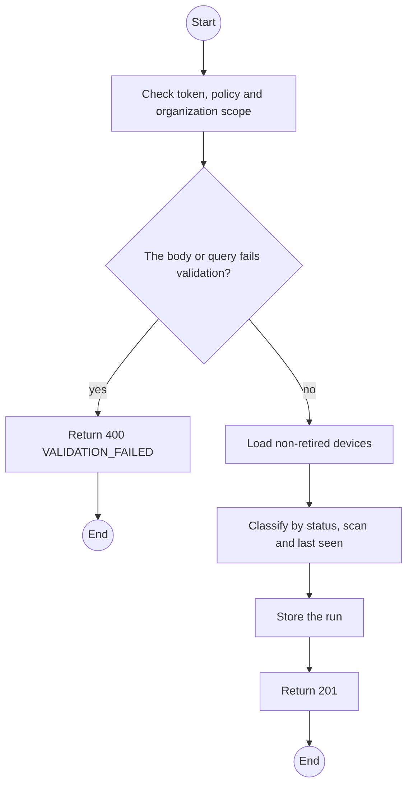
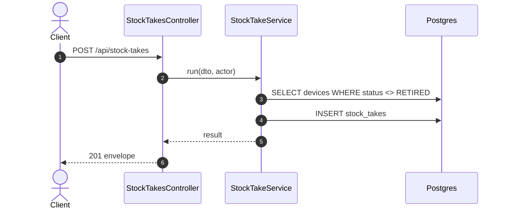

# POST /api/stock-takes: Run a stock-take

> Module `devices`. Generated from `scripts/specs/endpoints/devices.py` by `scripts/specs/build_api_design.py`; edit the catalog, not this file. Format: `02-templates/04-api-endpoint-template.md` with Mermaid (D-017). Envelope: D-002.

[TOC]

---
## Overview

Compares scanned asset tags with the fleet: in-stock units confirmed by scan, rented units confirmed by a packet within `devices.stockTakeSeenHours`, and every unit confirmed by neither (FR-DEV-10). The run and its result are stored.

## API Specification

| API | URL |
| --- | --- |
| POST | /api/stock-takes |
| Permission | TrekLink Staff, TrekLink Admin |
| Traces | UC-54, FR-DEV-10 |

## Request sample

```json
{
  "scannedTags": [
    "TL-0001",
    "TL-0002",
    "TL-0007"
  ]
}
```

| Field | Description | Data Type | Required | Examples |
| --- | --- | --- | --- | --- |
| scannedTags | Asset tags scanned on the shelf | string[] | yes | `["TL-0001", "TL-0002"]` |

## Response sample

```json
{
  "result": {
    "id": "st-1",
    "inStockConfirmed": 12,
    "rentedSeen": 20,
    "unconfirmed": [
      {
        "assetTag": "TL-0031",
        "status": "AVAILABLE"
      },
      {
        "assetTag": "TL-0040",
        "status": "RENTED",
        "lastSeenAt": "2026-10-17T08:00:00Z"
      }
    ],
    "unknownTags": [
      "TL-9999"
    ]
  },
  "isSuccess": true,
  "statusCode": 201,
  "message": "Stock-take recorded"
}
```

## Validation

<table>
    <th>Status code</th>
    <th>Description</th>
    <th>Examples</th>
    <tbody>
        <tr>
            <td>400</td>
            <td>The body or query fails validation (<code>VALIDATION_FAILED</code>)</td>
<td>

```json
{
  "result": {
    "errorCode": "VALIDATION_FAILED"
  },
  "isSuccess": false,
  "statusCode": 400,
  "message": "{field} is required."
}
```
</td>
        </tr>
        <tr>
            <td>401</td>
            <td>Missing, malformed or expired access token or API key (<code>UNAUTHENTICATED</code>)</td>
<td>

```json
{
  "result": {
    "errorCode": "UNAUTHENTICATED"
  },
  "isSuccess": false,
  "statusCode": 401,
  "message": "Authentication required."
}
```
</td>
        </tr>
        <tr>
            <td>403</td>
            <td>The caller's role, policy or organization does not allow this action (<code>FORBIDDEN</code>)</td>
<td>

```json
{
  "result": {
    "errorCode": "FORBIDDEN"
  },
  "isSuccess": false,
  "statusCode": 403,
  "message": "You do not have access to this."
}
```
</td>
        </tr>
    </tbody>
</table>

## Activity Diagram



## Sequence Diagram


