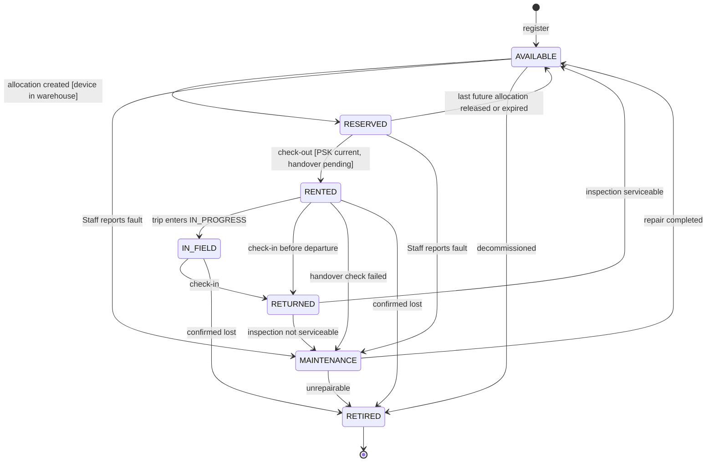
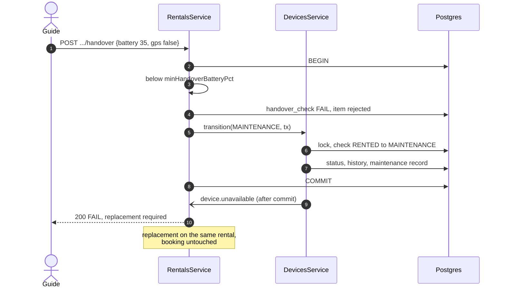
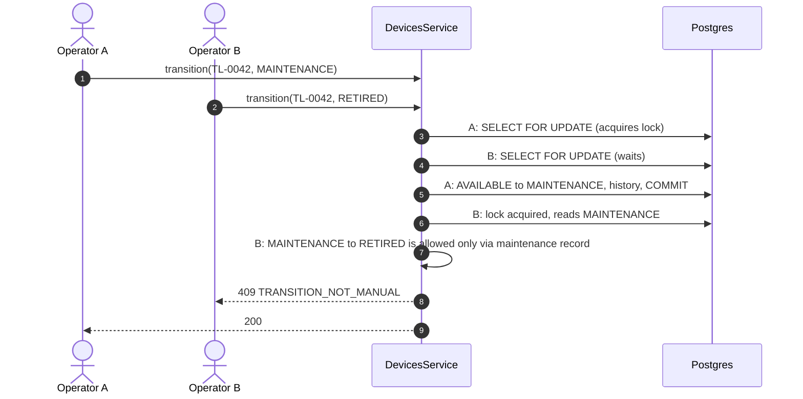

# Technical Design: devices

> Fulfills `requirements.md` in this folder. ERD slice: `specs/platform/design.md` Figure 7. The state machine in §2.1 is one of the two UML state machines the charter names as graded deliverables; it is also copied to `_handoff/outbound/capstone/Documents/reports/sdd-diagrams/` for the SDD.

---

## 1. Domain Model & Data Schema

```prisma
enum DeviceStatus { AVAILABLE RESERVED RENTED IN_FIELD RETURNED MAINTENANCE RETIRED }
enum RetireReason { UNREPAIRABLE LOST DECOMMISSIONED OTHER }
enum ActorKind    { USER SYSTEM }
enum MaintenanceReason { RETURN_DAMAGE FAILED_HANDOVER FAILED_INSPECTION SCHEDULED STAFF_REPORTED }
enum MaintenanceStatus { OPEN IN_REPAIR COMPLETED UNREPAIRABLE }
enum ProvisioningMethod { MESHTASTIC_APP_QR MESHTASTIC_CLI OTHER }

model HardwareVariant {
  id            String   @id @default(uuid())
  code          String   @unique          // treklink-v1 .. treklink-v4
  name          String
  mqttCapable   Boolean                   // false for v1: -D MESHTASTIC_EXCLUDE_MQTT=1
  hasPsram      Boolean                   // informs the on-device queue bound (firmware risk row, S7)
  notes         String?
  isActive      Boolean  @default(true)
  createdAt     DateTime @default(now())
  updatedAt     DateTime @updatedAt
  @@map("hardware_variants")
}

model Device {
  id                String        @id @default(uuid())
  assetTag          String        @unique   // printed label, e.g. TL-0042
  hardwareVariantId String
  nodeNum           BigInt?       @unique   // uint32 from MAC; REQ-UBI-04
  macAddress        String?       @unique
  firmwareVersion   String?
  status            DeviceStatus  @default(AVAILABLE)
  statusChangedAt   DateTime      @default(now())
  pskVersion        Int?                    // D-021: version only, never the key
  pskProvisionedAt  DateTime?
  // projection written by gateway-sync (REQ-EVT-12)
  lastSeenAt        DateTime?
  batteryPct        Int?
  lastLatitude      Float?
  lastLongitude     Float?
  lastGatewayId     String?
  buffering         Boolean       @default(false)
  // retirement
  retiredAt         DateTime?
  retireReason      RetireReason?
  notes             String?
  createdAt         DateTime      @default(now())
  updatedAt         DateTime      @updatedAt
  @@index([status])
  @@index([hardwareVariantId, status])
  @@map("devices")
}

model DeviceStatusHistory {
  id          String        @id @default(uuid())
  deviceId    String
  fromStatus  DeviceStatus?               // null for the registration row
  toStatus    DeviceStatus
  actorKind   ActorKind
  actorId     String?
  reason      String                      // machine reason: CHECKOUT, CHECKIN, TRIP_STARTED, ...
  note        String?
  refType     String?                     // ALLOCATION, RENTAL_ITEM, INSPECTION, MAINTENANCE, HANDOVER
  refId       String?
  createdAt   DateTime      @default(now())
  @@index([deviceId, createdAt])
  @@map("device_status_history")              // append-only trigger (platform task 1.5)
}

model MaintenanceRecord {
  id                 String            @id @default(uuid())
  deviceId           String
  reason             MaintenanceReason
  status             MaintenanceStatus @default(OPEN)
  description        String
  sourceRefType      String?           // INSPECTION, HANDOVER
  sourceRefId        String?
  resolution         String?
  openedById         String?
  closedById         String?
  openedAt           DateTime          @default(now())
  closedAt           DateTime?
  @@index([deviceId, status])
  @@map("maintenance_records")
}

model DeviceProvisioning {
  id            String             @id @default(uuid())
  deviceId      String
  pskVersion    Int
  channelName   String
  method        ProvisioningMethod
  provisionedById String
  note          String?
  createdAt     DateTime           @default(now())
  @@index([deviceId, createdAt])
  @@map("device_provisioning")               // append-only
}
```

A partial unique index keeps REQ-ERR-04 in the database too: `CREATE UNIQUE INDEX one_open_maintenance ON maintenance_records(device_id) WHERE status IN ('OPEN','IN_REPAIR')`.

---

## 2. Service / Business Logic Design

### 2.1 Device lifecycle state machine

See **Figure 1**.



***Figure 1***: Device lifecycle, 7 states. The charter's main path runs Available, Reserved, Rented, In-Field, Returned, then back to Available or into Maintenance and Retired. The extra edges are each required by a named exception scenario; the table below cites which.

The transition table is the only place these edges exist in code (`device-fsm.ts`, per `04-architecture-conventions.md` §2.1). Every row names who may trigger it:

| From | To | Trigger | Manual? | Actor | Required by |
|---|---|---|---|---|---|
| (none) | AVAILABLE | registration | yes | Operator, Admin | US-012 |
| AVAILABLE | RESERVED | allocation created, device in warehouse | no | rentals | MF-01 step 3 |
| RESERVED | AVAILABLE | last future allocation released, expired or moved | no | rentals, scheduler | E01-2, Q59 |
| RESERVED | RENTED | check-out | no | rentals | MF-01 step 7 |
| RENTED | IN_FIELD | trip enters `IN_PROGRESS` | no | trips event | Q48 proposal |
| RENTED | RETURNED | check-in before departure | no | rentals | trip cancelled after check-out (Q72) |
| IN_FIELD | RETURNED | check-in | no | rentals | MF-05 step 1 |
| RETURNED | AVAILABLE | inspection serviceable | no | rentals | MF-05 step 6 |
| RETURNED | MAINTENANCE | inspection not serviceable | no | rentals | E05-2, E05-6 |
| RENTED | MAINTENANCE | Guide handover check failed | no | rentals | E01-3 |
| AVAILABLE | MAINTENANCE | Staff reports a fault | yes | Operator | US-018 |
| RESERVED | MAINTENANCE | Staff reports a fault before check-out | yes | Operator | E01-3 variant |
| MAINTENANCE | AVAILABLE | maintenance completed | yes, via maintenance record | Operator | US-018 |
| MAINTENANCE | RETIRED | maintenance unrepairable | yes, via maintenance record | Operator | US-020 |
| AVAILABLE | RETIRED | decommission | yes | Operator, Admin | US-020 |
| RENTED | RETIRED | loss confirmed | yes, via rentals | Operator | E05-3, FR-DEV-09 |
| IN_FIELD | RETIRED | loss confirmed | yes, via rentals | Operator | E05-3, FR-DEV-09 |

Differences from the table in `04-architecture-conventions.md` §2.1, which is a sketch predating the exception scenarios: added `RENTED → MAINTENANCE` (E01-3), `RESERVED → MAINTENANCE`, and `RENTED | IN_FIELD → RETIRED` (E05-3). A REQUEST entry proposes the convention table be updated to match once this is approved.

**What `RESERVED` means, precisely.** Availability over time lives in `rentals`' `DeviceAllocation` windows, protected by an exclusion constraint. `Device.status` is custody state. `RESERVED` therefore means *in the warehouse and earmarked for at least one future allocation*. A unit out on trip A can hold an allocation for a later, non-overlapping trip B (Q53) without changing state; when it comes back and passes inspection it goes `RETURNED → AVAILABLE → RESERVED` in one transaction (REQ-EVT-07).

### 2.2 Services

`DevicesService` (exported) is the only writer of `Device.status`:

```ts
transition(deviceId: string, to: DeviceStatus, ctx: TransitionContext, tx?: Tx): Promise<DeviceDto>
// ctx = { actorKind, actorId?, reason, note?, refType?, refId?, manual: boolean }
```

1. `SELECT ... FROM devices WHERE id = $1 FOR UPDATE` on `tx ?? prisma` (REQ-ERR-02).
2. Look up `(from, to)` in the table; missing row gives `INVALID_STATE_TRANSITION`; `manual` true on a non-manual row gives `TRANSITION_NOT_MANUAL`.
3. Row-specific guards (PSK current for check-out, reason present for retirement).
4. Update status, `statusChangedAt`; insert history; queue `device.status.changed` and, for `MAINTENANCE` or `RETIRED`, `device.unavailable` for after commit.

Other exported methods used by other modules:

| Method | Caller | Purpose |
|---|---|---|
| `findById`, `findManyByIds` | all | reads |
| `findByNodeNum(nodeNum)` | gateway-sync | ingress resolution |
| `lockForAllocation(ids, tx)` | rentals | row lock before overlap check |
| `findAllocatableCandidates(variantIds, excludeIds, tx)` | rentals | devices not `MAINTENANCE` or `RETIRED`, `FOR UPDATE SKIP LOCKED` |
| `assertCheckoutEligible(deviceId, tx)` | rentals | status `RESERVED`, PSK version current |
| `isVariantAccepted(deviceId, variantIds)` | rentals | REQ-OPT-01 |
| `updateProjection(deviceId, patch, tx)` | gateway-sync | REQ-EVT-12 |
| `openMaintenance(deviceId, reason, source, tx)` | rentals | REQ-EVT-08 |

`DevicesService` does not subscribe to `trip.status.changed`, because it does not know which devices are on a trip. `rentals` subscribes, resolves the trip's checked-out items, and calls `transition(..., IN_FIELD)` for each. Devices stays ignorant of trips.

### 2.3 Battery advisory

Computed on read, never stored: `batteryPct == null` gives `UNKNOWN`; below `devices.batteryAdvisoryPct` gives `CHARGE_ADVISED`; otherwise `OK`. The **blocking** threshold `devices.minHandoverBatteryPct` applies only to a battery reading a person entered during the handover check in `rentals` (Q52: manual verification is final).

### 2.4 Connectivity on reads

Detail and list reads include `connectivity`: `NEVER_SEEN` when `lastSeenAt` is null, `BUFFERING` when `buffering` is true, `STALE` when `now - lastSeenAt` exceeds `monitoring.deviceStaleSeconds`, else `LIVE`. The threshold is owned by `monitoring`; `devices` reads the parameter so the fleet list and the live map agree.

### 2.5 Error catalogue

| Code | HTTP | Raised when |
|---|---|---|
| `ASSET_TAG_TAKEN`, `NODE_NUM_TAKEN`, `MAC_TAKEN` | 409 | uniqueness on register or update |
| `VARIANT_CODE_TAKEN` | 409 | variant code reused |
| `VARIANT_INACTIVE` | 409 | register on an inactive variant |
| `INVALID_STATE_TRANSITION` | 409 | pair not in the table, or state changed under the caller |
| `TRANSITION_NOT_MANUAL` | 409 | manual request for a system-only edge |
| `PSK_NOT_CURRENT` | 409 | check-out with an old PSK version |
| `DEVICE_NOT_ALLOCATABLE` | 409 | allocation on `MAINTENANCE` or `RETIRED` |
| `MAINTENANCE_ALREADY_OPEN` | 409 | second open record |
| `MAINTENANCE_NOT_OPEN` | 409 | completing a closed record |
| `NODE_NUM_INVALID` | 400 | not a uint32 in decimal or `!hex` form |

---

## 3. Sequence Flows

### 3.1 Handover check fails after check-out (E01-3)

See **Figure 2**.



***Figure 2***: A failed handover sends the unit to maintenance and leaves the rental open for a replacement, which is what E01-3 requires.

### 3.2 Manual transition with a race

See **Figure 3**.



***Figure 3***: The row lock makes the second request see committed state, so two Staff members cannot drive one device through inconsistent transitions (Q48).

---

## 4. API Endpoints in this module

| # | Method | Route | Permission | Spec |
|---|---|---|---|---|
| 01 | GET | `/api/hardware-variants` | Admin, Operator, Guide | `api-design/01-get-hardware-variants-list.md` |
| 02 | POST | `/api/hardware-variants` | Admin | `api-design/02-post-hardware-variants-create.md` |
| 03 | PATCH | `/api/hardware-variants/:id` | Admin | `api-design/03-patch-hardware-variants-update.md` |
| 04 | POST | `/api/devices` | Operator, Admin | `api-design/04-post-devices-register.md` |
| 05 | GET | `/api/devices` | Operator, Admin; Guide (own trips) | `api-design/05-get-devices-list.md` |
| 06 | GET | `/api/devices/:id` | Operator, Admin; Guide (own trips) | `api-design/06-get-devices-detail.md` |
| 07 | PATCH | `/api/devices/:id` | Operator, Admin | `api-design/07-patch-devices-update.md` |
| 08 | POST | `/api/devices/:id/transitions` | Operator, Admin (decommission) | `api-design/08-post-devices-transition.md` |
| 09 | GET | `/api/devices/:id/status-history` | Operator, Admin | `api-design/09-get-devices-status-history.md` |
| 10 | POST | `/api/devices/:id/maintenance` | Operator | `api-design/10-post-devices-maintenance-open.md` |
| 11 | PATCH | `/api/devices/:id/maintenance/:recordId` | Operator | `api-design/11-patch-devices-maintenance-close.md` |
| 12 | POST | `/api/devices/:id/provisioning` | Operator | `api-design/12-post-devices-provisioning.md` |
| 13 | GET | `/api/devices/availability` (served by `RentalsModule`, see the file) | Operator, Admin, Guide, Customer | `api-design/13-get-devices-availability.md` |

The device history view of US-022 is composed in the frontend from endpoint 09, `GET /api/rentals?deviceId=` and `GET /api/incidents?deviceId=`, because `devices` may not import `rentals` or `incidents` (dependency graph, platform Figure 3).

---

## 5. Frontend impact

- `pages/DeviceFleetPage` (Pattern A list), `pages/DeviceDetailPage` (status pill, connectivity, battery advisory, history timeline, maintenance tab, provisioning tab).
- `features/RegisterDeviceForm` (single step, 5 fields), `features/DeviceTransitionMenu` (only manual edges from §2.1, confirmation modal for retirement), `features/MaintenanceRecordForm`.
- `entities/DeviceStatusPill`, `entities/BatteryAdvisoryBadge`, `entities/ConnectivityBadge`.
- Zod: `registerDeviceSchema` accepts `nodeNum` as decimal or `!hex`, mirroring the DTO transform.
