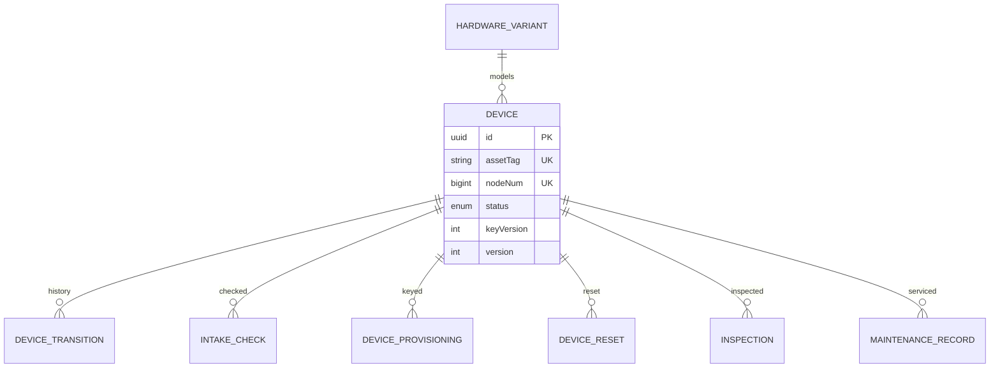
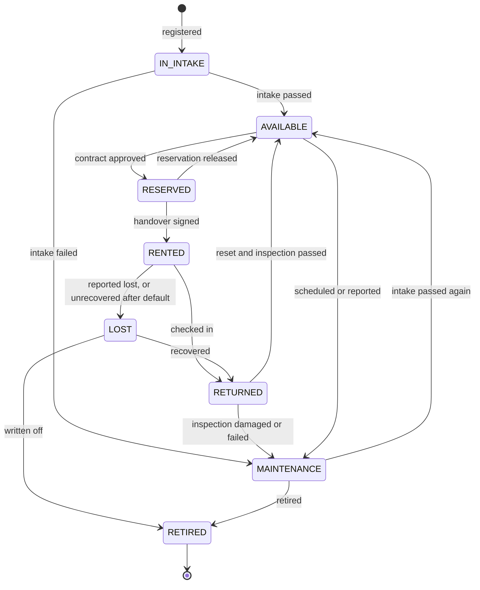
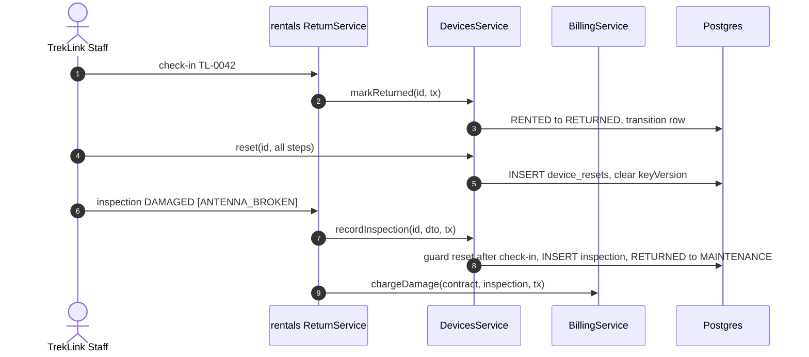

# Technical Design: devices

> Fulfills `requirements.md` in this folder. Schema: the `// @module devices` block of
> `backend/prisma/schema.prisma` is authoritative.

---

## 1. Data model

```mermaid
erDiagram
    HARDWARE_VARIANT ||--o{ DEVICE : "models"
    DEVICE ||--o{ DEVICE_TRANSITION : "history"
    DEVICE ||--o{ INTAKE_CHECK : "checked"
    DEVICE ||--o{ DEVICE_PROVISIONING : "keyed"
    DEVICE ||--o{ DEVICE_RESET : "reset"
    DEVICE ||--o{ INSPECTION : "inspected"
    DEVICE ||--o{ MAINTENANCE_RECORD : "serviced"
    DEVICE {
        uuid id PK
        string assetTag UK
        bigint nodeNum UK
        enum status
        int keyVersion
        int version
    }
```

***Figure 1***: devices slice. `Inspection.contractDeviceId` points at the `rentals` row the inspection
closes; `StockTake` stands alone.

`nodeNum` is the unsigned 32-bit radio identity the firmware derives from the MAC
(`04-firmware-ground-truth.md` §3); registration accepts either the number or the `!xxxxxxxx` node id.
Remaining value (FR-BILL-05) is read from the variant's `remainingValueSchedule` by whole months since
`acquiredAt`: `valueAt(device, date)`.

---

## 2. Device lifecycle (D-035, amended by D-038)

```mermaid
stateDiagram-v2
    [*] --> IN_INTAKE : registered
    IN_INTAKE --> AVAILABLE : intake passed
    IN_INTAKE --> MAINTENANCE : intake failed
    AVAILABLE --> RESERVED : contract approved
    RESERVED --> AVAILABLE : reservation released
    RESERVED --> RENTED : handover signed
    RENTED --> RETURNED : checked in
    RENTED --> LOST : reported lost, or unrecovered after default
    LOST --> RETURNED : recovered
    LOST --> RETIRED : written off
    RETURNED --> AVAILABLE : reset and inspection passed
    RETURNED --> MAINTENANCE : inspection damaged or failed
    AVAILABLE --> MAINTENANCE : scheduled or reported
    MAINTENANCE --> AVAILABLE : intake passed again
    MAINTENANCE --> RETIRED : retired
    RETIRED --> [*]
```

***Figure 2***: Device lifecycle; SRS Figure 22.

| From | To | Trigger | Caller | Guard |
|---|---|---|---|---|
| (none) | `IN_INTAKE` | register | Staff | unique tag and `nodeNum` |
| `IN_INTAKE`, `MAINTENANCE` | `AVAILABLE` | intake passed | Staff | no open maintenance record |
| `IN_INTAKE`, `AVAILABLE` | `MAINTENANCE` | intake failed, or maintenance opened | Staff | reason |
| `AVAILABLE` | `RESERVED` | `reserve()` | rentals | locked with `SKIP LOCKED` |
| `RESERVED` | `AVAILABLE` | `release()` | rentals | contract cancelled, or swap |
| `RESERVED` | `MAINTENANCE` | `failHandoverCheck()` | rentals | swap at the counter (E01-5) |
| `RESERVED` | `RENTED` | `markRented()` | rentals | provisioned at the organization's current key version |
| `RENTED` | `RETURNED` | `markReturned()` | rentals | check-in |
| `RENTED` | `LOST` | `markLost()` | rentals | contract `RETURN_DUE`, `OVERDUE` or `DEFAULTED` (D-038) |
| `LOST` | `RETURNED` | recover | Staff | note |
| `RETURNED` | `AVAILABLE`, `MAINTENANCE` | `recordInspection()` | rentals | reset logged after the last check-in |
| `MAINTENANCE`, `LOST` | `RETIRED` | retire | Admin | not on a live contract row |

Manual endpoints never reach the system-only rows; those are exported service methods taking `tx`.

---

## 3. Services other modules call

| Method | Caller |
|---|---|
| `reserve(variantId, quantity, contractId, tx)` returns device ids or throws `INSUFFICIENT_DEVICES` | rentals |
| `reserveExplicit(deviceIds, contractId, tx)` | rentals |
| `release(deviceIds, tx)`, `failHandoverCheck(deviceId, reason, tx)` | rentals |
| `recordProvisioning(deviceId, orgId, keyVersion, actor, tx)` | rentals |
| `assertReadyForHandover(deviceIds, keyVersion)` | rentals |
| `markRented(ids, tx)`, `markReturned(id, tx)`, `markLost(id, tx)` | rentals |
| `recordInspection(deviceId, dto, contractDeviceId, actor, tx)` returns the inspection | rentals |
| `valueAt(deviceId, date)` | billing |
| `projectReading(nodeNum, reading, tx)` returns the device id or null | gateway-sync |
| `byNodeNum(nodeNum)`, `projections(ids)`, `trail(id)` | gateway-sync, monitoring |
| `availability(variantId?)` | rentals, monitoring |

---

## 4. Error catalogue

| Code | HTTP |
|---|---|
| `INVALID_STATE_TRANSITION` | 409 |
| `INSUFFICIENT_DEVICES` | 409 |
| `RESET_REQUIRED` | 409 |
| `RESET_INCOMPLETE` | 400 |
| `MOTION_RESULT_REQUIRED` | 400 |
| `MAINTENANCE_OPEN` | 409 |
| `VARIANT_IN_USE` | 409 |
| `SCHEDULE_INVALID` | 400 |
| `KEY_VERSION_MISMATCH` | 409 |
| `DEVICE_NOT_PROVISIONED` | 409 |

---

## 5. Sequence: return loop (check-in, reset, inspection)

```mermaid
sequenceDiagram
    autonumber
    actor S as TrekLink Staff
    participant R as rentals ReturnService
    participant D as DevicesService
    participant B as BillingService
    participant DB as Postgres
    S->>R: check-in TL-0042
    R->>D: markReturned(id, tx)
    D->>DB: RENTED to RETURNED, transition row
    S->>D: reset(id, all steps)
    D->>DB: INSERT device_resets, clear keyVersion
    S->>R: inspection DAMAGED [ANTENNA_BROKEN]
    R->>D: recordInspection(id, dto, tx)
    D->>DB: guard reset after check-in, INSERT inspection, RETURNED to MAINTENANCE
    R->>B: chargeDamage(contract, inspection, tx)
```

***Figure 3***: The MF-05 return loop; one transaction per arrow from Staff.

---

## 6. Testing strategy

State-matrix test over all 64 pairs; reservation race with two transactions on Postgres; reset-before-
inspection guard; remaining-value lookup by age; projection ignores older readings.
