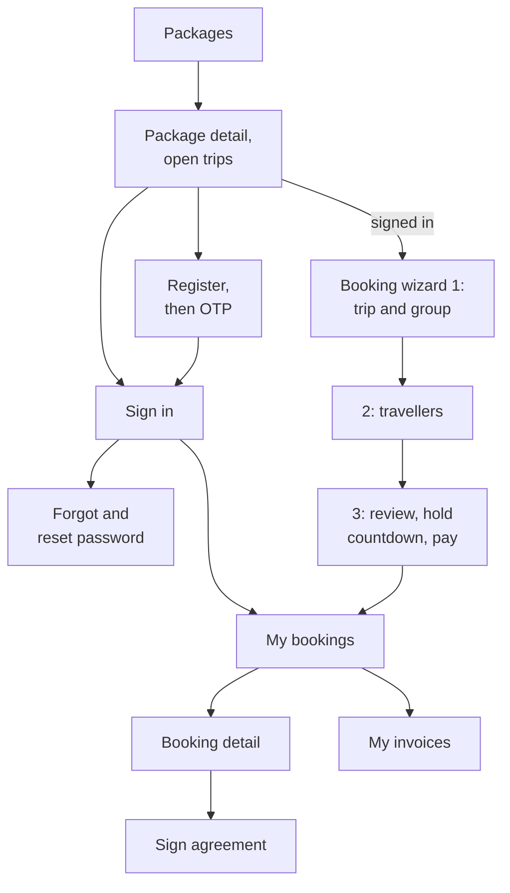
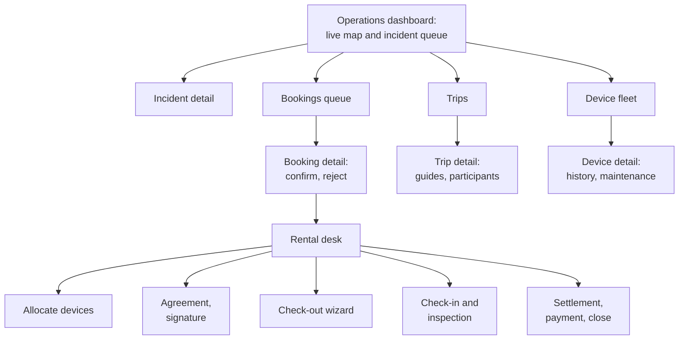
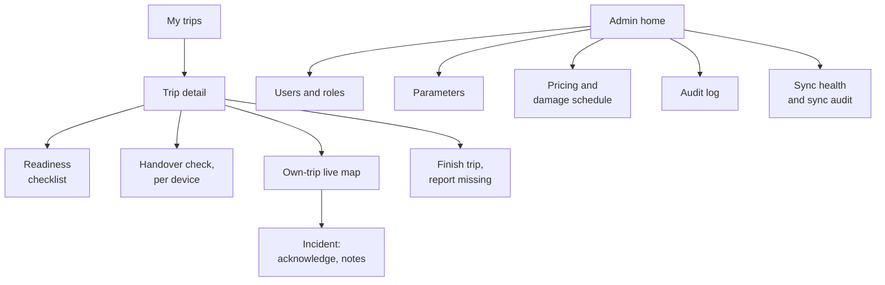

# Technical Design: frontend

> Fulfills `requirements.md` in this folder. Backend contracts are the `api-design/*.md` files of each module; `api-design/README.md` here maps screens to them.

---

## 1. Component architecture (Feature-Sliced Design)

```text
frontend/src/
├── app/            router, providers (QueryClient, Auth, Socket), route guards, global styles
├── pages/          one per route below; composition only, no API calls
├── widgets/        LiveMapWidget, IncidentQueueWidget, GatewayHealthWidget, DeviceTable,
│                   BookingsQueue, RentalDesk, AuditTable, SyncAuditTable
├── features/       auth (login, register, reset), BookingWizard, ReserveDevices, SignAgreement,
│                   ConfirmBooking, AllocateDevices, CheckOutWizard, HandoverCheck, CheckIn,
│                   InspectionForm, SettleRental, PayInvoice, AcknowledgeIncidentButton,
│                   IncidentTransitionMenu, DismissSuspected, ReadinessChecklist, FinishTrip,
│                   AssignGuidesDialog, RegisterDeviceForm, DeviceTransitionMenu,
│                   MaintenanceRecordForm, EditParameter, EditPricingRule, WaiverRequest
├── entities/       user, device (status pill, battery badge, connectivity badge), trip, booking,
│                   rental, incident (status pill, confidence tag), invoice, live (Zustand store)
└── shared/         api/apiClient.ts, api/generated types, socket/socketClient.ts, config/map.ts,
                    config/env.ts, ui kit (Button, Modal, Table, EmptyState, ErrorBanner, Pagination),
                    lib (dates with time zone, money formatting in VND), i18n-ready string modules
```

Import direction is enforced with `eslint-plugin-boundaries` configured for the six layers (AC-01), a dev dependency flagged in C-003.

---

## 2. Routes and screen authorisation

| Route | Page | Roles | Backend contracts |
|---|---|---|---|
| `/` , `/packages/:id` | Packages, PackageDetail | public | trips 01, 02, 06; billing 06 |
| `/login`, `/register`, `/reset` | Auth pages | public | auth 01 to 07 |
| `/book/:tripId` | BookingWizard (3 steps) | Customer, Guide, Operator | rentals 01, 02; billing 06, 09 |
| `/me/bookings`, `/me/bookings/:id` | My bookings | Customer | rentals 03, 04, 07, 14, 15 |
| `/me/invoices` | My invoices | Customer | billing 07, 08, 09 |
| `/ops` | Operations dashboard | Operator, Admin | monitoring 01, 03; incidents 01 |
| `/ops/incidents/:id` | Incident detail | Operator, Admin, Guide (own) | incidents 02 to 07; gateway-sync 02 |
| `/ops/bookings` | Bookings queue | Operator, Admin | rentals 03 to 08 |
| `/ops/rentals/:id` | Rental desk | Operator, Admin | rentals 11 to 23; billing 08 to 11 |
| `/ops/trips`, `/ops/trips/:id` | Trips | Operator, Admin | trips 05 to 12, 15, 16 |
| `/ops/devices`, `/ops/devices/:id` | Fleet, device detail | Operator, Admin | devices 01 to 12; rentals 10; incidents 01 |
| `/guide/trips`, `/guide/trips/:id` | My trips | Guide | trips 06, 07, 12, 13; rentals 17 |
| `/guide/map/:tripId` | Own-trip map | Guide | monitoring 01 to 03 |
| `/admin/users`, `/admin/roles` | Users, roles | Admin | auth 10 to 17 |
| `/admin/parameters`, `/admin/audit` | Parameters, audit log | Admin | platform 02 to 05 |
| `/admin/pricing` | Pricing | Admin | billing 01 to 05 |
| `/admin/sync` | Sync health and audit | Admin | gateway-sync 01 to 04 |

Route guards read roles from `GET /api/auth/me` to decide what to render; the server still authorises every call (REQ-UBI-06).

### 2.1 Screen flows

See **Figure 1**, **Figure 2** and **Figure 3**. Split by audience so each figure is legible when printed.



***Figure 1***: Public and Customer screen flow. The booking wizard is three steps (NFR-USE-01); the hold countdown lives in step 3.



***Figure 2***: Operator screen flow. The dashboard is the hub, with the live map and incident queue side by side (Pattern B).



***Figure 3***: Guide and Admin screen flows. Every Guide screen works at 360 px wide (NFR-USE-04).

---

## 3. State

| Kind | Tool | Examples |
|---|---|---|
| Server | TanStack Query, one query key factory per entity | `['incidents', filters]`, `['rental', id]` |
| Live | Zustand store `entities/live`, fed only by `socketClient` | device positions, connectivity, incidents by id, gateway states, last `seq` |
| Form | React Hook Form plus Zod mirrors of DTOs | booking, inspection, pricing rule |
| UI | `useState` | modal open, map zoom, selected tab |

Socket messages update the live store; they also invalidate the relevant TanStack queries (for example `incident:updated` invalidates `['incident', id]`), so detail pages stay current without polling. The store never duplicates TanStack data beyond the live projection (REQ-UBI-03).

### 3.1 Socket client lifecycle

`shared/socket/socketClient.ts` opens one connection after sign-in with `auth.token`, exposes `connectionState` (`connected`, `reconnecting`, `offline`) for the header indicator, refreshes the token on `connect_error UNAUTHENTICATED` or disconnect reason `TOKEN_EXPIRED`, and on every `monitoring:ready` compares `seq` with the store and fetches `GET /api/monitoring/snapshot` when there is a gap (REQ-EVT-02).

---

## 4. Live map

`widgets/LiveMapWidget` (already scaffolded with MapLibre GL and `shared/config/map.ts`) gains:

| Layer | Source | Encoding, monochrome-safe |
|---|---|---|
| Devices | live store | circle marker; `STALE` hollow with dashed outline plus last-seen label; `BUFFERING` half-filled; battery `WARNING` or `CRITICAL` shown by a small bar glyph |
| Incidents | live store | triangle marker; `CONFIRMED` solid, `SUSPECTED` hatched with the word "Suspected"; pulsing ring while `DETECTED` |
| Trails | monitoring 02 | thin line per selected device, dashed where the gap between points exceeds the stale threshold |

Colour may be added for screens, never as the only carrier of meaning (REQ-UBI-07). Map failure renders `MapUnavailable` in the map area while panels continue (E04-6, already implemented in the scaffold's error path).

---

## 5. Validation schemas

Every backend request DTO has a Zod mirror in `shared/api/schemas/{module}.ts`, generated by hand from `api-design/*.md` field tables and reviewed with them. The critical ones for Review 2: `registerSchema`, `loginSchema`, `createBookingSchema`, `reserveSchema`, `inspectionSchema`, `handoverCheckSchema`, `acknowledgeSchema` (note only), `transitionSchema`.

---

## 6. Testing strategy

| Tier | Tool | Target |
|---|---|---|
| Unit | Vitest | schemas, `apiClient` unwrap and refresh, live-store reducers, time-zone formatting |
| Component | Testing Library | wizard step limits, empty and error states, 409 handling (E01-1, E03-3) |
| Accessibility | axe via Vitest | every page (AC-06) |
| E2E | Playwright with the preinstalled Chromium | MF-01 happy path, acknowledge race, reconnect resync |

The frontend has no test runner today; adding Vitest, Testing Library, axe and Playwright is a dependency change flagged in C-003, and `ci.yml` gains a `frontend test` step.
