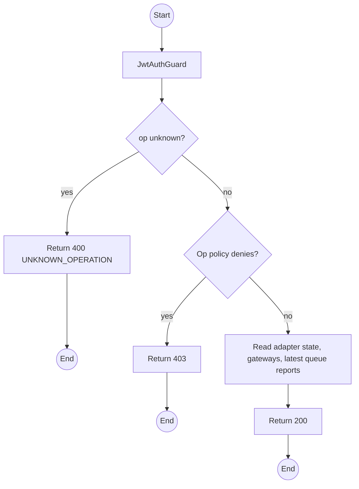
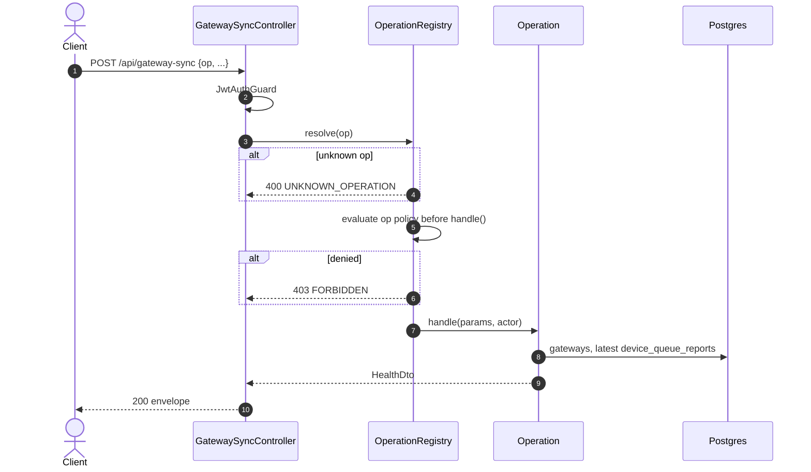

# POST /api/gateway-sync: op health

> Module `gateway-sync`. Format: `02-templates/04-api-endpoint-template.md`, with Mermaid in place of PlantUML (D-017). Envelope: D-002.

[TOC]

---
## Overview

Broker connectivity, ingress adapter status, per-gateway last-packet age and stale flag, and per-device queue depth and buffering state from the Stage B health reports. Feeds the gateway connectivity indicator (E04-2) and the buffering badge (E04-1).

## API Specification

| API        | URL             |
| ---------- | --------------- |
| POST | /api/gateway-sync |
| Permission | Operator, Admin |
| Operation | `op: "health"` |
| Dispatch | Single route per module; policy resolved per `op` inside dispatch (design §4) |
| Traces | US-049, REQ-ERR-10, REQ-EVT-12, REQ-EVT-13, REQ-EVT-14, E04-1, E04-2 |

## Request sample

```json
{
  "op": "health"
}
```

| Field | Description | Data Type | Required | Examples |
| --- | --- | --- | --- | --- |
| op | Literal `health` | string | yes | `health` |

## Response sample

```json
{
  "result": {
    "broker": {
      "connected": true,
      "since": "2026-10-10T00:01:12Z"
    },
    "adapters": [
      {
        "path": "MQTT_NODE",
        "running": true
      }
    ],
    "gateways": [
      {
        "gatewayKey": "!a4b1c2d3",
        "ingress": "MQTT_NODE",
        "lastPacketAt": "2026-10-10T05:12:40Z",
        "ageSeconds": 18,
        "stale": false
      }
    ],
    "devices": [
      {
        "deviceId": "0d3f...",
        "assetTag": "TL-0042",
        "buffering": true,
        "depth": [
          0,
          3,
          11,
          20
        ],
        "shed": [
          0,
          0,
          0,
          4
        ],
        "p0Refused": 0,
        "rebootDetected": false,
        "reportedAt": "2026-10-10T05:10:00Z"
      }
    ]
  },
  "isSuccess": true,
  "statusCode": 200,
  "message": "Gateway health retrieved"
}
```

## Validation

<table>
    <th>Status code</th>
    <th>Description</th>
    <th>Examples</th>
    <tbody>
        <tr>
            <td>400</td>
            <td>`op` missing or not registered (<code>UNKNOWN_OPERATION</code>)</td>
<td>

```json
{
  "result": {
    "errorCode": "UNKNOWN_OPERATION"
  },
  "isSuccess": false,
  "statusCode": 400,
  "message": "Unknown operation: listEvent."
}
```
</td>
        </tr>
        <tr>
            <td>401</td>
            <td>Missing, malformed or expired access token (<code>UNAUTHENTICATED</code>)</td>
<td>

```json
{
  "result": {
    "errorCode": "UNAUTHENTICATED"
  },
  "isSuccess": false,
  "statusCode": 401,
  "message": "Authentication required."
}
```
</td>
        </tr>
        <tr>
            <td>403</td>
            <td>Authenticated, but the caller's role or policy does not allow this action (<code>FORBIDDEN</code>)</td>
<td>

```json
{
  "result": {
    "errorCode": "FORBIDDEN"
  },
  "isSuccess": false,
  "statusCode": 403,
  "message": "You do not have permission to perform this action."
}
```
</td>
        </tr>
    </tbody>
</table>

## Activity Diagram



## Sequence Diagram


