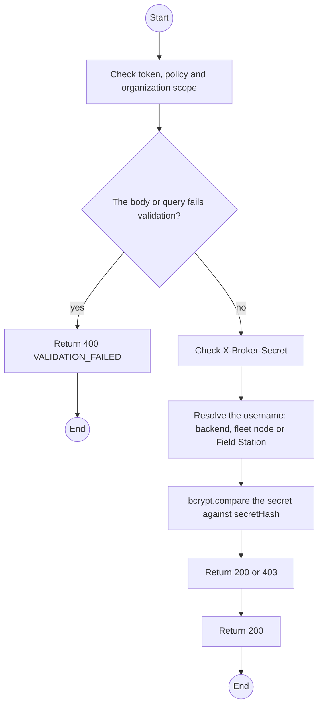
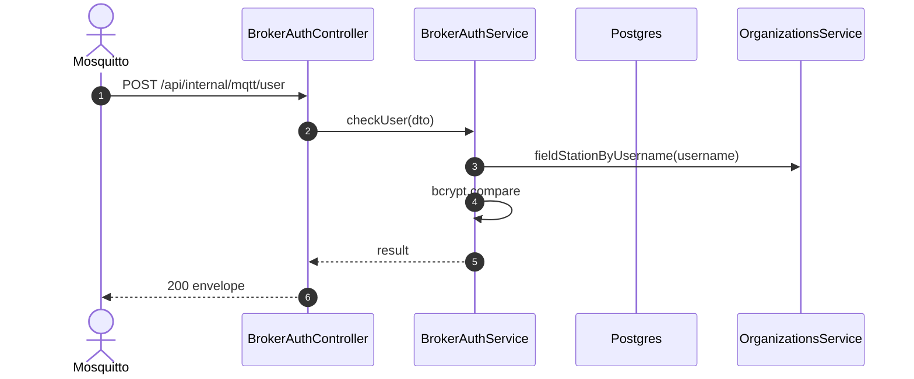

# POST /api/internal/mqtt/user: Broker credential check

> Module `gateway-sync`. Generated from `scripts/specs/endpoints/gateway_sync.py` by `scripts/specs/build_api_design.py`; edit the catalog, not this file. Format: `02-templates/04-api-endpoint-template.md` with Mermaid (D-017). Envelope: D-002.

[TOC]

---
## Overview

Called by the mosquitto-go-auth HTTP backend (`auth_opt_http_getuser_uri`, JSON params, status response mode) when a client connects. Allows the backend's subscriber, Stage A and B fleet nodes, and Field Station credentials that are not revoked and whose organization is not `CLOSED`; a `SUSPENDED` organization still connects, because its devices stay monitored (BR-32). Any non-2xx denies.

## API Specification

| API | URL |
| --- | --- |
| POST | /api/internal/mqtt/user |
| Permission | Internal (broker) |
| Traces | FR-EVT-14, D-037, BR-20, NFR-SEC-02 |
| Notes | Broker only: the request must come from the broker's network and carry `X-Broker-Secret` equal to `MQTT_AUTH_HOOK_SECRET` |

## Request sample

```json
{
  "username": "fs-org-0007-1",
  "password": "fs_s3cr3t...",
  "clientid": "fieldstation-7f3a"
}
```

| Field | Description | Data Type | Required | Examples |
| --- | --- | --- | --- | --- |
| username | MQTT username | string | yes | `fs-org-0007-1` |
| password | MQTT password | string | yes | `fs_s3cr3t...` |
| clientid | MQTT client id | string | yes | `fieldstation-7f3a` |

## Response sample

```json
{
  "result": {
    "allowed": true,
    "kind": "FIELD_STATION"
  },
  "isSuccess": true,
  "statusCode": 200,
  "message": "OK"
}
```

## Validation

<table>
    <th>Status code</th>
    <th>Description</th>
    <th>Examples</th>
    <tbody>
        <tr>
            <td>400</td>
            <td>The body or query fails validation (<code>VALIDATION_FAILED</code>)</td>
<td>

```json
{
  "result": {
    "errorCode": "VALIDATION_FAILED"
  },
  "isSuccess": false,
  "statusCode": 400,
  "message": "{field} is required."
}
```
</td>
        </tr>
        <tr>
            <td>401</td>
            <td>Missing, malformed or expired access token or API key (<code>UNAUTHENTICATED</code>)</td>
<td>

```json
{
  "result": {
    "errorCode": "UNAUTHENTICATED"
  },
  "isSuccess": false,
  "statusCode": 401,
  "message": "Authentication required."
}
```
</td>
        </tr>
        <tr>
            <td>403</td>
            <td>The caller's role, policy or organization does not allow this action (<code>FORBIDDEN</code>)</td>
<td>

```json
{
  "result": {
    "errorCode": "FORBIDDEN"
  },
  "isSuccess": false,
  "statusCode": 403,
  "message": "You do not have access to this."
}
```
</td>
        </tr>
        <tr>
            <td>401</td>
            <td>The hook secret is missing or wrong (<code>BROKER_SECRET</code>)</td>
<td>

```json
{
  "result": {
    "errorCode": "BROKER_SECRET"
  },
  "isSuccess": false,
  "statusCode": 401,
  "message": "Authentication required."
}
```
</td>
        </tr>
        <tr>
            <td>403</td>
            <td>Unknown username, wrong secret, revoked credential or closed organization (<code>CREDENTIAL_REJECTED</code>)</td>
<td>

```json
{
  "result": {
    "errorCode": "CREDENTIAL_REJECTED"
  },
  "isSuccess": false,
  "statusCode": 403,
  "message": "Denied."
}
```
</td>
        </tr>
    </tbody>
</table>

## Activity Diagram



## Sequence Diagram


