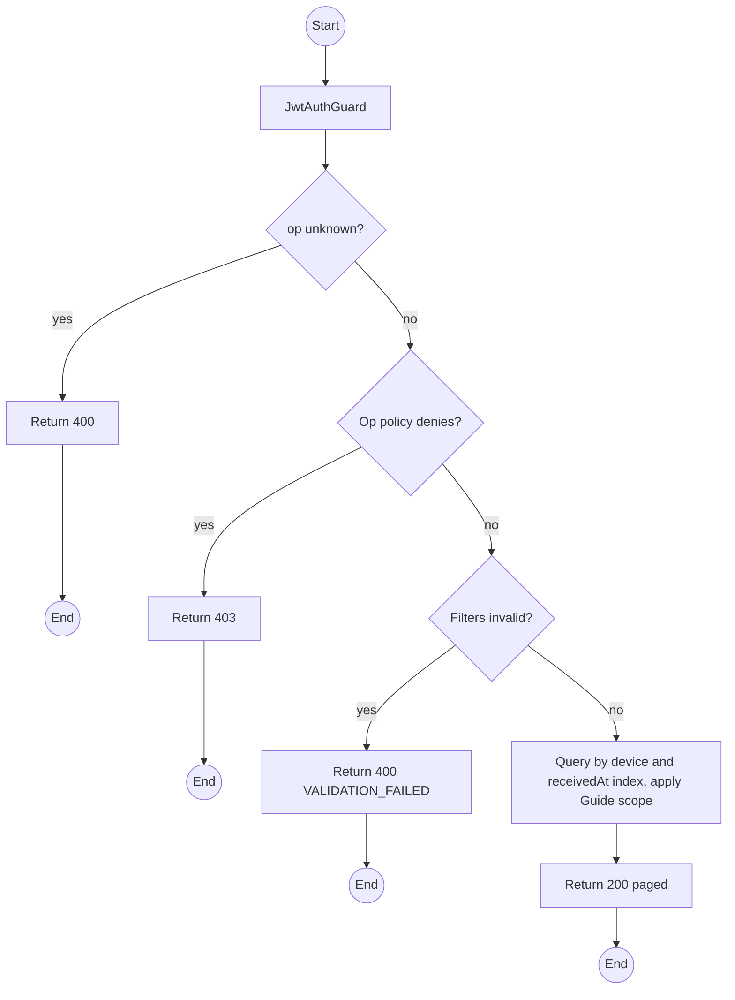
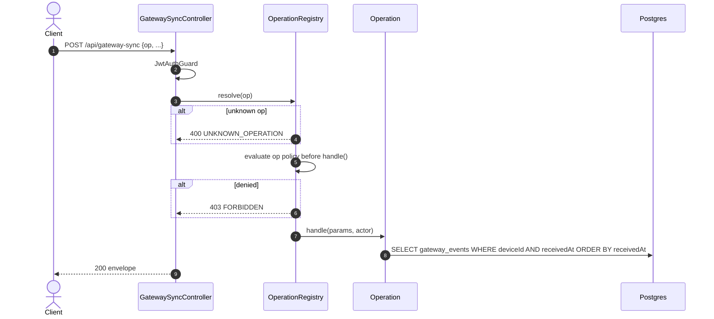

# POST /api/gateway-sync: op listEvents

> Module `gateway-sync`. Format: `02-templates/04-api-endpoint-template.md`, with Mermaid in place of PlantUML (D-017). Envelope: D-002.

[TOC]

---
## Overview

Paged `GatewayEvent` query ordered by `receivedAt`: map trails, "last N readings", and the correlated events of an Incident. Guides are limited to devices on their own trips.

## API Specification

| API        | URL             |
| ---------- | --------------- |
| POST | /api/gateway-sync |
| Permission | Operator, Admin; Guide (own trips' devices) |
| Operation | `op: "listEvents"` |
| Traces | US-017, US-056, UC-14, REQ-UBI-02 |

## Request sample

```json
{
  "op": "listEvents",
  "deviceId": "0d3f...",
  "kind": [
    "POSITION",
    "SOS"
  ],
  "priority": null,
  "incidentId": null,
  "from": "2026-10-10T00:00:00Z",
  "to": "2026-10-10T06:00:00Z",
  "pageNumber": 1,
  "pageSize": 100
}
```

| Field | Description | Data Type | Required | Examples |
| --- | --- | --- | --- | --- |
| op | Literal `listEvents` | string | yes | `listEvents` |
| deviceId | Device filter | uuid | no | `0d3f...` |
| kind | EventKind values | enum[] | no | `POSITION` |
| priority | P0 to P3 | enum[] | no | `P0` |
| incidentId | Events correlated to one Incident | uuid | no | `inc-1...` |
| from | receivedAt lower bound | datetime | no | `2026-10-10T00:00:00Z` |
| to | receivedAt upper bound | datetime | no | `2026-10-10T06:00:00Z` |
| pageNumber | 1-based | int | no | `1` |
| pageSize | Default 100, max 500 | int | no | `100` |

## Response sample

```json
{
  "result": {
    "items": [
      {
        "eventId": "5d41402a...",
        "deviceId": "0d3f...",
        "kind": "POSITION",
        "priority": "P1",
        "observedAt": null,
        "receivedAt": "2026-10-10T05:12:40Z",
        "position": {
          "lat": 11.5601,
          "lon": 108.5402
        },
        "incidentId": "inc-1...",
        "gatewayKey": "!a4b1c2d3",
        "linkQuality": {
          "rssi": -97,
          "snr": 6.25,
          "hopsAway": 1
        }
      }
    ],
    "pageNumber": 1,
    "pageSize": 100,
    "totalCount": 1,
    "totalPages": 1
  },
  "isSuccess": true,
  "statusCode": 200,
  "message": "Events retrieved"
}
```

## Validation

<table>
    <th>Status code</th>
    <th>Description</th>
    <th>Examples</th>
    <tbody>
        <tr>
            <td>400</td>
            <td>`op` missing or not registered (<code>UNKNOWN_OPERATION</code>)</td>
<td>

```json
{
  "result": {
    "errorCode": "UNKNOWN_OPERATION"
  },
  "isSuccess": false,
  "statusCode": 400,
  "message": "Unknown operation: listEvent."
}
```
</td>
        </tr>
        <tr>
            <td>400</td>
            <td>Bad filter or window over 7 days (<code>VALIDATION_FAILED</code>)</td>
<td>

```json
{
  "result": {
    "errorCode": "VALIDATION_FAILED"
  },
  "isSuccess": false,
  "statusCode": 400,
  "message": "The time window cannot exceed 7 days."
}
```
</td>
        </tr>
        <tr>
            <td>401</td>
            <td>Missing, malformed or expired access token (<code>UNAUTHENTICATED</code>)</td>
<td>

```json
{
  "result": {
    "errorCode": "UNAUTHENTICATED"
  },
  "isSuccess": false,
  "statusCode": 401,
  "message": "Authentication required."
}
```
</td>
        </tr>
        <tr>
            <td>403</td>
            <td>Authenticated, but the caller's role or policy does not allow this action (<code>FORBIDDEN</code>)</td>
<td>

```json
{
  "result": {
    "errorCode": "FORBIDDEN"
  },
  "isSuccess": false,
  "statusCode": 403,
  "message": "You do not have permission to perform this action."
}
```
</td>
        </tr>
    </tbody>
</table>

## Activity Diagram



## Sequence Diagram


