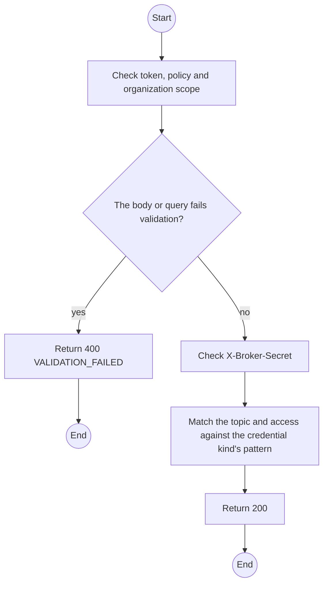
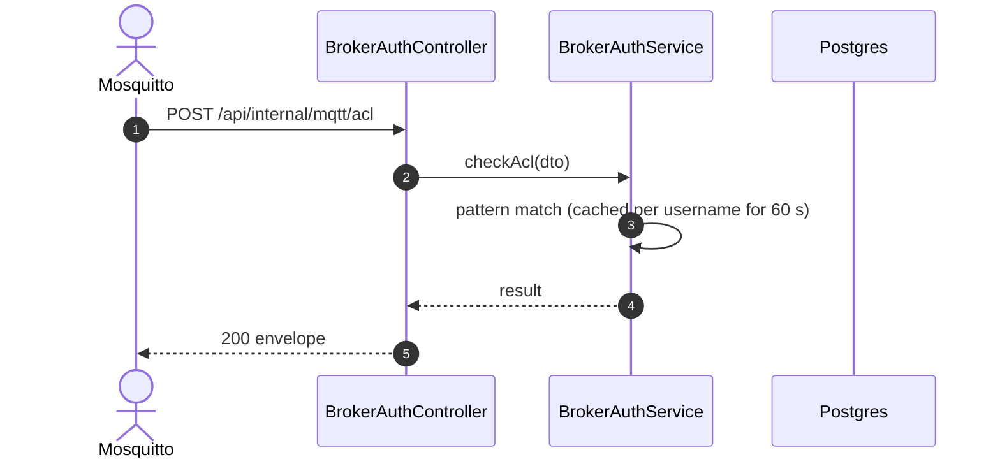

# POST /api/internal/mqtt/acl: Broker topic check

> Module `gateway-sync`. Generated from `scripts/specs/endpoints/gateway_sync.py` by `scripts/specs/build_api_design.py`; edit the catalog, not this file. Format: `02-templates/04-api-endpoint-template.md` with Mermaid (D-017). Envelope: D-002.

[TOC]

---
## Overview

Called per publish and subscribe (`auth_opt_http_aclcheck_uri`). A Field Station may publish only under `treklink/fs/<its username>/#` and never subscribe; a fleet node only under its own Stage A topics; the backend subscriber may subscribe to `treklink/#` and publish nothing. Which devices a station may report for is enforced at ingestion, not here (FR-EVT-14).

## API Specification

| API | URL |
| --- | --- |
| POST | /api/internal/mqtt/acl |
| Permission | Internal (broker) |
| Traces | FR-EVT-14, D-037 |
| Notes | Broker only: the request must come from the broker's network and carry `X-Broker-Secret` equal to `MQTT_AUTH_HOOK_SECRET` |

## Request sample

```json
{
  "username": "fs-org-0007-1",
  "clientid": "fieldstation-7f3a",
  "topic": "treklink/fs/fs-org-0007-1/2/json/LongFast/!a4b1c2d3",
  "acc": 2
}
```

| Field | Description | Data Type | Required | Examples |
| --- | --- | --- | --- | --- |
| username | MQTT username | string | yes | `fs-org-0007-1` |
| clientid | Client id | string | yes | `fieldstation-7f3a` |
| topic | Topic | string | yes | `treklink/fs/fs-org-0007-1/2/json/LongFast/!a4b1c2d3` |
| acc | 1 read, 2 write, 3 readwrite, 4 subscribe | int | yes | `2` |

## Response sample

```json
{
  "result": {
    "allowed": true
  },
  "isSuccess": true,
  "statusCode": 200,
  "message": "OK"
}
```

## Validation

<table>
    <th>Status code</th>
    <th>Description</th>
    <th>Examples</th>
    <tbody>
        <tr>
            <td>400</td>
            <td>The body or query fails validation (<code>VALIDATION_FAILED</code>)</td>
<td>

```json
{
  "result": {
    "errorCode": "VALIDATION_FAILED"
  },
  "isSuccess": false,
  "statusCode": 400,
  "message": "{field} is required."
}
```
</td>
        </tr>
        <tr>
            <td>401</td>
            <td>Missing, malformed or expired access token or API key (<code>UNAUTHENTICATED</code>)</td>
<td>

```json
{
  "result": {
    "errorCode": "UNAUTHENTICATED"
  },
  "isSuccess": false,
  "statusCode": 401,
  "message": "Authentication required."
}
```
</td>
        </tr>
        <tr>
            <td>403</td>
            <td>The caller's role, policy or organization does not allow this action (<code>FORBIDDEN</code>)</td>
<td>

```json
{
  "result": {
    "errorCode": "FORBIDDEN"
  },
  "isSuccess": false,
  "statusCode": 403,
  "message": "You do not have access to this."
}
```
</td>
        </tr>
        <tr>
            <td>401</td>
            <td>The hook secret is missing or wrong (<code>BROKER_SECRET</code>)</td>
<td>

```json
{
  "result": {
    "errorCode": "BROKER_SECRET"
  },
  "isSuccess": false,
  "statusCode": 401,
  "message": "Authentication required."
}
```
</td>
        </tr>
        <tr>
            <td>403</td>
            <td>The topic or access is outside the credential's pattern (<code>TOPIC_DENIED</code>)</td>
<td>

```json
{
  "result": {
    "errorCode": "TOPIC_DENIED"
  },
  "isSuccess": false,
  "statusCode": 403,
  "message": "Denied."
}
```
</td>
        </tr>
    </tbody>
</table>

## Activity Diagram



## Sequence Diagram


