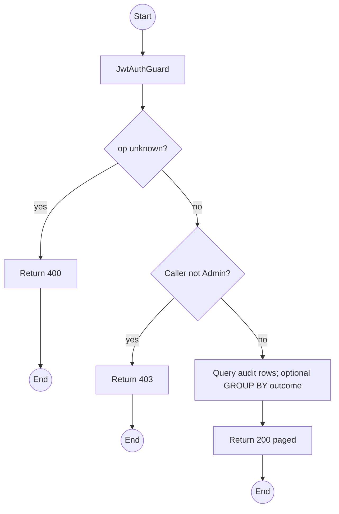
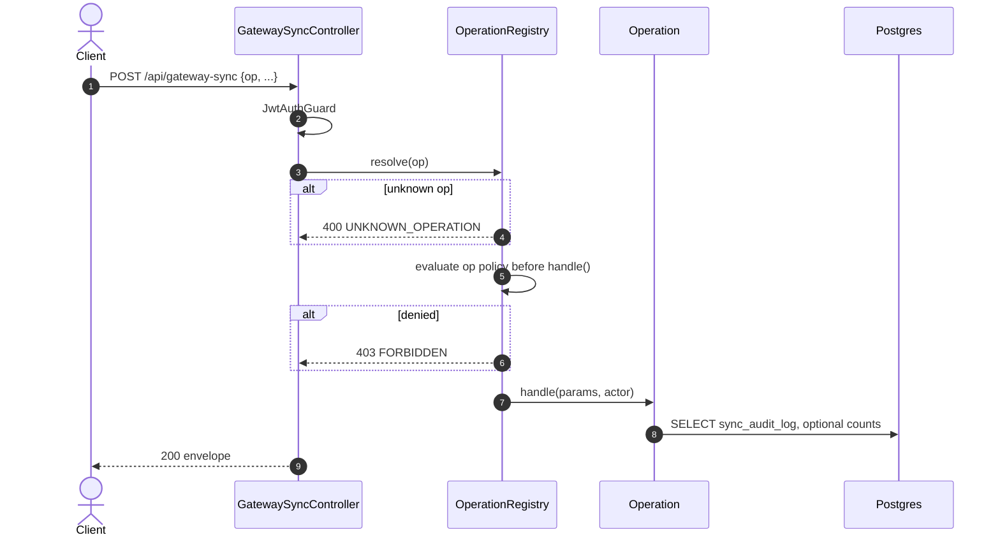

# POST /api/gateway-sync: op listAudit

> Module `gateway-sync`. Format: `02-templates/04-api-endpoint-template.md`, with Mermaid in place of PlantUML (D-017). Envelope: D-002.

[TOC]

---
## Overview

Paged `SyncAuditLog`: every ingestion attempt and its outcome, including rejects. This is the RQ1 evidence surface; delivery, duplicate and loss rates are computed from it. `summary=true` adds counts per outcome for the window.

## API Specification

| API        | URL             |
| ---------- | --------------- |
| POST | /api/gateway-sync |
| Permission | Admin |
| Operation | `op: "listAudit"` |
| Traces | US-051, UC-20, RQ1, REQ-EVT-03, REQ-ERR-01 to REQ-ERR-11 |

## Request sample

```json
{
  "op": "listAudit",
  "outcome": [
    "DUPLICATE_REJECTED"
  ],
  "from": "2026-10-10T00:00:00Z",
  "to": "2026-10-11T00:00:00Z",
  "summary": true,
  "pageNumber": 1,
  "pageSize": 50
}
```

| Field | Description | Data Type | Required | Examples |
| --- | --- | --- | --- | --- |
| op | Literal `listAudit` | string | yes | `listAudit` |
| outcome | SyncOutcome values | enum[] | no | `DUPLICATE_REJECTED` |
| eventId | Exact eventId | string | no | `5d41...` |
| nodeNum | Exact node number | int | no | `2763113171` |
| from | createdAt lower bound | datetime | no | `2026-10-10T00:00:00Z` |
| to | createdAt upper bound | datetime | no | `2026-10-11T00:00:00Z` |
| summary | Include per-outcome counts | bool | no | `true` |
| pageNumber | 1-based | int | no | `1` |
| pageSize | Default 50, max 500 | int | no | `50` |

## Response sample

```json
{
  "result": {
    "summary": {
      "ACCEPTED": 1204,
      "DUPLICATE_REJECTED": 97,
      "MALFORMED_ENVELOPE": 2,
      "UNKNOWN_DEVICE": 0
    },
    "items": [
      {
        "id": "sa-9...",
        "eventId": "5d41402a...",
        "nodeNum": 2763113171,
        "outcome": "DUPLICATE_REJECTED",
        "detail": null,
        "ingress": "MQTT_NODE",
        "createdAt": "2026-10-10T05:12:41Z"
      }
    ],
    "pageNumber": 1,
    "pageSize": 50,
    "totalCount": 97,
    "totalPages": 2
  },
  "isSuccess": true,
  "statusCode": 200,
  "message": "Sync audit retrieved"
}
```

## Validation

<table>
    <th>Status code</th>
    <th>Description</th>
    <th>Examples</th>
    <tbody>
        <tr>
            <td>400</td>
            <td>`op` missing or not registered (<code>UNKNOWN_OPERATION</code>)</td>
<td>

```json
{
  "result": {
    "errorCode": "UNKNOWN_OPERATION"
  },
  "isSuccess": false,
  "statusCode": 400,
  "message": "Unknown operation: listEvent."
}
```
</td>
        </tr>
        <tr>
            <td>401</td>
            <td>Missing, malformed or expired access token (<code>UNAUTHENTICATED</code>)</td>
<td>

```json
{
  "result": {
    "errorCode": "UNAUTHENTICATED"
  },
  "isSuccess": false,
  "statusCode": 401,
  "message": "Authentication required."
}
```
</td>
        </tr>
        <tr>
            <td>403</td>
            <td>Caller is not Admin (per-op policy; Operators are denied, AC in design §4) (<code>FORBIDDEN</code>)</td>
<td>

```json
{
  "result": {
    "errorCode": "FORBIDDEN"
  },
  "isSuccess": false,
  "statusCode": 403,
  "message": "You do not have permission to perform this action."
}
```
</td>
        </tr>
    </tbody>
</table>

## Activity Diagram



## Sequence Diagram


