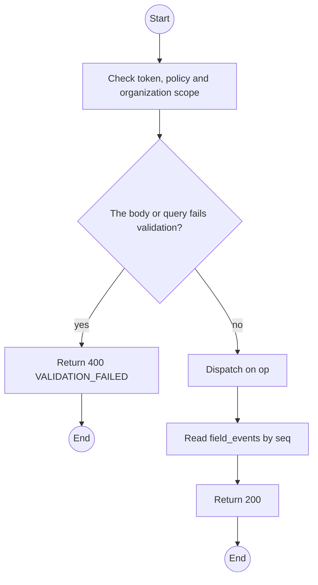
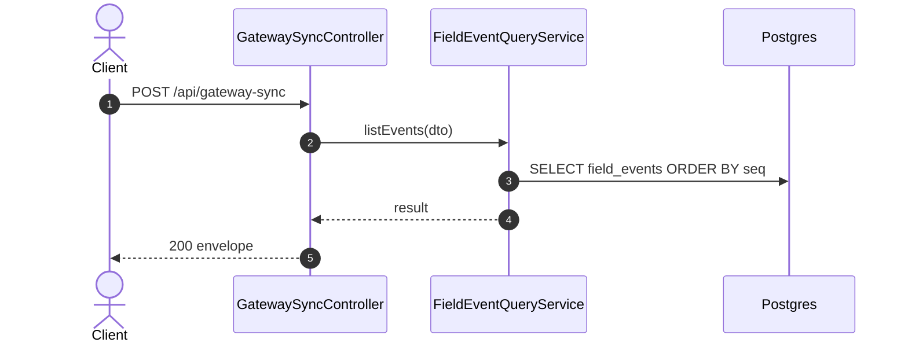

# POST /api/gateway-sync op listEvents: List field events

> Module `gateway-sync`. Generated from `scripts/specs/endpoints/gateway_sync.py` by `scripts/specs/build_api_design.py`; edit the catalog, not this file. Format: `02-templates/04-api-endpoint-template.md` with Mermaid (D-017). Envelope: D-002.

[TOC]

---
## Overview

Paged query over the append-only field-event ledger, ordered by ingestion `seq`: the raw view behind map trails and an incident's episode. Organization members read history through monitoring (FR-MON-07), never here.

## API Specification

| API | URL |
| --- | --- |
| POST | /api/gateway-sync |
| Permission | TrekLink Staff, TrekLink Admin |
| Operation | `op: "listEvents"` (D-027) |
| Traces | UC-26, FR-EVT-01, FR-EVT-11 |

## Request sample

```json
{
  "op": "listEvents",
  "deviceId": "0d3f6a2b-7e11-4c55-8f0a-2b1c9e7d4a10",
  "kind": [
    "POSITION",
    "SOS"
  ],
  "from": "2026-10-20T00:00:00Z",
  "to": "2026-10-20T06:00:00Z",
  "pageNumber": 1,
  "pageSize": 100
}
```

| Field | Description | Data Type | Required | Examples |
| --- | --- | --- | --- | --- |
| op | Literal `listEvents` | string | yes | `listEvents` |
| deviceId | Device | uuid | no | `0d3f6a2b-7e11-4c55-8f0a-2b1c9e7d4a10` |
| organizationId | Renting organization at ingestion | uuid | no | `5b1d2c0e-7f3a-4e21-9c8d-1a2b3c4d5e6f` |
| kind | EventKind values | enum[] | no | `["SOS"]` |
| incidentId | Events of one episode | uuid | no | `7a6b5c4d-3e2f-4a1b-8c9d-0e1f2a3b4c5d` |
| from | receivedAt lower bound | datetime | no | `2026-10-20T00:00:00Z` |
| to | receivedAt upper bound | datetime | no | `2026-10-20T06:00:00Z` |
| pageNumber | 1-based | int | no | `1` |
| pageSize | Default 100, at most 500 | int | no | `100` |

## Response sample

```json
{
  "result": {
    "items": [
      {
        "seq": 88213,
        "eventId": "5d41402abc4b2a76b9719d911017c592...",
        "deviceId": "0d3f6a2b-7e11-4c55-8f0a-2b1c9e7d4a10",
        "assetTag": "TL-0042",
        "organizationId": "5b1d2c0e-7f3a-4e21-9c8d-1a2b3c4d5e6f",
        "ingress": "FIELD_STATION",
        "uplinkKey": "fs-org-0007-1",
        "kind": "POSITION",
        "priority": "P2_GPS",
        "observedAt": "2026-10-20T03:14:58Z",
        "receivedAt": "2026-10-20T03:15:00.000Z",
        "latitude": 11.5601,
        "longitude": 108.5402,
        "altitude": 1320,
        "batteryPct": 81,
        "rssi": -97,
        "snr": 6.25,
        "hopsAway": 1,
        "plotted": true,
        "incidentId": null
      }
    ],
    "pageNumber": 1,
    "pageSize": 20,
    "totalCount": 214,
    "totalPages": 1
  },
  "isSuccess": true,
  "statusCode": 200,
  "message": "OK"
}
```

## Validation

<table>
    <th>Status code</th>
    <th>Description</th>
    <th>Examples</th>
    <tbody>
        <tr>
            <td>400</td>
            <td>The body or query fails validation (<code>VALIDATION_FAILED</code>)</td>
<td>

```json
{
  "result": {
    "errorCode": "VALIDATION_FAILED"
  },
  "isSuccess": false,
  "statusCode": 400,
  "message": "{field} is required."
}
```
</td>
        </tr>
        <tr>
            <td>401</td>
            <td>Missing, malformed or expired access token or API key (<code>UNAUTHENTICATED</code>)</td>
<td>

```json
{
  "result": {
    "errorCode": "UNAUTHENTICATED"
  },
  "isSuccess": false,
  "statusCode": 401,
  "message": "Authentication required."
}
```
</td>
        </tr>
        <tr>
            <td>403</td>
            <td>The caller's role, policy or organization does not allow this action (<code>FORBIDDEN</code>)</td>
<td>

```json
{
  "result": {
    "errorCode": "FORBIDDEN"
  },
  "isSuccess": false,
  "statusCode": 403,
  "message": "You do not have access to this."
}
```
</td>
        </tr>
    </tbody>
</table>

## Activity Diagram



## Sequence Diagram


