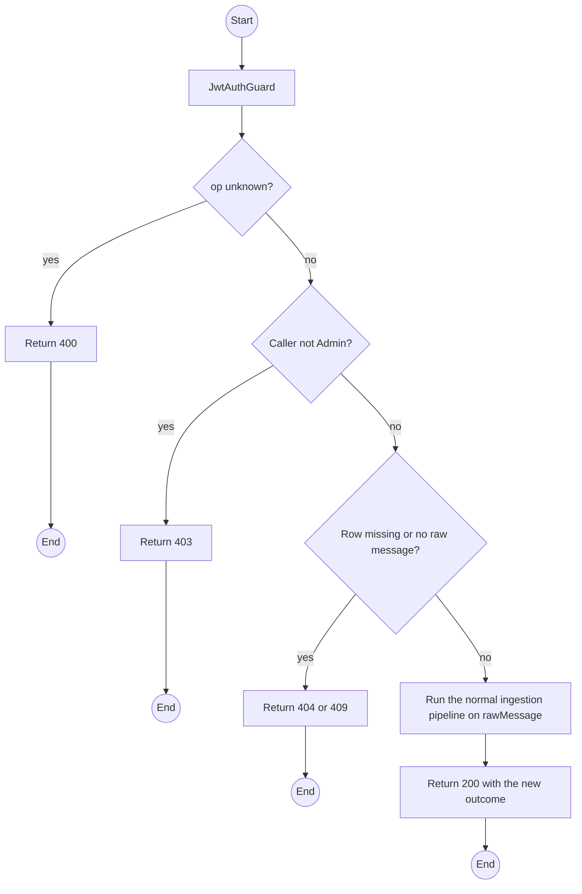
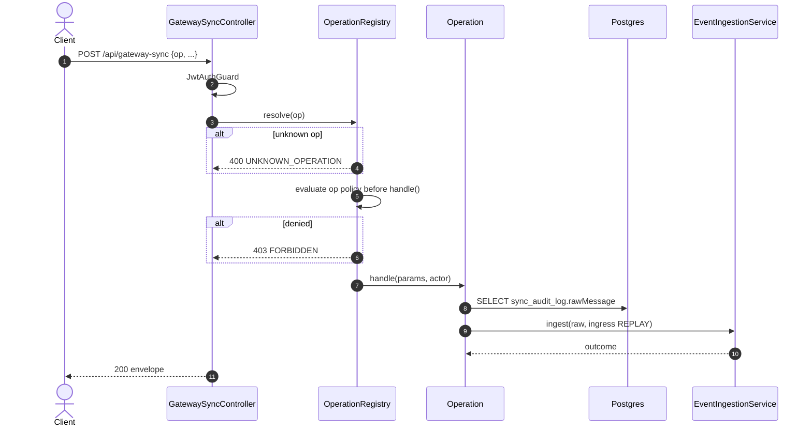

# POST /api/gateway-sync: op replay

> Module `gateway-sync`. Format: `02-templates/04-api-endpoint-template.md`, with Mermaid in place of PlantUML (D-017). Envelope: D-002.

[TOC]

---
## Overview

Re-runs normalization on the stored raw payload of one audit row after a parser fix (REQ-UBI-04). Useful for `NORMALIZATION_FAILED` and `MALFORMED_ENVELOPE` rows. Also the Admin-side way to demonstrate the 10x replay NFR: replaying an accepted event yields `DUPLICATE_REJECTED` and no second Incident.

## API Specification

| API        | URL             |
| ---------- | --------------- |
| POST | /api/gateway-sync |
| Permission | Admin |
| Operation | `op: "replay"` |
| Idempotency | Replaying a stored event never creates a second `GatewayEvent`; the unique `eventId` still arbitrates |
| Traces | REQ-UBI-04, REQ-ERR-04, AC-02 |

## Request sample

```json
{
  "op": "replay",
  "auditId": "sa-9..."
}
```

| Field | Description | Data Type | Required | Examples |
| --- | --- | --- | --- | --- |
| op | Literal `replay` | string | yes | `replay` |
| auditId | SyncAuditLog row whose rawMessage is replayed | uuid | yes | `sa-9...` |

## Response sample

```json
{
  "result": {
    "auditId": "sa-9...",
    "newAuditId": "sa-10...",
    "outcome": "DUPLICATE_REJECTED",
    "eventId": "5d41402a...",
    "incidentId": null
  },
  "isSuccess": true,
  "statusCode": 200,
  "message": "Event replayed"
}
```

## Validation

<table>
    <th>Status code</th>
    <th>Description</th>
    <th>Examples</th>
    <tbody>
        <tr>
            <td>400</td>
            <td>`op` missing or not registered (<code>UNKNOWN_OPERATION</code>)</td>
<td>

```json
{
  "result": {
    "errorCode": "UNKNOWN_OPERATION"
  },
  "isSuccess": false,
  "statusCode": 400,
  "message": "Unknown operation: listEvent."
}
```
</td>
        </tr>
        <tr>
            <td>401</td>
            <td>Missing, malformed or expired access token (<code>UNAUTHENTICATED</code>)</td>
<td>

```json
{
  "result": {
    "errorCode": "UNAUTHENTICATED"
  },
  "isSuccess": false,
  "statusCode": 401,
  "message": "Authentication required."
}
```
</td>
        </tr>
        <tr>
            <td>403</td>
            <td>Caller is not Admin (<code>FORBIDDEN</code>)</td>
<td>

```json
{
  "result": {
    "errorCode": "FORBIDDEN"
  },
  "isSuccess": false,
  "statusCode": 403,
  "message": "You do not have permission to perform this action."
}
```
</td>
        </tr>
        <tr>
            <td>404</td>
            <td>Audit row not found (<code>NOT_FOUND</code>)</td>
<td>

```json
{
  "result": {
    "errorCode": "NOT_FOUND"
  },
  "isSuccess": false,
  "statusCode": 404,
  "message": "Audit entry not found."
}
```
</td>
        </tr>
        <tr>
            <td>409</td>
            <td>Row has no stored raw message (<code>NOTHING_TO_REPLAY</code>)</td>
<td>

```json
{
  "result": {
    "errorCode": "NOTHING_TO_REPLAY"
  },
  "isSuccess": false,
  "statusCode": 409,
  "message": "This audit entry has no stored message to replay."
}
```
</td>
        </tr>
    </tbody>
</table>

## Activity Diagram



## Sequence Diagram


