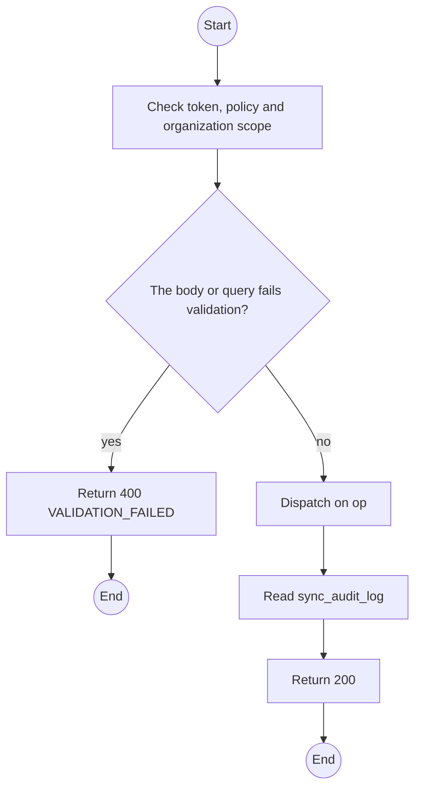
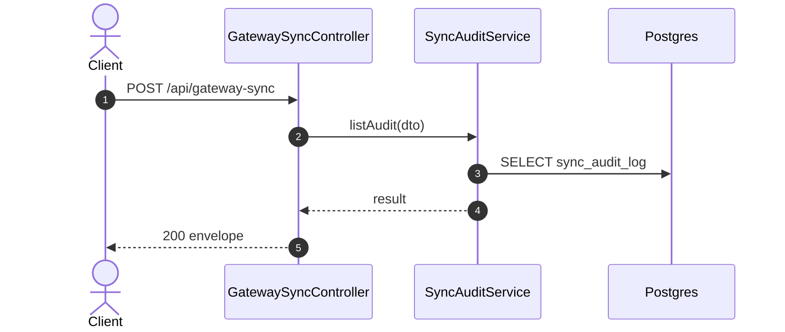

# POST /api/gateway-sync op listAudit: Search the sync audit

> Module `gateway-sync`. Generated from `scripts/specs/endpoints/gateway_sync.py` by `scripts/specs/build_api_design.py`; edit the catalog, not this file. Format: `02-templates/04-api-endpoint-template.md` with Mermaid (D-017). Envelope: D-002.

[TOC]

---
## Overview

Searches the append-only synchronization audit: one row per ingestion attempt with its outcome (FR-EVT-11). This is the evidence base for the delivery, duplicate and ordering experiments.

## API Specification

| API | URL |
| --- | --- |
| POST | /api/gateway-sync |
| Permission | TrekLink Admin |
| Operation | `op: "listAudit"` (D-027) |
| Traces | UC-42, FR-EVT-05, FR-EVT-11, NFR-REL-03 |

## Request sample

```json
{
  "op": "listAudit",
  "outcome": [
    "DUPLICATE_REJECTED",
    "MALFORMED_ENVELOPE"
  ],
  "pageNumber": 1
}
```

| Field | Description | Data Type | Required | Examples |
| --- | --- | --- | --- | --- |
| op | Literal `listAudit` | string | yes | `listAudit` |
| outcome | SyncOutcome values | enum[] | no | `["DUPLICATE_REJECTED"]` |
| deviceId | Device | uuid | no | `0d3f6a2b-7e11-4c55-8f0a-2b1c9e7d4a10` |
| uplinkKey | Node id or station username | string | no | `fs-org-0007-1` |
| from | Lower bound | datetime | no | `...` |
| to | Upper bound | datetime | no | `...` |
| pageNumber | 1-based | int | no | `1` |
| pageSize | Default 100 | int | no | `100` |

## Response sample

```json
{
  "result": {
    "items": [
      {
        "id": "sa-1",
        "eventId": "5d41...",
        "nodeNum": 2763113171,
        "deviceId": "0d3f6a2b-7e11-4c55-8f0a-2b1c9e7d4a10",
        "uplinkKey": "fs-org-0007-1",
        "ingress": "FIELD_STATION",
        "outcome": "DUPLICATE_REJECTED",
        "detail": null,
        "createdAt": "2026-10-20T03:15:00.000Z"
      }
    ],
    "pageNumber": 1,
    "pageSize": 20,
    "totalCount": 9,
    "totalPages": 1
  },
  "isSuccess": true,
  "statusCode": 200,
  "message": "OK"
}
```

## Validation

<table>
    <th>Status code</th>
    <th>Description</th>
    <th>Examples</th>
    <tbody>
        <tr>
            <td>400</td>
            <td>The body or query fails validation (<code>VALIDATION_FAILED</code>)</td>
<td>

```json
{
  "result": {
    "errorCode": "VALIDATION_FAILED"
  },
  "isSuccess": false,
  "statusCode": 400,
  "message": "{field} is required."
}
```
</td>
        </tr>
        <tr>
            <td>401</td>
            <td>Missing, malformed or expired access token or API key (<code>UNAUTHENTICATED</code>)</td>
<td>

```json
{
  "result": {
    "errorCode": "UNAUTHENTICATED"
  },
  "isSuccess": false,
  "statusCode": 401,
  "message": "Authentication required."
}
```
</td>
        </tr>
        <tr>
            <td>403</td>
            <td>The caller's role, policy or organization does not allow this action (<code>FORBIDDEN</code>)</td>
<td>

```json
{
  "result": {
    "errorCode": "FORBIDDEN"
  },
  "isSuccess": false,
  "statusCode": 403,
  "message": "You do not have access to this."
}
```
</td>
        </tr>
    </tbody>
</table>

## Activity Diagram



## Sequence Diagram


